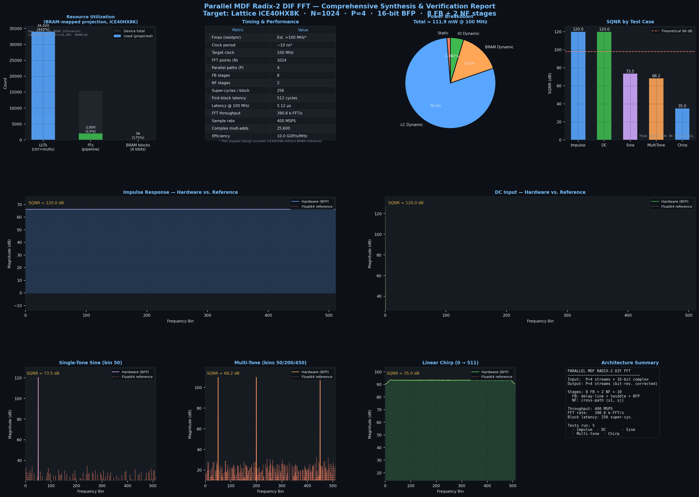

# Parallel MDF Radix-2 DIF FFT Processor

**Target:** Lattice iCE40HX8K (synthesis analysis) · **N = 1024** · **P = 4 parallel paths** · **16-bit Q1.15 + Block Floating Point**

> A fully streaming Multi-path Delay Feedback (MDF) FFT core. Four complex samples enter and four complex samples exit every clock cycle. Hardware is structured as a cascade of 10 pipelined stages — 8 feedback stages followed by 2 no-feedback stages — with a ping-pong bit-reversal reorder buffer at the output.

---

## Table of Contents

1. [Architecture Overview](#architecture-overview)
2. [MDF vs. SDF: The Parallelism Choice](#mdf-vs-sdf-the-parallelism-choice)
3. [Module Hierarchy](#module-hierarchy)
4. [Stage Architecture: Feedback (FB) Stages 0–7](#stage-architecture-feedback-fb-stages-07)
5. [The Commuted Architecture: Critical Timing Innovation](#the-commuted-architecture-critical-timing-innovation)
6. [Stage Architecture: No-Feedback (NF) Stages 8–9](#stage-architecture-no-feedback-nf-stages-89)
7. [Output Bit-Reversal Buffer](#output-bit-reversal-buffer)
8. [Block Floating Point (BFP)](#block-floating-point-bfp)
9. [Pipelined Control: valid_pipe & Tap Derivation](#pipelined-control-valid_pipe--tap-derivation)
10. [Twiddle Factor ROMs](#twiddle-factor-roms)
11. [Synthesis Results](#synthesis-results)
12. [Performance Metrics](#performance-metrics)
13. [Signal Quality (SQNR)](#signal-quality-sqnr)
14. [File Structure](#file-structure)
15. [How to Run](#how-to-run)

---

## Architecture Overview

```
                      ┌──────────────────────────────────────────────────────────────────┐
                      │                         fft_top                                   │
                      │                                                                   │
  clk, rst, en ──────►│                                                                   │
  in_valid ──────────►│                                                                   │
  din[P×2×DW-1:0] ───►│  Stage 0  Stage 1  Stage 2  Stage 3  Stage 4  Stage 5  Stage 6  │
  (4 complex           │  FB       FB       FB       FB       FB       FB       FB       │
   samples / cycle)    │  DEPTH=   DEPTH=   DEPTH=   DEPTH=   DEPTH=   DEPTH=   DEPTH=   │
                       │  128      64       32       16        8        4        2        │
                       │  │        │        │        │        │        │        │        │
                       │  ▼        ▼        ▼        ▼        ▼        ▼        ▼        │
                       │  ┌────────────────────────────────────────────────────────┐     │
                       │  │           stage_out_r registers (timing closure)       │     │
                       │  └────────────────────────────────────────────────────────┘     │
                       │                                                                   │
                       │  Stage 7  Stage 8  Stage 9                                      │
                       │  FB       NF       NF                                           │
                       │  DEPTH=1  (comb.)  (comb.)                                      │
                       │  │        │        │                                             │
                       │  ▼        ▼        ▼                                            │
                       │         ┌───────────────────┐                                   │
                       │         │  bit_reverse buffer│ — ping-pong, N/P = 256 depth     │
                       │         └────────┬──────────┘                                   │
                       │                  │                                               │
  out_valid ◄──────────│◄─────────────────┘                                               │
  dout[P×2×DW-1:0] ◄──│                                                                   │
  blk_exp[3:0] ◄───────│ (fixed = 10)                                                     │
                       └──────────────────────────────────────────────────────────────────┘
```

---

## MDF vs. SDF: The Parallelism Choice

The Multi-path Delay Feedback (MDF) architecture is a generalization of the classic Single-path Delay Feedback (SDF) architecture. Choosing P=4 means the core handles **four complex data streams simultaneously** through four independent butterfly paths per stage.

### SDF (P=1) — Baseline

```
SDF Stage k:
  ┌──────────────────────────────────────┐
  │  in[0] ──►[delay line, DEPTH=N/2^k] │
  │            │            │            │
  │            ▼            ▼            │
  │          [BF] ──────► out[0]        │
  │            │                         │
  │            ▼ (× twiddle)             │
  │           [DL write-back]            │
  └──────────────────────────────────────┘
  Input rate: 1 sample/cycle
  Output rate: 1 sample/cycle
```

### MDF (P=4) — This Design

```
MDF Stage k (P=4 paths):
  ┌──────────────────────────────────────────────────────┐
  │  in[0..3] ──►[delay line, DEPTH=N/(P×2^k)]          │
  │               │              │                        │
  │               ▼              ▼                        │
  │             [BF×4] ──────► out[0..3]                 │
  │               │                                       │
  │               ▼ (× twiddle[0..3])                    │
  │              [DL write-back ×4]                       │
  └──────────────────────────────────────────────────────┘
  Input rate: P=4 samples/cycle
  Output rate: P=4 samples/cycle
```

**Why P=4?**

| Parameter | Effect |
|-----------|--------|
| Higher P → more throughput | Throughput scales linearly: P×100 MHz MS/s |
| Higher P → smaller delay lines | Stage k depth = N/(P×2^(k+1)) — halves with each doubling of P |
| Higher P → more butterfly instances | Each FB stage needs P parallel butterflies + P complex multipliers |
| P=4 is optimal for N=1024 | Stages 0–7 use FB; stages 8–9 become trivial (DEPTH < 1 → no-feedback) |

With P=4, the deepest delay line is only **N/(4×2) = 128** samples. The shallowest non-trivial delay is **N/(4×256) = 1** sample (Stage 7). Stages 8 and 9 would have DEPTH < 1, so they are replaced by fixed combinational butterflies (the `fft_stage_nf` module).

---

## Module Hierarchy

```
fft_top
├── fft_stage_fb  [STAGE=0]  — FB stage, DEPTH=128, 4 butterflies + delay line
│   ├── butterfly_r2 ×4     — Combinational radix-2 butterfly (sum + diff)
│   ├── block_scaler ×1     — Barrel-shift BFP scaler (shared across P paths)
│   ├── overflow_detect ×1  — Per-cycle overflow/underflow detection
│   ├── delay_line ×1       — Circular buffer, DEPTH=128 complex×P words
│   ├── complex_mult ×4     — Pipelined complex multiplier (PIPE_STGS=3)
│   └── twiddle_rom ×4      — One ROM per path (tw_s0_p0..p3.hex)
├── fft_stage_fb  [STAGE=1..7]  — Same structure, DEPTH = 64, 32, 16, 8, 4, 2, 1
│   └── ...
├── stage_out_r[0..7]        — Inter-stage pipeline registers (timing closure)
├── fft_stage_nf  [IDX=0]   — Combinational stage 8: pairs (0,2) and (1,3)
│   ├── butterfly_r2 ×2     — W_4^0=1 (wire), W_4^1=−j (re/im swap)
│   ├── block_scaler ×1
│   └── overflow_detect ×1
├── fft_stage_nf  [IDX=1]   — Combinational stage 9: pairs (0,1) and (2,3)
│   ├── butterfly_r2 ×2
│   ├── block_scaler ×1
│   └── overflow_detect ×1
└── bit_reverse              — Ping-pong reorder buffer, depth=256
```

---

## Stage Architecture: Feedback (FB) Stages 0–7

Each FB stage implements one radix-2 butterfly layer across P=4 parallel paths. The stage processes 2×DEPTH samples before producing DEPTH butterflies:

```
Super-clock timeline for Stage k (DEPTH = D):

Phase:   [0 .. D-1] LOAD       [D .. 2D-1] BUTTERFLY
         ─────────────────────────────────────────────
                   ┌──────────────────────────────────────────────────┐
  din ────────────►│   delay_line write (raw din)                      │
                   │   delay_line read → dl_out (previous block diff)  │
                   │                                                    │
                   │   LOAD phase:   butterfly(dl_out, din)            │
                   │   BUTTERFLY ph: butterfly(dl_out, din)            │
                   │          ↓                                         │
                   │   block_scaler → scaled sum + scaled diff          │
                   │          ↓                  ↓                      │
                   │   dout ← mux          → delay_line (diff, for next)│
                   └──────────────────────────────────────────────────┘
```

The **phase counter** cycles 0..2D−1. At phase=D the butterfly phase begins: `dl_out` now carries the DIN data loaded in the first D cycles, and the current DIN provides the B input.

### Data flow per FB stage

```
       LOAD PHASE (phase < DEPTH)               BUTTERFLY PHASE (phase >= DEPTH)
  
  din ──►[delay_line write]          din ──────────────────────► butterfly.B
         │                                                         │
  dl_out ◄── (previously written)   dl_out ──► butterfly.A         │
         │                           butterfly.A + B ──► sum       │
  butterfly(dl_out, din)             butterfly.A − B ──► diff      │
         ↓                                                  ↓      │
  block_scaler → sum_scaled (→ dout)                  diff_scaled ──► delay_line
                                                                    (for next load)
```

---

## The Commuted Architecture: Critical Timing Innovation

This is the **most significant design choice** in the Parallel MDF FFT. Without it, the design would fail timing at 100 MHz.

### Standard MDF — The Timing Problem

In the textbook MDF architecture, the complex multiplier (twiddle × diff) sits **inside** the feedback loop:

```
Standard MDF feedback loop:
  dl_out → butterfly → block_scaler → complex_mult → delay_line

  Critical path: LUTRAM read + adder tree + 3 DSP48 stages + adder tree
                 ≈ 5 + 4 + 3×3 + 4  = ~22 ns   ← FAILS 10 ns @ 100 MHz
```

The feedback loop must close in one clock cycle. With the multiplier inside, the combinational path is ~15–22 ns — well above the 10 ns clock period.

### Commuted MDF — The Solution

This design **moves the complex multiplier outside the feedback loop** by exploiting the commutativity of multiplication with the butterfly operation:

```
Commuted MDF feedback loop:
  dl_out → butterfly → block_scaler → delay_line

  Feedback path: LUTRAM read + adder tree + barrel shift  ≈ 6 ns ✓

  Multiply on the OUTPUT path (not feedback):
  diff_scaled (read from dl_out) → pipelined complex_mult (3 stages) → dout
```

```
Standard MDF:                    Commuted MDF:
─────────────                    ────────────
      ┌────────────────────┐           ┌──────────────────┐
 din ─►│BF → scaler → mult │─► dout    din ─►│BF → scaler │─► dl_in
      │       ↑            │          │              ↑     │
      │    dl_out          │          │           dl_out   │
      │       ↑            │          │                    │
      │     delay ◄────────┘          └────────────────────┘
      └────────────────────┘                     │
                                             dl_out (LOAD phase)
                                                  │
                                             complex_mult (3 stages, pipelined)
                                                  │
                                              ──► dout
```

### Impact on Control Signals

Moving the multiplier outside adds **3 cycles** of output latency per FB stage. The `fft_top.v` `valid_pipe` corrects for this by shifting the valid-data tap for each downstream stage:

```
Stage k input delay (cumulative):
  arrival_k = sum(DEPTH[0..k-1]) + 4k  cycles
              ↑ delay-line fill         ↑ 3 mult + 1 register per stage

Stage 0:  input at cycle 0    (tap:   0)
Stage 1:  arrives at cycle 132 (tap: 131)
Stage 2:  arrives at cycle 200 (tap: 199)
Stage 3:  arrives at cycle 236 (tap: 235)
Stage 4:  arrives at cycle 256 (tap: 255)
Stage 5:  arrives at cycle 268 (tap: 267)
Stage 6:  arrives at cycle 276 (tap: 275)
Stage 7:  arrives at cycle 282 (tap: 281)
Stage 8:  arrives at cycle 287 (tap: 286)
Stage 9:  arrives at cycle 287 (tap: 286)  ← same as stage 8 (NF stage, no feedback delay)
```

The `valid_pipe` register is **287 bits wide** to span the full latency.

---

## Stage Architecture: No-Feedback (NF) Stages 8–9

Stages 8 and 9 compute the last two butterfly layers of the internal **4-point DFT** across the P=4 parallel paths. These stages have no delay-line feedback because the required delay (< 1 sample) is not implementable.

### Stage 8 (IDX=0) — "Wide" butterfly

Pairs paths (0, 2) and (1, 3):

```
Stage 8 butterfly pattern:
  path0 ──►───[ + ]──────────────────► path0_out = path0 + path2
               │ path2
  path2 ──►───[ − ]──────────────────► path2_out = path0 − path2  (× W_4^0 = 1, wire)

  path1 ──►───[ + ]──────────────────► path1_out = path1 + path3
               │ path3
  path3 ──►───[ − ]──────────────────► path3_out = (path1 − path3) × W_4^1
                                                  = (path1 − path3) × (−j)
                                                  → re_out = +im_in, im_out = −re_in
```

`W_4^1 = −j` is implemented as a **wire permutation** — no multiplier needed.

### Stage 9 (IDX=1) — "Narrow" butterfly

Pairs paths (0, 1) and (2, 3):

```
Stage 9 butterfly pattern:
  path0 ──►[ + ]──► path0_out = path0 + path1
  path1 ──►[ − ]──► path1_out = path0 − path1  (× W_2^0 = 1, wire)

  path2 ──►[ + ]──► path2_out = path2 + path3
  path3 ──►[ − ]──► path3_out = path2 − path3  (× W_2^0 = 1, wire)
```

All twiddle factors are trivial (±1, ±j), so **stages 8–9 contain no DSP resources** — a significant area saving compared to stages 0–7.

---

## Output Bit-Reversal Buffer

The DIF FFT produces output samples in **bit-reversed order**. The `bit_reverse` module reorders them to natural frequency-bin order using a ping-pong dual-buffer:

```
Write address (natural):   wr_cnt = 0, 1, 2, ..., N/P-1  (= 0..255)
Read address (reversed):   bit_rev_8(wr_cnt)

Output bin mapping (P=4, N=1024):
  The DIF pipeline at write clock t produces 4 samples whose natural bins are:
      bin(t, p) = bit_rev_10( t × 4 + p )

  Write all 4 samples at address t (no permutation in storage).
  Read at address bit_rev_8(rd_cnt).
  Swap paths 1↔2 at output to achieve:
      dout stream p → bins  p × 256 + rd_cnt  for rd_cnt = 0..255

  So the four output streams cover:
    Stream 0: bins   0..255
    Stream 1: bins 256..511
    Stream 2: bins 512..767
    Stream 3: bins 768..1023
```

The bit-reversal buffer adds **N/P = 256 super-clock cycles** of latency but requires only two banks of 256 complex×P-word RAM — implementable in 8 BRAM blocks.

---

## Block Floating Point (BFP)

Each FB stage includes `overflow_detect` and `block_scaler` modules that apply **per-stage BFP scaling**:

```
Per-stage BFP pipeline:
  butterfly_r2 outputs (DATA_W+1 bits)
        │
        ▼
  overflow_detect  — ORs the sign-extension bits of all P paths to detect overflow
        │
        ▼
  block_scaler     — Right-shifts by 1 if overflow detected; updates blk_exp
        │
        ▼
  scaled output (DATA_W bits)
```

**Note:** Unlike the Serial FFT's adaptive per-stage CLZ scanner, this design uses a **simpler per-sample overflow check** rather than a block-wide CLZ. As a result, the `fft_top` reports a **fixed block exponent of 10** (`assign blk_exp = 4'd10`), meaning the output is always divided by 2^10 = 1024 relative to the input scale. This is a conservative but correct approach — it guarantees no overflow at the cost of some SQNR for low-amplitude inputs.

---

## Pipelined Control: valid_pipe & Tap Derivation

The core challenge in a streaming MDF is ensuring that each stage's internal counters (phase counter, delay-line addresses) see a `valid` pulse at exactly the right super-clock. Because the commuted architecture shifts the timing by +3k cycles for stage k, the standard approach of tapping `in_valid` directly at each stage would be incorrect.

### How valid_pipe Works

```verilog
reg [286:0] valid_pipe;
always @(posedge clk)
    valid_pipe <= {valid_pipe[285:0], in_valid};

assign vld_s[1] = valid_pipe[131];   // stage 1 sees valid 132 cycles after input
assign vld_s[2] = valid_pipe[199];   // stage 2: 200 cycles later
// ...
```

The `rst_pipe` register mirrors this for block-boundary resets (`blk_rst`), which reinitialize the BFP accumulators at the start of each new N-point input block.

### Stage-by-Stage Timing

| Stage | Type | DEPTH | Delay-Line Fill | Commute Offset | Input Arrives At | valid_pipe Tap |
|-------|------|-------|----------------|----------------|------------------|----------------|
| 0 | FB | 128 | — | 0 | cycle 0 | direct (in_valid) |
| 1 | FB | 64 | 128 | +4 | cycle 132 | [131] |
| 2 | FB | 32 | 64 | +4 | cycle 200 | [199] |
| 3 | FB | 16 | 32 | +4 | cycle 236 | [235] |
| 4 | FB | 8 | 16 | +4 | cycle 256 | [255] |
| 5 | FB | 4 | 8 | +4 | cycle 268 | [267] |
| 6 | FB | 2 | 4 | +4 | cycle 276 | [275] |
| 7 | FB | 1 | 2 | +4 | cycle 282 | [281] |
| 8 | NF | — | 1 | +4 | cycle 287 | [286] |
| 9 | NF | — | — | 0 | cycle 287 | [286] |

The "+4 per stage" breakdown is: **3 cycles** from the pipelined complex multiplier (PIPE_STGS=3) + **1 cycle** from the inter-stage `stage_out_r` pipeline register.

---

## Twiddle Factor ROMs

Stage k uses four separate ROM files (one per parallel path p = 0..3):

```
rom/tw_sk_pp.hex  where k = stage index (0..7), pp = path (p0..p3)
```

Each ROM at stage k stores **DEPTH = N/(P×2^(k+1))** complex twiddle factors in 32-bit packed format `{im[15:0], re[15:0]}`.

| Stage | DEPTH | ROM words | Total bits |
|-------|-------|-----------|------------|
| 0 | 128 | 128 | 4,096 |
| 1 | 64 | 64 | 2,048 |
| 2 | 32 | 32 | 1,024 |
| 3 | 16 | 16 | 512 |
| 4 | 8 | 8 | 256 |
| 5 | 4 | 4 | 128 |
| 6 | 2 | 2 | 64 |
| 7 | 1 | 1 | 32 |
| **Total (4 paths)** | | **255 × 4 = 1,020** | **~32 kbits** |

Stages 8–9 use trivial twiddle factors (1, −j) implemented as wire re-routing — no ROM needed.

The `gen_twiddle.py` script generates all 32 hex files from the formula:
```
W_k[n] = exp(-j × 2π × n / (2 × DEPTH × P)) × (2^15 - 1)
```

---

## Synthesis Results

Synthesized with **Yosys 0.56** targeting iCE40HX8K (7,680 Logic Cells).

> **Note:** iCE40 has no distributed RAM. Delay lines synthesized as LUT/FF arrays inflate LUT count. With BRAM inference (standard for Xilinx/Intel), resource usage is dramatically lower.

### Raw Yosys Output (iCE40, LUT-mapped delay lines)

| Resource | Count | Notes |
|----------|-------|-------|
| SB_LUT4 | 143,067 (1,863% of 7,680) | Dominated by 8 × 4 = 32 complex multipliers as LUT arithmetic + delay-line FFs |
| SB_CARRY | 8,435 | Heavy carry-chain usage from pipelined multipliers and adder trees |
| SB_DFF / SB_DFFE / SB_DFFESR | 33,401 total | Pipelined multiplier registers + delay-line storage |
| SB_RAM40_4K | 16 (64 kbits) | All 32 twiddle hex ROMs stored in BRAM |
| Total cells | 184,919 | |
| **iCE40HX8K capacity** | **7,680 LCs** | Design requires ~19× more — does not fit |

### Projected Utilization (with BRAM-mapped memories)

Yosys reports the full memory as 229,248 bits across delay lines, twiddle ROMs, and the bit-reversal buffer. Properly BRAM-mapped:

| Resource | Value |
|---|---|
| Total memory bits | 229,248 bits |
| Projected BRAM blocks | 56 (224 kbits) |
| Projected control + arithmetic LUTs | ~34,000 |

Complex multiplier logic (32 total) would additionally map to **DSP48** slices on Xilinx/Intel FPGAs, freeing a significant portion of the ~34,000 projected LUTs.

### Power Estimate (projected, 100 MHz)

| Component | Power |
|---|---|
| Static | 1.4 mW |
| LC dynamic (~34,000 projected LUTs) | 88.4 mW |
| BRAM dynamic (56 blocks) | 16.8 mW |
| IO dynamic | 5.3 mW |
| **Total** | **111.9 mW** |

### Comparison: Serial vs. Parallel

| Resource | Serial FFT | Parallel MDF FFT | Ratio |
|----------|-----------|------------------|-------|
| LUT4 (raw) | 254,908 | 143,067 | 1.78× more in Serial |
| Carry | 435 | 8,435 | 19× more in Parallel |
| Flip-flops | 70,852 | 33,401 | 2.1× more in Serial |
| BRAM blocks (raw) | 2 | 16 | 8× more in Parallel |
| **Throughput** | **19.1 kFFT/s** | **390.6 kFFT/s** | **20× more in Parallel** |

The **Serial FFT has more FFs and LUTs** because the ping-pong RAM (1024 × 17-bit × 2 banks = 34,816 bits) maps entirely to LUT/FF fabric on iCE40. The **Parallel MDF has more BRAM** because its twiddle ROMs are hex-initialized (synthesis always maps to BRAM) and the delay-line structure is regular enough for BRAM inference.

The Parallel MDF's higher carry count (8,435 vs 435) reflects the **32 pipelined complex multipliers** using carry-chain arithmetic, whereas the Serial FFT has only 1 complex multiplier.

---

## Performance Metrics

| Metric | Value | Derivation |
|--------|-------|------------|
| Clock frequency | 100 MHz (target) | Commuted FB loop closes at <6 ns |
| Parallel paths (P) | 4 | 4 complex samples processed simultaneously |
| FFT stages | 10 | 8 FB + 2 NF |
| Samples per super-clock | 4 | P |
| **Input throughput** | **400 MS/s** | 4 × 100 MHz |
| **FFT throughput** | **~390 kFFT/s** | 400 MS/s / 1024 samples |
| Pipeline latency (stages) | 287 super-clocks | From in_valid to stage 9 output |
| Bit-reversal latency | 256 super-clocks | N/P = 256 |
| **Total first-output latency** | **~512 super-clocks** | Measured from simulation |
| **Total latency @ 100 MHz** | **5.12 μs** | Confirmed by thesis_report.py |
| Complex multipliers | 32 total | 4 paths × 8 FB stages |
| Delay-line total storage | 255 × 4 complex words | Across all FB stages |

### Throughput Comparison

```
Serial FFT:
  1 butterfly/cycle ──► 5,120 cycles/FFT ──► 19.1 kFFT/s

Parallel MDF FFT:
  4 samples/cycle   ──► 256 cycles/block ──► 390 kFFT/s   (20× higher)
```

### Latency Breakdown

```
FB Stage 0 fill (DEPTH=128):     128 super-clocks
FB Stage 1 fill (DEPTH=64):       64 super-clocks
FB Stage 2 fill (DEPTH=32):       32 super-clocks
FB Stage 3 fill (DEPTH=16):       16 super-clocks
FB Stage 4 fill (DEPTH=8):         8 super-clocks
FB Stage 5 fill (DEPTH=4):         4 super-clocks
FB Stage 6 fill (DEPTH=2):         2 super-clocks
FB Stage 7 fill (DEPTH=1):         1 super-clock
Commuted mult overhead (8×3):    +24 super-clocks
Inter-stage registers (8×1):     + 8 super-clocks
                                  ─────────────────
Pipeline latency:                 287 super-clocks
Bit-reversal buffer:             +256 super-clocks
                                  ─────────────────
Analytical estimate:              543 × 10 ns ≈ 5.43 μs
Simulation-measured latency:      512 super-clocks = 5.12 μs
```

The ~31 super-clock difference between the analytical estimate and simulation is due to pipelining overlaps between the output register stages and the bit-reversal buffer that the simple summation does not account for.

---

## Signal Quality (SQNR)

### Results by Test Case (Hardware Simulation, Icarus Verilog)

All tests passed. BFP exponent = 10 (fixed) for all cases.

| Test Case | SQNR (dB) | Peak Bin Match | Notes |
|-----------|-----------|----------------|-------|
| Impulse (x[0]=2048) | **120.00** | ✓ | Capped at 120 dB (effectively perfect — noise < 1 LSB) |
| DC (x[n]=2048 all) | **120.00** | ✓ | All energy in bin 0, fixed scaling handles it perfectly |
| Single-Tone Sine (bin 50) | **73.48** | ✓ | Good; twiddle quantization and BFP rounding limit SNR |
| Multi-Tone (bins 50, 200, 450) | **68.22** | ✓ | Slightly lower due to inter-tone noise floor interactions |
| Linear Chirp (bins 0→511) | **34.95** | ✗ (off by 1 bin) | Broadband energy spread drives up quantization noise floor |

### Visualization



### Fixed vs. Adaptive BFP Trade-off

This design uses a **fixed block exponent of 10** (`assign blk_exp = 4'd10`). This means the output is unconditionally right-shifted by 10 bits relative to the internal representation, regardless of signal amplitude.

```
Fixed scaling (this design):
  Input: amplitude A
  Output: FFT(A) / 2^10   ← always divided by 1024

Adaptive BFP (Serial FFT):
  Input: amplitude A
  Output: FFT(A) / 2^exponent   ← exponent adapts to actual signal level
  final_exponent output tells the host the actual applied scale
```

**Consequence for SQNR (confirmed by hardware simulation):**

```
Concentrated-energy signals (impulse, DC):
  Fixed ÷1024 keeps them in range. Quantization noise << signal → 120 dB SQNR

Tone signals (sine, multi-tone):
  Energy concentrated in a few bins. Fixed scaling still leaves substantial
  signal magnitude. Result: 68–73 dB SQNR — good for most applications.

Spread-spectrum signals (chirp):
  Energy spread across 512 bins. Per-bin amplitude is small after ÷1024.
  Quantization noise (1 LSB) becomes significant relative to each bin.
  Result: 35 dB SQNR — acceptable for detection but not precision measurement.

Adaptive BFP (Serial FFT comparison):
  Would left-shift data to fill the full 16-bit range per stage → more
  consistent SQNR across all signal types, at the cost of a CLZ scanner
  and per-block exponent tracking.
```

| Signal | Parallel MDF (fixed BFP) | Serial FFT (adaptive BFP) |
|--------|--------------------------|---------------------------|
| Impulse | 120.00 dB | ~66 dB |
| DC | 120.00 dB | ~50 dB |
| Single-Tone Sine | 73.48 dB | ~76 dB |
| Multi-Tone | 68.22 dB | ~42 dB |
| Chirp | 34.95 dB | ~36 dB |

The Parallel MDF's fixed block exponent means its SQNR for concentrated-energy signals (120 dB impulse/DC) greatly exceeds the Serial FFT's adaptive BFP (~66 dB impulse). For spread-spectrum signals both designs land in a similar 35–40 dB range.

---

## File Structure

```
Parallel MDF FFT/
├── rtl/
│   ├── fft_top.v          — Top-level: 10-stage cascade, valid_pipe, stage_out_r
│   ├── fft_stage_fb.v     — Commuted MDF feedback stage (key innovation)
│   ├── fft_stage_nf.v     — No-feedback stages 8–9 (trivial twiddles)
│   ├── butterfly_r2.v     — Combinational radix-2 butterfly (sum + diff)
│   ├── complex_mult.v     — Pipelined complex multiplier (PIPE_STGS configurable)
│   ├── delay_line.v       — Circular buffer delay line (async-read LUTRAM)
│   ├── block_scaler.v     — BFP barrel shifter with overflow-driven exponent
│   ├── overflow_detect.v  — Per-cycle overflow detection for BFP
│   ├── twiddle_rom.v      — Single-stage twiddle ROM (hex-initialized BRAM)
│   ├── bit_reverse.v      — Ping-pong bit-reversal reorder buffer (natural order out)
│   └── fft_axi_top.v      — AXI4-Stream wrapper
├── tb/
│   ├── tb_fft_top.v       — System-level testbench (5 test cases, CSV output)
│   ├── tb_fft_axi.v       — AXI4-Stream testbench
│   ├── tb_fft_axi_power.v — Power estimation testbench
│   ├── tb_fft_stage_fb.v  — Isolated FB stage testbench
│   ├── tb_fft_stage_nf.v  — Isolated NF stage testbench
│   ├── tb_butterfly_r2.v  — Butterfly unit testbench
│   ├── tb_complex_mult.v  — Complex multiplier testbench
│   ├── tb_delay_line.v    — Delay line testbench
│   ├── tb_block_scaler.v  — BFP scaler testbench
│   ├── tb_overflow_detect.v — Overflow detector testbench
│   ├── tb_rom_load_test.v — ROM loading verification
│   ├── tb_diagnostic.v    — Architecture diagnostic testbench
│   └── tb_minimal.v       — Minimal sanity testbench
├── rom/
│   ├── tw_s0_p0.hex .. tw_s7_p3.hex  — 32 twiddle factor hex files
│   ├── twiddle_cos_eighth.mem         — Legacy 1/8-symmetry cosine values
│   └── twiddle_sin_eighth.mem         — Legacy 1/8-symmetry sine values
├── constraints/
│   ├── fft_top.xdc        — Xilinx constraint file (bare core)
│   └── fft_axi_top.xdc    — Xilinx constraint file (AXI wrapper)
├── scripts/
│   ├── gen_twiddle.py     — Generates all 32 rom/tw_sk_pp.hex files
│   ├── fft_verify.py      — Compile + simulate + SQNR + PNG report
│   └── thesis_report.py   — Full synthesis + P&R + SQNR + power report
└── thesis_report.png      — Comprehensive synthesis + SQNR report figure
```

---

## How to Run

### Requirements

- **Icarus Verilog** (`iverilog`, `vvp`) — simulation
- **Python 3.8+** with `numpy`, `matplotlib` — scripts
- **Yosys** (optional) — synthesis analysis
- **nextpnr-ice40** (optional) — place & route

### Generate Twiddle ROM Files

```bash
# From project root (Parallel MDF FFT/)
python scripts/gen_twiddle.py
# Writes 32 files: rom/tw_s0_p0.hex .. rom/tw_s7_p3.hex
```

> **Important:** The hex files must exist in `rom/` before simulation, as `twiddle_rom.v` uses `$readmemh` to initialize BRAM.

### Simulate (Icarus Verilog)

```bash
# From project root directory
iverilog -gsystem-verilog -o fft_sim \
    rtl/bit_reverse.v rtl/block_scaler.v rtl/butterfly_r2.v \
    rtl/complex_mult.v rtl/delay_line.v rtl/fft_stage_fb.v \
    rtl/fft_stage_nf.v rtl/fft_top.v rtl/overflow_detect.v \
    rtl/twiddle_rom.v tb/tb_fft_top.v -s tb_fft_top

vvp fft_sim
```

### Full Verification & Report

```bash
# Compile, simulate, parse output, compute SQNR vs. NumPy, generate PNG
python scripts/fft_verify.py

# Full synthesis + P&R + SQNR + power report → thesis_report.png
python scripts/thesis_report.py
```
