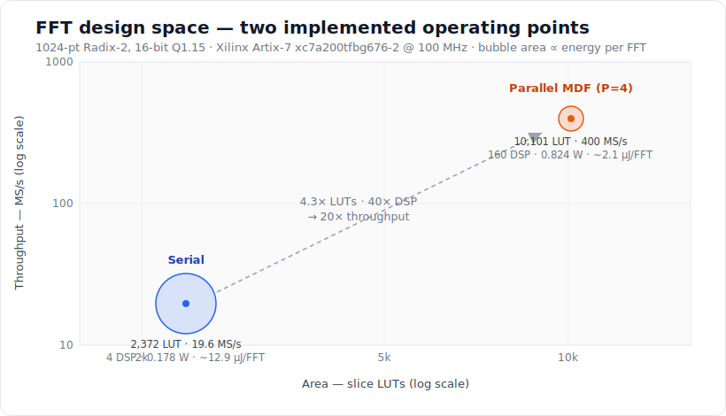

# FPGA FFT Processor Architectures — Serial vs. Parallel (MSc Thesis)

Design, implementation, and verification of **two complementary 1024-point fixed-point FFT processors** on a Xilinx Artix-7 FPGA — a compact time-multiplexed **serial** core and a high-throughput **parallel Multi-path Delay Feedback (MDF)** core — built with the *same* arithmetic, device, clock, and verification methodology so the comparison is apples-to-apples.


<p align="center">
  
</p>

> **📄 Read the full thesis:** [`docs/Ntoumas_MSc_Thesis.pdf`](docs/Ntoumas_MSc_Thesis.pdf) — design, implementation, verification, a head-to-head trade-off study, a parametric design-space sweep, and an HLS-vs-RTL comparison.

---

## TL;DR

- **Two architectures, one fair comparison.** A resource-minimal serial core (one butterfly, reused 5,120 times per transform) and a streaming P=4 MDF core (four samples/clock), both 1024-point, 16-bit Q1.15, both on **Artix-7 `xc7a200tfbg676-2`** at **100 MHz with positive slack**.
- **Parallelism is cheaper than its reputation.** The MDF core buys **~20× throughput** for only **4.3× the LUTs** and **~4.6× the power** — and comes out *ahead* on normalized efficiency (MS/s per LUT **and** per watt).
- **Rigorously verified.** A unified **UVM 1.2** environment drives *both* DUTs — one agent/scoreboard/coverage stack, five stimulus families, AXI4-Stream SVA, and a Serial↔Parallel equivalence check → **10/10 PASS**.
- **Characterized like a data converter.** SQNR plus the full DSP figures of merit — **SFDR, THD, SINAD, ENOB, per-bin phase error**.
- **Two extra study chapters.** A **parametric design-space sweep** (transform size × data width × twiddle width × parallelism) and an **HLS-vs-hand-RTL** comparison in Vitis HLS.

---

## The two architectures at a glance

| | [Serial FFT](serial_fft/) | [Parallel MDF FFT](parallel_mdf_fft/) |
|---|---|---|
| **Architecture** | Time-multiplexed single butterfly (radix-2 **DIT**) | Multi-path Delay Feedback, **P=4** (radix-2 **DIF**) |
| **Parallelism** | 1 butterfly/cycle | 4 complex samples/cycle |
| **Throughput** | 19.6 MS/s (19.1 kFFT/s) | 400 MS/s (390.6 kFFT/s) |
| **First-output latency** | ~62.5 µs (~6,250 cyc) | ~5.4 µs (~543 cyc) |
| **Slice LUTs** | 2,372 (1.77 %) | 10,101 (7.55 %) |
| **Slice registers** | 3,087 (1.15 %) | 5,722 (2.13 %) |
| **DSP48E1** | 4 (0.54 %) | 160 (21.62 %) |
| **Block RAM tiles** | 11 (3.01 %) | 0 (distributed RAM) |
| **Fmax / slack @ 100 MHz** | ~152 MHz (+3.42 ns) | ~112 MHz (+1.03 ns) |
| **On-chip power (post-route, SAIF)** | 0.178 W | 0.824 W |
| **Energy per FFT** | ~12.9 µJ | ~2.1 µJ |
| **Scaling** | Adaptive BFP (per-stage CLZ) | Fixed block exponent (÷2¹⁰) |
| **SQNR — Sine / Chirp** | 72.4 / 65.9 dB | 73.5 / 35.0 dB |
| **Interface** | AXI4-Stream (`fft_axi_top.v`) | AXI4-Stream (`fft_axi_top.v`) |

> **Target device:** Xilinx **Artix-7 `xc7a200tfbg676-2`** (speed grade −2), placed & routed in **Vivado 2023.2** at 100 MHz. Yosys `synth_xilinx` is also supported for a fast open-source area sanity check.

---

## What's in here

```
.
├── serial_fft/            Serial FFT processor (RTL + tb + ROM + scripts + README)
│   ├── rtl/               AGU, ping-pong RAM, butterfly, Karatsuba CMUL,
│   │                      BFP scanner/shifter, 1/8-octant twiddle ROM, AXI wrapper
│   ├── tb/  rom/  constrs/  scripts/  synthesis/
│   └── README.md          Full architecture + results (incl. DSP figures of merit)
│
├── parallel_mdf_fft/      Parallel P=4 MDF FFT processor
│   ├── rtl/               FB/NF stages, commuted twiddle mult, delay lines,
│   │                      bit-reversal buffer, block scaler, AXI wrapper
│   ├── tb/  rom/  constraints/  scripts/  synthesis/
│   └── README.md          Full architecture + results (incl. DSP figures of merit)
│
├── UVM/                   Unified UVM 1.2 env driving BOTH DUTs
│                          (agent + SQNR scoreboard + coverage + AXI-Stream SVA)
│
├── common/               Shared DSP-metrics library (SQNR/SFDR/THD/SINAD/ENOB/phase)
├── cosim/                Cross-architecture co-simulation & comparison
│
├── parametric_study/     Design-space sweep: N × data width × twiddle width × P
├── hls/                  Vitis HLS C/C++ re-implementation + HLS-vs-RTL comparison
│
├── docs/                 Compiled thesis PDF + figures
└── README.md             You are here
```

> **Generated artifacts are not version-controlled.** Simulation outputs (`*.vcd/*.wdb/*.csv`, coverage DBs, UVM reference vectors), the `results/` figures, the Vivado project directories, and the Vitis HLS solution trees are all reproducible from the tracked sources and scripts, and are excluded via `.gitignore`. The repo tracks only source, ROMs, constraints, synthesis logs, and documentation.

---

## Key results

### Vivado post-route utilization — `xc7a200tfbg676-2`

| Resource | Serial FFT | Parallel MDF FFT |
|---|---:|---:|
| Slice LUTs            | 2,372 (1.77 %) | 10,101 (7.55 %) |
| Slice registers       | 3,087 (1.15 %) |  5,722 (2.13 %) |
| DSP48E1               |   4 (0.54 %)   |    160 (21.62 %) |
| Block RAM tiles       |  11 (3.01 %)   |      0 (distributed RAM) |
| **Total on-chip power** | **0.178 W** | **0.824 W** |
| **Worst slack @ 100 MHz** | **+3.42 ns** | **+1.03 ns** |

### Signal quality (hardware simulation, AXI flow, vs. float64 NumPy reference)

| Signal | Serial FFT SQNR | Parallel MDF SQNR |
|---|---:|---:|
| Impulse          | 120.00 dB | 120.00 dB |
| DC               |  75.59 dB | 120.00 dB |
| Single-tone Sine |  72.41 dB |  73.48 dB |
| Multi-tone       |  59.75 dB |  68.22 dB |
| Chirp            |  65.88 dB |  34.95 dB |

The Parallel MDF's fixed block exponent (÷2¹⁰) is near-perfect on concentrated-energy signals (impulse, DC) but degrades on the broadband **chirp**, where the Serial FFT's **adaptive BFP** holds the noise floor ~30 dB lower — the clearest evidence that adaptive scaling beats a fixed block exponent on spread-spectrum inputs.

### Throughput, energy & normalized efficiency

| Metric | Serial FFT | Parallel MDF FFT |
|---|---:|---:|
| Throughput | 19.6 MS/s | 400 MS/s |
| Energy per FFT | ~12.9 µJ | ~2.1 µJ |
| MS/s per kLUT | 8.3 | **39.6** |
| MS/s per watt | 110 | **485** |

The Parallel MDF draws ~4.6× more power but computes ~20× as many FFTs in the same time, so it is both the faster **and** the more energy-efficient design *per result* — a quantitative twist on the textbook serial-vs-pipelined trade-off.

---

## Verification

### Unified UVM 1.2 environment ([`UVM/`](UVM/))

A single parameterized environment treats the serial (P=1) and parallel (P=4) DUTs as instances of the **same** agent–scoreboard topology, reusing every component except the bus width.

- **Result:** ✅ **10/10 PASS** (5 stimulus families × 2 DUTs), under Vivado `xsim` 2023.2 (ships UVM 1.2).
- **Equivalence:** a direct Serial↔Parallel cross-check reports **5/5 EQUIV** — two very different micro-architectures compute the same FFT within the worst-case rounding budget of either.
- **Protocol:** `bind`-ed AXI4-Stream SVA (tvalid-hold, tdata/tlast stability under backpressure, no-X) plus functional covergroups (signal kind, amplitude, BFP exponent, peak bin).

```bash
cd UVM
make refs          # generate NumPy reference vectors
make regression    # 5 tests × 2 DUTs  →  "GRAND TOTAL: 10/10 PASS"
make coverage      # merge coverage DBs → cov_html/
make equiv         # Serial↔Parallel equivalence check
```

See **[UVM/README.md](UVM/README.md)** for the full standalone guide.

### DSP figures of merit

Beyond SQNR, both cores are characterized with the standard converter-style metrics — **SFDR, THD, SINAD, ENOB, and per-bin phase error** — via the shared analysis library in [`common/`](common/) and the cross-architecture flow in [`cosim/`](cosim/). Single-tone metrics use the coherent, no-window convention (the Sine test sits exactly on bin 50). Head-to-head on the broadband **chirp**, the ranking flips decisively: Serial holds **65.9 dB / 0.03°** vs. Parallel **35.0 dB / 0.71°**. Full per-metric tables and the fixed-BFP saturation caveat are documented in each architecture's README.

---

## Beyond the two cores

- **[Parametric design-space study](parametric_study/)** — sweeps both cores over transform size *N*, data-path width, twiddle width, and parallelism *P*. Key findings: twiddle width is the master accuracy knob (~6 dB/bit); accuracy is governed by `min(data, twiddle)` width; the serial core is structurally reusable across *N* while the pipelined MDF must be regenerated per size; widening the MDF data path to 32-bit all but closes its broadband-chirp gap; a P=8 variant was built and verified at **800 MS/s**.
- **[HLS vs. hand-written RTL](hls/)** — both architectures re-implemented in C/C++ with **Vitis HLS** and compared against the hand RTL on the same device and clock. The verdict is architecture-dependent: HLS is ~9× larger and ~7× slower on the resource-shared **serial** core, but **competitive** on the streaming **MDF** (matches throughput, higher Fmax, fewer LUTs) from ~4–5× shorter source.

---

## Reproduce

```bash
# Serial FFT — generate ROMs, simulate, generate report
cd serial_fft
python scripts/twiddle_generator.py    # rom/cos.mem + sin.mem
python scripts/fft_verify_serial.py    # AXI sim + SQNR + PNG report
python scripts/thesis_report_xc7.py    # comprehensive Artix-7 figure

# Parallel MDF FFT — generate ROMs, simulate, generate report
cd parallel_mdf_fft
python scripts/gen_twiddle.py          # rom/tw_*.hex
python scripts/fft_verify.py           # simulate + SQNR + PNG report
python scripts/thesis_report.py        # comprehensive Artix-7 figure
```

**Requirements:** Icarus Verilog, Python 3.8+, NumPy, Matplotlib. Full synthesis/P&R: Xilinx Vivado 2023.2 (utilization, Fmax, SAIF power). Open-source area sanity check: Yosys 0.56+ (`synth_xilinx`). UVM regression: Vivado `xsim` 2023.2.

---

## Author

**Christos Ntoumas** — MSc Thesis, Department of Physics, Aristotle University of Thessaloniki
Supervisor: Prof. Konstantinos Siozios

## License

Code is released under the [MIT License](LICENSE). The thesis PDF in [`docs/`](docs/) is the author's academic work — please cite rather than redistribute as your own.
