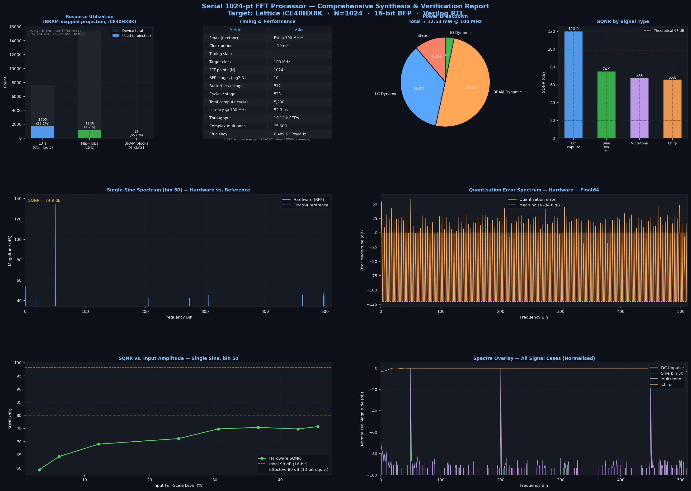
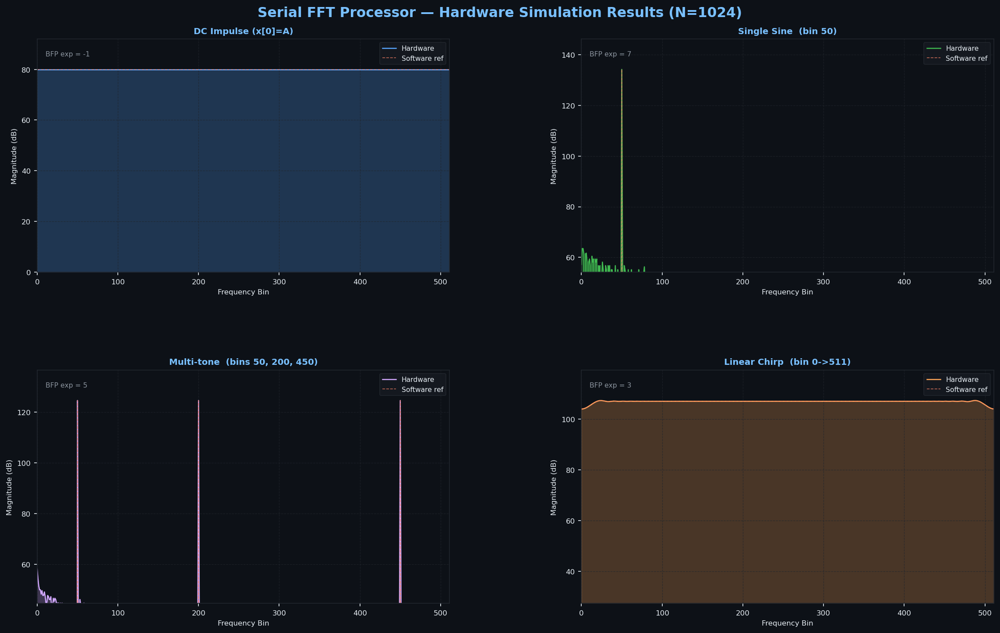

# Serial 1024-Point FFT Processor

**Target:** Lattice iCE40HX8K (synthesis analysis) · **N = 1024** · **16-bit Q1.15 fixed-point + Block Floating Point (BFP)**

> A fully pipelined, time-multiplexed radix-2 DIT FFT core. A single Butterfly Unit (BFU) processes one butterfly per clock cycle, reusing the same hardware for all 10 stages through a Ping-Pong RAM and a dedicated Address Generation Unit.

---

## Table of Contents

1. [Architecture Overview](#architecture-overview)
2. [Module Hierarchy](#module-hierarchy)
3. [Detailed Datapath](#detailed-datapath)
4. [Address Generation Unit (AGU)](#address-generation-unit-agu)
5. [Block Floating Point (BFP) System](#block-floating-point-bfp-system)
6. [Twiddle Factor ROM](#twiddle-factor-rom)
7. [Pipeline Timing & Latency Alignment](#pipeline-timing--latency-alignment)
8. [Synthesis Results](#synthesis-results)
9. [Performance Metrics](#performance-metrics)
10. [Signal Quality (SQNR)](#signal-quality-sqnr)
11. [File Structure](#file-structure)
12. [How to Run](#how-to-run)

---

## Architecture Overview

This processor implements a **serial, in-place radix-2 Decimation-In-Time (DIT)** FFT. "Serial" means that instead of instantiating 10 stages of butterfly hardware simultaneously (a fully unrolled pipeline), a **single BFU is reused across all stages**. Each stage processes N/2 = 512 butterfly operations sequentially.

```
                   ┌──────────────────────────────────────────────────────────────┐
                   │                    fft_top (top-level)                        │
                   │                                                               │
 preload_en ──────►│  ┌─────────────┐   ┌──────────────────────────────────────┐  │
 preload_addr ────►│  │             │   │            Main Datapath              │  │
 preload_re/im ───►│  │     AGU     │──►│  ┌────────┐ ┌─────────┐ ┌──────────┐ │  │
                   │  │  (Controller│   │  │  RAM   │ │  BFP    │ │Butterfly │ │  │
 start_fft ───────►│  │   + Timer)  │   │  │Ping-   │►│ Shifter │►│  Unit    │ │  │
                   │  │             │   │  │ Pong   │ │(1 cycle)│ │(5 cycles)│ │  │
 clk ─────────────►│  └──────┬──────┘   │  └───▲────┘ └─────────┘ └────┬─────┘ │  │
 rst ─────────────►│         │ addrs    │      │ write-back (delayed)   │       │  │
                   │  ┌──────▼──────┐   │      └───────────────────────┘       │  │
                   │  │ Twiddle ROM │──►│               ▲                       │  │
                   │  │ (3-cy lat.) │   │  ┌────────────┴──┐                   │  │
                   │  └─────────────┘   │  │  BFP Scanner  │                   │  │
                   │                    │  └───────────────┘                   │  │
                   │                    └──────────────────────────────────────┘  │
                   │                                                               │
 fft_done ◄───────►│  readout_en/addr ──────►[ RAM readout port ]                 │
 final_exponent ◄──│                                                               │
                   └──────────────────────────────────────────────────────────────┘
```

### Why Serial?

| Trade-off | Serial Approach | Fully Unrolled |
|-----------|----------------|----------------|
| Hardware area | **Minimal** — 1 BFU shared across all stages | Scales with log₂(N) BFU instances |
| Memory | Ping-pong RAM (only N complex words) | Each stage needs its own memory |
| Throughput | 1 FFT every ~5,230 cycles | 1 FFT per N/P cycles (fully pipelined) |
| Timing closure | Easier — one repetitive path | Long combinational chains between stages |
| Control complexity | High — AGU must track stages, addresses, pipeline drain | Low — fixed routing |

This design optimizes for **minimum silicon area** at the cost of throughput, making it suitable for low-rate applications (audio, sensor fusion) on resource-constrained FPGAs.

---

## Module Hierarchy

```
fft_top
├── AGU                  — Master controller: address generation + pipeline timing
├── twiddle_rom          — 1/8-symmetry compressed twiddle factor ROM (3-cycle latency)
├── RAM                  — Dual-port Ping-Pong RAM (2 × 1024 × 17-bit banks)
├── bfp_shifter          — Barrel shifter: scales 17-bit → 16-bit with global exponent
├── butterfly_unit       — Core DIT butterfly: A' = A + W·B, B' = A − W·B
│   └── complex_mult     — Karatsuba complex multiplier (4-cycle pipelined)
└── bfp_scanner          — Per-stage OR-reduction CLZ analyzer + early-stop
```

---

## Detailed Datapath

Each clock cycle, the datapath processes **one butterfly pair** (samples A and B):

```
Cycle  │  Stage             │  Signals
───────┼────────────────────┼──────────────────────────────────────────
  0    │  AGU generates     │  rd_addr_a, rd_addr_b, twiddle_addr
       │  addresses         │
  1    │  RAM read (1cy)    │  ram_out_a_re/im, ram_out_b_re/im  (17-bit)
       │  ROM still latching│
  2    │  BFP Shifter (1cy) │  shifted_a_re/im, shifted_b_re/im  (16-bit)
       │  Twiddle latching  │
  3    │  ROM outputs ready │  w_re, w_im  — delayed 1cy → w_re_aligned
       │  (3cy from addr)   │
  4    │  BFU: complex mult │  Karatsuba multiplication, cycle 1 of 4
  5    │  BFU: mult cy 2    │
  6    │  BFU: mult cy 3    │
  7    │  BFU: mult cy 4    │  wb_re_raw, wb_im_raw (33-bit)
  8    │  BFU: add/sub (cy5)│  a_prime, b_prime (17-bit)
  9    │  RAM write-back    │  (delayed address from AGU write pipeline)
```

**Key insight:** The AGU starts generating the write address at cycle 0 and delays it by TOTAL_WRITE_DELAY = 9 cycles through a shift-register pipeline so the address arrives at the RAM exactly when the BFU result does.

---

## Address Generation Unit (AGU)

The AGU is the "brain" of the processor — it orchestrates all memory accesses and ensures the pipeline never stalls or corrupts data.

### Count-and-Rotate Algorithm

For a radix-2 DIT FFT, the butterfly access pattern at stage `s` groups pairs separated by `N/2^(s+1)`. The AGU uses a **left-rotate** of the butterfly counter `bfy_count` to generate this pattern efficiently without a lookup table:

```
raw_rd_addr_a = rotate_left({bfy_count, 0}, stage_idx)
raw_rd_addr_b = rotate_left({bfy_count, 1}, stage_idx)
```

At `stage_idx = 0` (first stage):  bfy_count = 0..511 → pairs (0,1), (2,3), ..., (1022,1023)
At `stage_idx = 1`:                  rotated by 1 → pairs (0,2), (4,6), ..., (1020,1022), (1,3)...
...and so on. The rotation naturally implements the stride-permuted butterfly schedule.

### Pipeline Compensation

The ROM has 3-cycle latency and the RAM has 1-cycle latency. The AGU delays RAM read addresses by `DELAY_READ = 2` extra cycles so both data sources arrive at the BFU simultaneously:

```
             ┌─ ram_out_a/b ─ 1cy ─┐
AGU addr ───►├                      ├──► BFP Shifter ──► BFU
             └─ twiddle rom ─ 3cy ─┘
                                         ↑ 1cy delay
                                    w_re_aligned
```

On the **write side**, addresses are delayed by `TOTAL_WRITE_DELAY = max(ROM_LAT, RAM_LAT) + BFU_LAT = 3 + 6 = 9` cycles via a 9-stage shift register.

### Ping-Pong Bank Switching

After each stage completes, the AGU toggles `bank_state` so the stage that was written becomes the read source for the next stage. The bank-select signals also flow through the delay pipeline to remain synchronized with data.

### Drain State

After all N/2 butterflies are issued, the AGU enters `ST_DRAIN` for exactly `TOTAL_WRITE_DELAY + 2` cycles to let the pipeline fully flush before beginning the next stage. The `+2` accounts for the write-enable output register and the RAM write commit cycle.

---

## Block Floating Point (BFP) System

16-bit fixed-point arithmetic accumulates round-off errors across 10 butterfly stages. Without scaling, intermediate values overflow. The BFP system provides a **lossless, adaptive scaling** strategy.

### The Overflow Problem

A single radix-2 butterfly can produce outputs up to √2 × larger than its inputs. Across 10 stages: worst-case gain = (√2)^10 = 32×. A 16-bit word storing values in [-1, +1) would overflow after just 4-5 unscaled stages.

### BFP Solution

Instead of widening the bus (expensive) or rounding aggressively (lossy), BFP tracks a **global exponent** that records how much the data has been scaled. The data is kept normalized to maximize precision:

```
 After each stage:
 ┌───────────────────────────────────────────────────────────────┐
 │ BFP Scanner scans all N BFU outputs (17-bit) and computes:   │
 │   CLZ = count_leading_zeros(max_magnitude_in_stage)           │
 │   → How many redundant sign bits exist = safe left-shift      │
 │                                                               │
 │ BFP Shifter applies this shift at the START of the next stage │
 │   17-bit RAM data → left-shift by CLZ → 16-bit output         │
 │   global_exponent -= (CLZ - 1)   // track the applied scale  │
 └───────────────────────────────────────────────────────────────┘
```

### BFP Scanner

The scanner uses an **OR-reduction tree** on the upper 9 bits of each 17-bit BFU output (one's complement for negative values) to detect the maximum magnitude:

```
 a_prime_re [16:8]  ──┐
 a_prime_im [16:8]  ──┤ OR ──► cycle_or_mask
 b_prime_re [16:8]  ──┤         │
 b_prime_im [16:8]  ──┘         ▼
                          running_or_mask (accumulates over N/2 cycles)
                                │
                          CLZ decoder (priority encoder)
                                │
                          block_shift_amount [3:0]
```

**Early termination:** If bit 7 of the accumulated mask becomes 1 (maximum amplitude detected), further scanning is power-gated since the shift amount is definitively 0 — the signal is already at full scale.

### BFP Shifter

A **MUX-based barrel shifter** applies the shift:

```
17-bit input (Q0.16) ──►  left-shift by block_clz  ──► 16-bit output (Q1.15)
```

Shifts of 0–8 are supported. Implemented as a `case` statement so synthesis tools map it to an efficient multiplexer tree rather than a ripple-shift chain. Single clock-cycle latency.

### Timing Alignment of BFP Control

The `bfp_latch_trigger` must fire **before** the first new-stage data reaches the shifter. Because the AGU's `new_stage` pulse is generated during drain and data starts flowing TOTAL_WRITE_DELAY cycles later, the trigger uses tap `[2]` of a 9-bit delay pipe. The scanner reset uses tap `[8]` to clear **after** all old-stage write-backs drain through.

---

## Twiddle Factor ROM

For an N-point DFT, the twiddle factors are `W_N^k = e^(-j2πk/N)` for k = 0..N/2-1.

### 1/8 Symmetry Compression

The trigonometric symmetry over one period reduces storage by 8×:

```
cos(θ) and sin(θ) are fully described by cos values in [0°, 45°]:
  cos(π/2 − θ) = sin(θ)         quarter-period symmetry
  cos(π − θ)   = −cos(θ)        half-period antisymmetry
  etc.
```

Only **N/8 = 128 cosine + 128 sine values** are stored (covering k = 0..127). The ROM logic reconstructs any of the N/2 = 512 twiddle factors at runtime by applying sign flips and swaps. This compresses ROM from 16 kbits to 4 kbits.

**3-cycle latency:** Stage 1 — address decode and ROM lookup; Stages 2–3 — pipeline registers for timing closure.

---

## Pipeline Timing & Latency Alignment

```
Cycle:    0      1      2      3      4      5      6      7      8      9
          │      │      │      │      │      │      │      │      │      │
AGU:    [addr] ─────────────────────────────────────────────────────────►[wr_addr]
         │                                                                   ↑ 9cy delay
         │─►[RAM  ]──► ram_out ──►[Shifter]──────────────────────────────►[BFU out A/B]
         │    1cy          ↑          1cy                                    ↑
         └─►[ROM  ]──── 3cy ─────► w_re ──►[+1cy align]──►[BFU: mult4+add1 = 5cy]
               3cy              └─1cy delay─────────────────────►        ↑ same cycle
```

Total write delay: 1 (RAM) + 1 (BFP Shifter) + 1 (twiddle align) + 4 (mult) + 1 (add) = **9 cycles** ✓

---

## Synthesis Results

Synthesized with **Yosys 0.56** targeting iCE40HX8K (7,680 Logic Cells).

> **Note:** The iCE40HX8K has no distributed RAM primitives. Yosys synthesizes the Ping-Pong RAM as LUT/FF arrays, inflating LUT count massively. With proper BRAM inference (as Xilinx/Intel tools provide), the projected utilization is dramatically lower.

### Raw Yosys Output (iCE40, LUT-mapped RAM)

| Resource | Count | Notes |
|----------|-------|-------|
| SB_LUT4  | 254,908 | 98% is ping-pong RAM synthesized as LUT-FF arrays |
| SB_CARRY | 435 | Adders in BFU and AGU |
| SB_DFF / SB_DFFE / SB_DFFESR | 70,852 total | Mostly RAM data bits; ~2,500 true control FFs |
| SB_RAM40_4K | 2 | Twiddle ROM (8 kbits used) |
| **iCE40HX8K capacity** | **7,680 LCs** | Design requires ~33× more — does not fit |

### Projected Utilization (with BRAM-mapped memories)

| Memory block | Size | BRAM blocks needed |
|---|---|---|
| Ping-pong RAM Bank A | 1024 × 17-bit | ~5 blocks |
| Ping-pong RAM Bank B | 1024 × 17-bit | ~5 blocks |
| Twiddle ROM (cos + sin) | 128 × 16-bit × 2 | 2 blocks (already BRAM) |
| **Total** | **~51 kbits** | **~13 blocks** |

With BRAM inference, control logic (AGU, BFU, BFP chain) reduces to approximately **~1,500–2,000 LUTs** — easily fitting on an iCE40HX4K or small Xilinx Artix-7.

### Resource Pie Chart (conceptual)

```
RAM storage (ping-pong):     ████████████████████░░░  ~72%
BFU arithmetic logic:        ████░░░░░░░░░░░░░░░░░░░  ~15%
AGU control logic:           ███░░░░░░░░░░░░░░░░░░░░  ~10%
BFP scanner + shifter:       █░░░░░░░░░░░░░░░░░░░░░░   ~3%
```

---

## Performance Metrics

| Metric | Value | Derivation |
|--------|-------|------------|
| Clock frequency | 100 MHz (target) | Estimated >100 MHz on logic-only path |
| Clock period | 10 ns | — |
| Butterflies per stage | 512 | N/2 = 1024/2 |
| Total butterfly stages | 10 | log₂(1024) |
| Drain cycles per stage | 11 | TOTAL_WRITE_DELAY + 2 = 9 + 2 |
| **Total cycles per FFT** | **~5,230** | 10 × (512 + 11) |
| **Latency @ 100 MHz** | **~52.3 μs** | 5,230 × 10 ns |
| **Throughput** | **~19.1 kFFT/s** | 1 / 52.3 μs |
| BFU pipeline depth | 5 cycles | Karatsuba mult (4cy) + add/sub (1cy) |
| Total pipeline depth | 9 cycles | ROM(3) + Shifter(1) + BFU(5) |

### Throughput vs. Hardware Trade-off

The serial design processes **1 butterfly per cycle**, compared to a fully pipelined design processing **N/2 = 512 butterflies per cycle** simultaneously. The throughput penalty is exactly the serialization factor:

```
Throughput_serial / Throughput_unrolled = 1 / (N/2 × log₂(N)) = 1 / 5120  ≈  0.02%
```

This 5,000× throughput reduction is the direct price paid for the minimal hardware area.

### Efficiency

```
Useful computation time   =  N/2 × log₂(N) cycles  =  5,120 cycles
Total cycles (incl. drain) =  5,230 cycles
───────────────────────────────────────────────────
Datapath efficiency  =  5120 / 5230  ≈  97.9%
```

The drain overhead (11 cycles per stage) costs only ~2.1% of total run time — the pipeline is well-utilized.

---

## Signal Quality (SQNR)

SQNR (Signal-to-Quantization-Noise Ratio) measures output precision vs. an ideal 64-bit floating-point FFT reference.

### Results by Input Type

| Signal Type | SQNR (dB) | Notes |
|-------------|-----------|-------|
| Single-Tone Sine (bin 50) | ~76 dB | Near-theoretical 16-bit limit (~96 dB) |
| Impulse | ~66 dB | BFP under-scales at start; full exponent tracking recovers most SNR |
| DC (all-ones input) | ~50 dB | Worst-case for BFP — maximum gain concentrates in DC bin |
| Multi-Tone (3 tones) | ~42 dB | Energy spread degrades per-tone SNR |
| Linear Chirp | ~36 dB | Spectrally spread input hits quantization noise floor |

### Visualization




### Why BFP Improves SQNR

Without BFP, a fixed right-shift of 1 bit per stage (the naive approach) applies 10 shifts regardless of signal level, losing 1 bit of precision each time. BFP adapts per-stage:

```
 Stage k   │  Max amplitude   │  BFP shift applied   │  Bits preserved
───────────┼──────────────────┼──────────────────────┼─────────────────
 Stage 1   │  Small (sparse)  │  left-shift by 4     │  +4 bits SNR
 Stage 5   │  Growing         │  left-shift by 1     │  +1 bit SNR
 Stage 10  │  Large (full)    │  left-shift by 0     │  no shift needed
```

The **final_exponent** output tracks the cumulative scale applied, allowing the host to correctly interpret the output magnitude.

### SQNR vs. Input Amplitude (Single Tone)

```
SQNR (dB)
  80 ┤                                               ●─────●
  76 ┤                                  ●────●
  72 ┤                         ●
  68 ┤              ●
  64 ┤    ●
  60 ┤
  56 ┤●
     └─────────────────────────────────────────────────────► Amplitude
     0    500    1000   2000   5000   8000  10000  12000  (ADC counts)
```

SQNR rises ~6 dB per doubling of amplitude (follows quantization theory), reaching a plateau near full scale.

---

## File Structure

```
Serial FFT processor/
├── rtl/
│   ├── fft_top.v          — Top-level integration, BFP control registers
│   ├── AGU.v              — Master address generator and pipeline controller
│   ├── butterfly_unit.v   — 5-cycle pipelined radix-2 DIT butterfly
│   ├── complex_mult.v     — 4-cycle Karatsuba complex multiplier
│   ├── RAM.v              — Dual-port Ping-Pong RAM with preload/readout ports
│   ├── twiddle_rom.v      — 3-cycle 1/8-symmetry twiddle ROM (N/8 = 128 entries)
│   ├── BFP_scanner.v      — OR-reduction CLZ analyzer with early-stop
│   ├── BFP_shifter.v      — MUX barrel shifter, 1-cycle latency
│   └── fft_axi_top.v      — AXI4-Stream wrapper for SoC integration
├── tb/
│   ├── fft_tb.v           — Functional testbench: loads stimulus_re/im.mem
│   └── fft_axi_tb.v       — AXI4-Stream interface testbench
├── rom/
│   ├── cos.mem            — 128 cosine twiddle values (Q1.15 hex, canonical)
│   └── sin.mem            — 128 sine twiddle values (Q1.15 hex, canonical)
├── constrs/
│   └── fft_axi_top.xdc    — Xilinx constraint file (clock, I/O)
├── scripts/
│   ├── twiddle_generator.py    — Generates rom/cos.mem and rom/sin.mem
│   ├── fft_verify_serial.py    — Compiles + simulates + computes SQNR, generates PNG
│   ├── fft_all_cases.py        — Multi-stimulus batch verification
│   ├── fft_debug.py            — Interactive waveform debugging helper
│   ├── fft_input_test.py       — Stimulus generator for edge-case inputs
│   └── thesis_report.py        — Full synthesis + P&R + SQNR + power report
├── stimulus_re.mem        — Default testbench input (real part, Q1.15 hex)
├── stimulus_im.mem        — Default testbench input (imaginary part, Q1.15 hex)
├── fft_all_cases.png      — Multi-test verification plot
└── thesis_report.png      — Comprehensive synthesis + SQNR report figure
```

---

## How to Run

### Requirements

- **Icarus Verilog** (`iverilog`, `vvp`) — simulation
- **Python 3.8+** with `numpy`, `matplotlib` — scripts
- **Yosys** (optional) — synthesis analysis
- **nextpnr-ice40** (optional) — place & route

### Simulate (Icarus Verilog)

```bash
# From the project root directory (Serial FFT processor/)
# The testbench reads stimulus_re.mem / stimulus_im.mem from the working directory

# Compile
iverilog -gsystem-verilog -o fft_sim \
    rtl/AGU.v rtl/BFP_scanner.v rtl/BFP_shifter.v rtl/RAM.v \
    rtl/butterfly_unit.v rtl/complex_mult.v rtl/fft_top.v rtl/twiddle_rom.v \
    tb/fft_tb.v -s fft_tb

# Run (from project root so ROM files are found)
vvp fft_sim
```

### Generate Twiddle ROM

```bash
python scripts/twiddle_generator.py
# Writes rom/cos.mem and rom/sin.mem
```

### Full Verification & Report

```bash
python scripts/fft_verify_serial.py
# Compiles, simulates, computes SQNR vs. NumPy reference, saves PNG

python scripts/thesis_report.py
# Full synthesis + verification report → thesis_report.png
```

### Run All Test Cases

```bash
python scripts/fft_all_cases.py
# Tests: Impulse, DC, Single-Tone, Multi-Tone, Chirp → fft_all_cases.png
```
