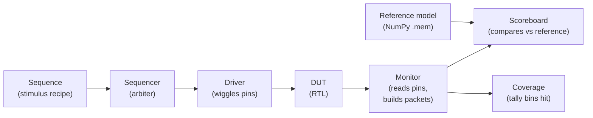
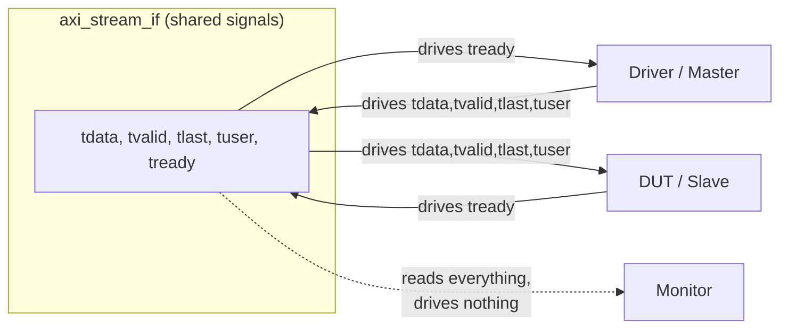
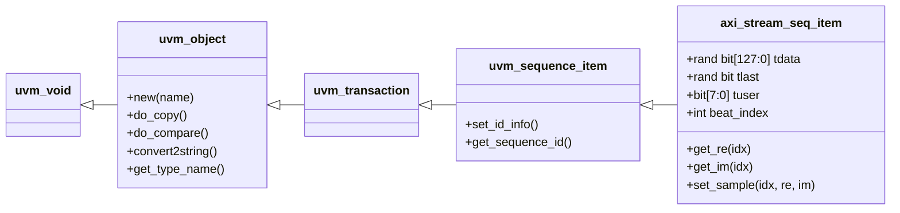
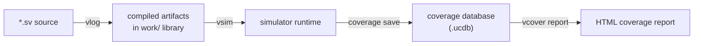
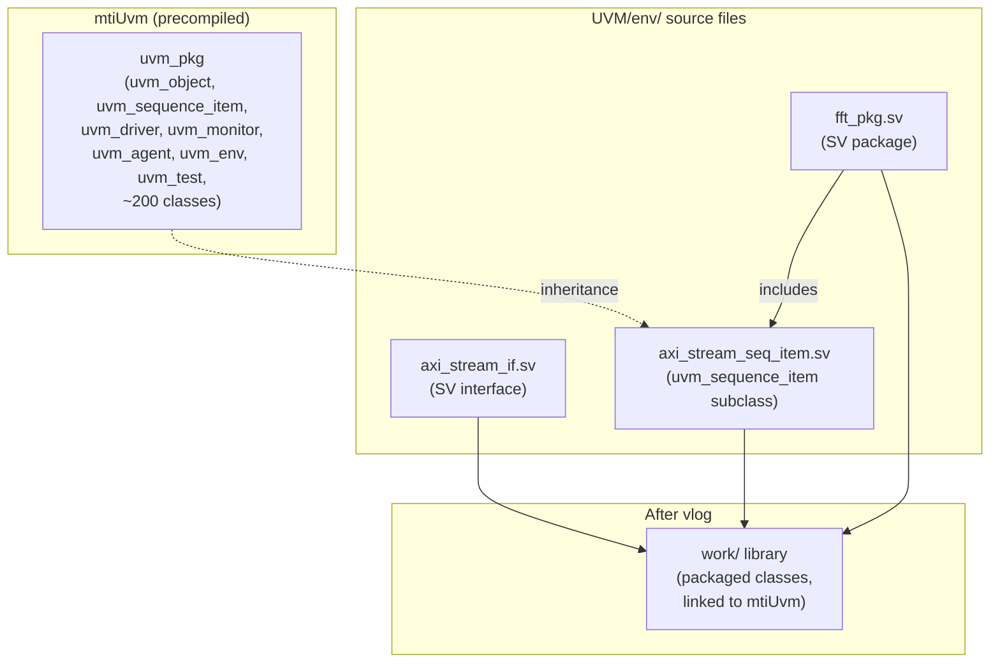

# Day 1 — UVM + SystemVerilog deep-dive walkthrough

**Audience:** Familiar with Verilog/SystemVerilog modules and basic testbenches; new to UVM and to SV's class system.
**Goal:** Understand *every line* of the four files we wrote, and *why* it's there.

---

## 0. TL;DR — what Day 1 produced

Four files + a directory tree. They don't simulate anything yet — they just declare the
shape of the testbench world we're about to build.

```
UVM/
├── env/
│   ├── axi_stream_if.sv         <- the "wires" (DUT pins, packaged)
│   ├── axi_stream_seq_item.sv   <- one packet of stimulus or observation
│   └── fft_pkg.sv               <- the namespace that holds all UVM classes
└── Makefile                     <- build/run automation
```

`make env-check` proves they compile cleanly against ModelSim's UVM library. We have not yet built a driver, monitor, scoreboard, sequence, agent, env, or test.

---

## 1. The big picture — why UVM at all?

In plain Verilog, a testbench is a single `module` that:
- drives the DUT inputs from an `initial` block,
- watches outputs with `$display`,
- maybe writes results to a `.csv`.

That works for *one* design with *one* set of tests. It collapses the moment you want to:
- run the **same test on two different DUTs** (we need this — Serial vs Parallel),
- run **many randomised tests** with different stimuli,
- collect **coverage** to know what you've actually tested,
- check **AXI4-Stream protocol rules** independently of the test,
- mix-and-match tests on **regression** night.

UVM is a SystemVerilog class library that solves this by splitting the monolithic
testbench into **roles** that talk to each other over standard interfaces:



Day 1 only delivered the **pipe** between Driver↔DUT↔Monitor (the **interface**) and the **packet format** they pass around (the **sequence_item**). Days 2-5 fill in the components.

---

## 2. Directory tour — why this layout?

```
UVM/
├── env/      classes that build the testbench (reusable across tests)
├── seq/      stimulus recipes (one .sv per test type)
├── tests/    "test" classes — pick which sequence(s) to fire and any config
├── tb/       the SystemVerilog `module` that instantiates DUT + interface
│             (the *only* place plain Verilog lives in the testbench)
├── refs/     pre-computed NumPy expected outputs (.mem files)
├── scripts/  Python helpers
└── docs/     this file lives here
```

**Why split env / seq / tests?**
- `env/` is *DUT-independent* infrastructure — should compile once and stay frozen.
- `seq/` is *test-independent* stimulus — "give me a sine wave at bin 50".
- `tests/` is the *experiment* — "run the sine sequence, then the chirp, expect SQNR ≥ 60".

This separation is the heart of UVM's reusability claim. The same `env/` will drive two different DUTs in Day 4.

---

## 3. File 1 — `env/axi_stream_if.sv` (the wires)

### 3.1 What is a SystemVerilog `interface`?

In plain Verilog you'd connect a DUT and a testbench with a pile of `wire` and `reg` declarations:

```verilog
// Plain Verilog testbench style
wire [31:0] tdata;
wire        tvalid;
reg         tready;
wire        tlast;
wire [7:0]  tuser;

dut_axi_top dut(
    .s_axis_tdata (tdata),
    .s_axis_tvalid(tvalid),
    .s_axis_tready(tready),
    .s_axis_tlast (tlast),
    .s_axis_tuser (tuser),
    ...
);
```

That's seven wires per AXI port and you have to copy the bundle to every module that touches it. SystemVerilog's `interface` construct lets you **package related signals as a single entity**, then pass it around like a typedef:

```systemverilog
axi_stream_if s_if(.clk(clk), .rst(rst));
dut_axi_top dut(.s_axis_tdata(s_if.tdata), ...);
```

Better still, you can pass the *interface itself* into a class (UVM driver) using a **virtual interface handle**. That's the magic glue between the OOP class hierarchy (no pins) and the static RTL hierarchy (only pins).

### 3.2 Walking through our file

```systemverilog
interface axi_stream_if #(
    parameter int unsigned DATA_WIDTH = 16,
    parameter int unsigned P          = 1,
    parameter int unsigned TUSER_W    = 8
)(
    input  logic clk,
    input  logic rst
);
```

**Parameters** (the `#(...)` block):
- `DATA_WIDTH = 16` — one component (real or imag) is 16 bits (Q1.15).
- `P = 1` — how many complex samples are packed per AXI beat. Serial uses 1; Parallel uses 4.
- `TUSER_W = 8` — the side-channel that carries the BFP exponent on M_AXIS.

Why parameterise? Because we will instantiate **two copies** in Day 3:
```systemverilog
axi_stream_if #(.P(1)) s_if(...);   // Serial S_AXIS
axi_stream_if #(.P(4)) m_if(...);   // Parallel M_AXIS (later)
```
One interface definition, two physical instances with different widths.

**Ports** (the `(...)` block after the parameter list): `clk` and `rst` are the *only* signals coming in from outside — they're driven by the testbench's clock generator. Everything else (`tdata`, `tvalid`, ...) is *internal* to the interface and connects the DUT to whoever drives the interface.

```systemverilog
    localparam int unsigned TDATA_W = P * 2 * DATA_WIDTH;
    logic [TDATA_W-1:0] tdata;
    logic               tvalid;
    logic               tready;
    logic               tlast;
    logic [TUSER_W-1:0] tuser;
```

`localparam` is a parameter computed inside the module/interface body — the user can't override it from outside. `TDATA_W = P × 2 × DATA_WIDTH` so:
- P=1 → 32-bit beat (1 sample × 16 re + 16 im)
- P=4 → 128-bit beat (4 samples × 16 re + 16 im each)

`logic` is SystemVerilog's universal 4-state type. It replaces both `wire` and `reg` from old Verilog. The compiler figures out from context whether it needs to be a net (driven from outside via continuous assignment) or a variable (assigned in a procedural block).

### 3.3 Modports — different *views* of the same signals

```systemverilog
    modport master (
        output tdata, tvalid, tlast, tuser,
        input  tready,
        input  clk, rst
    );

    modport slave (
        input  tdata, tvalid, tlast, tuser,
        output tready,
        input  clk, rst
    );

    modport monitor (
        input  tdata, tvalid, tlast, tuser, tready,
        input  clk, rst
    );
```

A **modport** declares which signals are inputs and which are outputs *from a specific viewpoint*. Same physical interface, three viewpoints:



**Why bother?**
- Compile-time safety — if our driver tries to assign `tready`, the compiler errors because `master` says `tready` is an `input`.
- Self-documenting — anyone reading the file knows exactly who's driving what.
- Required for the **virtual interface handle** trick later (UVM driver takes `virtual axi_stream_if.master vif`).

The `monitor` modport has **everything as input** — a monitor must not drive anything (a "passive observer").

### 3.4 Clocking blocks — getting timing right

```systemverilog
    clocking drv_cb @(posedge clk);
        default input #1step output #1ns;
        output tdata, tvalid, tlast;
        input  tready, tuser;
    endclocking

    clocking mon_cb @(posedge clk);
        default input #1step;
        input  tdata, tvalid, tlast, tuser, tready;
    endclocking
```

A **clocking block** is a synchronous *envelope* around a set of signals that says "all reads and writes through this block happen at `posedge clk`, with these timing skews":

- `default input #1step` — when the driver *reads* `tready`, it sees the value as it stood *immediately before* the clock edge (the `#1step` is a special "preponed" sample).
- `default output #1ns` — when the driver *writes* `tdata`, the wire is updated **1 ns after** the clock edge. This avoids race conditions between the DUT (which drives at posedge) and the testbench (which would otherwise drive at the *same* posedge and lose).

**Picture of one beat:**

```
                        ┌──── posedge clk ────┐
clk     ___________/¯¯¯¯¯¯¯¯¯¯¯¯¯¯¯¯¯¯¯¯¯¯¯\__________
                        │                    │
sample inputs   ────────●  ◄── read tready, tuser HERE (preponed)
                        │
write outputs   ────────● ◄─── 1ns later... tdata, tvalid, tlast change
                        │
                        ▼
                     #1ns
```

We have two clocking blocks because the driver and monitor have different needs:
- `drv_cb` — drives 3 signals, reads 2.
- `mon_cb` — reads everything, drives nothing (passive snoop).

`#1step` is special: "the latest stable value before this edge". Using it for monitor reads guarantees we see what the DUT actually sent, not what's being scheduled for the *next* cycle.

### 3.5 The convenience `handshake` wire

```systemverilog
    wire handshake = tvalid & tready;
```

A tiny named wire so SVA properties and waveforms can refer to "a beat happened" with a single signal. AXI4-Stream defines a *handshake* as the rising edge where both `tvalid` and `tready` are high — that's when one transaction transfers.

---

## 4. File 2 — `env/axi_stream_seq_item.sv` (the packet)

### 4.1 What is a `uvm_sequence_item`?

In OOP terms: a class that represents **one transaction**. For us, that's one AXI beat — one set of {tdata, tvalid, tlast, tuser} values. A sequence produces a stream of these; a driver consumes them and translates them to pin wiggles; a monitor produces them by observing pin wiggles.

Why a class and not just a `struct`? Because UVM needs to:
- Randomise the field values (`rand`)
- Copy / compare / print them generically (`uvm_field_*` macros)
- Allocate them via the factory (`type_id::create()`)



Our class lives at the bottom of that hierarchy. Most of the cool methods (`copy`, `compare`, `print`, `clone`) come for free — we just had to call the right factory macros.

### 4.2 The fields

```systemverilog
    rand bit [127:0] tdata;
    rand bit         tlast;
    bit [7:0]        tuser;
    int              beat_index;
```

- `rand` keyword marks fields the **constraint solver** can randomise on `item.randomize()`. We want random `tdata` and `tlast` for stress tests later; `tuser` (BFP exponent) is *captured*, never driven, so it doesn't need `rand`.
- `bit [127:0]` is the *widest* tdata we'll ever need (P=4 × 32 bits/sample). For P=1, the upper 96 bits stay zero. Same class for both DUTs — no duplication.
- `beat_index` is bookkeeping — "this is the 437th item in a 1024-beat block". The monitor stamps it for trace-readability.

### 4.3 Constraints

```systemverilog
    rand int unsigned ready_delay;
    constraint c_ready_delay { ready_delay inside {[0:3]}; ready_delay dist {0:=80, [1:3]:=20}; }
```

`ready_delay` controls back-pressure: when this beat goes out, optionally hold `tready` low for `ready_delay` cycles afterwards. The **constraint** says:
- `inside {[0:3]}` — value must be 0, 1, 2 or 3.
- `dist {0:=80, [1:3]:=20}` — 80 % of the time `ready_delay==0` (no back-pressure); the remaining 20 % is split evenly across 1-3.

This is how UVM stress-tests timing edge-cases without us writing 30 hand-crafted scenarios.

### 4.4 The `uvm_object_utils_begin/end` block — the factory dance

```systemverilog
    `uvm_object_utils_begin(axi_stream_seq_item)
        `uvm_field_int(tdata,       UVM_DEFAULT | UVM_HEX)
        `uvm_field_int(tlast,       UVM_DEFAULT)
        `uvm_field_int(tuser,       UVM_DEFAULT)
        `uvm_field_int(beat_index,  UVM_DEFAULT | UVM_DEC | UVM_NOCOMPARE)
        `uvm_field_int(ready_delay, UVM_DEFAULT | UVM_DEC | UVM_NOCOMPARE)
    `uvm_object_utils_end
```

These look like Verilog code but they're **macros** — text that the preprocessor expands into ~50 lines of SystemVerilog before compile. The expansion does three jobs:

1. **Factory registration** — `uvm_object_utils_begin(T)` expands to a `typedef` and a `static T type_id` member, so anyone can write `axi_stream_seq_item::type_id::create("item")` and the factory hands them back a fresh instance.

2. **Field automation** — each `uvm_field_int(name, flags)` line adds the field to a list. The base class then knows how to copy / compare / pack / unpack / print it. So when we do:
   ```systemverilog
   item.print();
   ```
   the output magically includes `tdata`, `tlast`, `tuser`, etc. — we never wrote a print method.

3. **Flag fine-tuning:**
   - `UVM_DEFAULT` — participate in all automatic operations.
   - `UVM_HEX` — print as hexadecimal (instead of decimal).
   - `UVM_DEC` — print as decimal.
   - `UVM_NOCOMPARE` — *exclude* this field from automatic compare. `beat_index` is bookkeeping; the scoreboard shouldn't care if two items have different beat indices, only different data.

> **What's a "factory"?** A factory is an OOP pattern where you ask a registry to make you an object of class T, instead of writing `new()` directly. The benefit: you can later *replace* T with a subclass T' (e.g. an "error-injecting" version) across the entire testbench by adding *one* line in your test. Without `uvm_object_utils`, the factory wouldn't know our class exists.

### 4.5 The constructor

```systemverilog
    function new(string name = "axi_stream_seq_item");
        super.new(name);
    endfunction
```

Every UVM class needs a constructor that takes a `name` and forwards to the parent. The default argument means callers can write `new()` or `new("my_item")`. The `name` is used by `uvm_info` / `uvm_warning` calls so log messages identify which item produced them.

### 4.6 The helper functions

```systemverilog
    function automatic bit signed [15:0] get_re(int idx = 0);
        get_re = tdata[idx*32 + 31 -: 16];
    endfunction
```

This is the **sample unpacking** code. Recall the layout for P=4:

```
tdata[127:0] = {sample3, sample2, sample1, sample0}
sampleK[31:0] = {reK[15:0], imK[15:0]}
              31 ─────── 16 15 ─────── 0
                  re_K           im_K
```

So sample index `idx` lives at bits `[idx*32+31 : idx*32]`, with:
- real part at bits `[idx*32+31 : idx*32+16]`
- imag part at bits `[idx*32+15 : idx*32]`

`tdata[idx*32 + 31 -: 16]` is the **`-:` indexed part-select** — "starting from bit `idx*32+31`, take **16 bits going down**". It's the SystemVerilog idiom for variable-width slicing.

`function automatic` — the `automatic` keyword means each call gets a fresh stack frame for locals. Without it, the function would be `static` and a second call before the first returns could corrupt state. Always use `automatic` for class methods unless you have a specific reason not to.

`bit signed [15:0]` — declares the return type as a 16-bit signed value. By default `bit` is unsigned; the `signed` qualifier ensures arithmetic and comparisons treat the MSB as a sign bit.

### 4.7 `convert2string` — the optional override

```systemverilog
    function string convert2string();
        return $sformatf("beat[%0d] tdata=0x%0h tlast=%0b tuser=%0d",
                         beat_index, tdata, tlast, tuser);
    endfunction
```

The base class' default `convert2string` uses the field automation, which produces a verbose multi-line dump. By overriding it with a one-liner, UVM log messages stay readable:

```
[SCOREBOARD] expected beat[437] tdata=0x12340000 tlast=0 tuser=7
[SCOREBOARD] actual   beat[437] tdata=0x12340002 tlast=0 tuser=7
```

`$sformatf` is the SystemVerilog equivalent of C's `sprintf` — same `%d`, `%h`, `%b` format specifiers.

---

## 5. File 3 — `env/fft_pkg.sv` (the namespace)

### 5.1 What is a package?

In Verilog, every module/function/parameter is in a flat global namespace. In SystemVerilog, **packages** let you scope a group of related declarations and import them where needed — exactly like Python modules or C++ namespaces.

```systemverilog
package fft_pkg;
    // ... declarations ...
endpackage : fft_pkg
```

To use stuff from a package, you either:
- `import fft_pkg::*;` — pull everything into the current scope, OR
- `fft_pkg::SIG_SINE` — refer to it by fully qualified name.

UVM itself is a package — that's why every UVM file starts with `import uvm_pkg::*;`.

### 5.2 The imports

```systemverilog
package fft_pkg;
    import uvm_pkg::*;
    `include "uvm_macros.svh"
```

- `import uvm_pkg::*` makes every UVM class (`uvm_sequence_item`, `uvm_driver`, ...) visible.
- `\`include "uvm_macros.svh"` brings in the **macros** (`uvm_info`, `uvm_object_utils`, ...). Macros are not classes — they're textual substitutions — so they're not imported, they're textually pasted.

**Why does the macro file have to be `\`include`d in every file that uses macros?** Because macros aren't part of the SystemVerilog type system — they're a preprocessor concept. The preprocessor scans each file independently; it doesn't know about packages.

### 5.3 Compile-time constants

```systemverilog
    localparam int unsigned FFT_N          = 1024;
    localparam int unsigned FFT_DATA_WIDTH = 16;
    localparam int unsigned FFT_TUSER_W    = 8;
```

`localparam` declares a compile-time constant that can't be overridden from outside the package. It's the SV equivalent of a `const` in C++. Using these instead of magic numbers means we can change N from 1024 to 4096 in one place if the design ever scales.

### 5.4 The enumeration

```systemverilog
    typedef enum int {
        SIG_IMPULSE   = 0,
        SIG_DC        = 1,
        SIG_SINE      = 2,
        SIG_MULTITONE = 3,
        SIG_CHIRP     = 4
    } sig_kind_e;
```

A `typedef enum` creates a new type that can hold only the listed values. Compared to plain `parameter SIG_IMPULSE = 0;`, the enum:
- Catches typos at compile time (`sig_kind_e k = SIG_INPULSE` errors immediately).
- Plays nicely with `case (k)` exhaustiveness checks.
- Auto-prints as `SIG_SINE` instead of `2` in `convert2string`.

The trailing `_e` suffix is a widely-used convention to mark enum types.

### 5.5 Functions in packages

```systemverilog
    function automatic real sqnr_threshold(sig_kind_e k, bit is_parallel);
        case (k)
            SIG_IMPULSE  : sqnr_threshold = 100.0;
            SIG_DC       : sqnr_threshold = is_parallel ? 100.0 : 60.0;
            ...
        endcase
    endfunction
```

A package-level function is callable from any class that imports the package. Treat it like a C `static` function in a header. No `this`, no class state — pure logic.

`return-by-name` — note `sqnr_threshold = 100.0;` (assigning to the function name) instead of `return 100.0;`. Both work in SV; the assignment form is the older Verilog style.

`real` is a 64-bit floating-point type. We use it for SQNR (in dB) where 16-bit integer precision isn't enough.

### 5.6 The conditional includes

```systemverilog
    `include "axi_stream_seq_item.sv"
    // Day 2+ files added below as they come online:
    // `include "axi_stream_driver.sv"
    // ...
```

The package includes the class files **textually**. After preprocessing, the package body contains the entire class source. This is how you bundle many classes into one importable namespace.

**Why include in a package instead of compiling each `.sv` separately?** Because UVM classes reference each other (driver uses sequence_item, agent uses driver+monitor, etc.). If they were in separate packages, you'd hit circular-import issues. Bundling them under one `fft_pkg` sidesteps that.

---

## 6. File 4 — the Makefile

### 6.1 The ModelSim simulation flow

ModelSim (and most commercial SV simulators) has three stages:



| Tool | Role | Analogue |
|---|---|---|
| `vlib work` | Create an empty design library called `work` (just a directory) | `mkdir build/` |
| `vmap work work` | Map the logical name "work" to the physical dir `work/` | symlink |
| `vlog -sv file.sv` | Compile SystemVerilog source into `work` | `gcc -c` |
| `vsim work.tb_top` | Elaborate + simulate `tb_top` from the `work` library | `./a.out` |
| `vcover report` | Render a coverage database to HTML | `lcov` |

### 6.2 The key flags in our `VLOG_FLAGS`

```make
VLOG_FLAGS := -sv -mfcu -timescale=1ns/1ps \
              +incdir+$(UVM_HOME)/src \
              +incdir+env +incdir+seq +incdir+tests
```

- `-sv` — accept full SystemVerilog (not just plain Verilog).
- `-mfcu` — **"Multi-File Compilation Unit"**. Treat all files on the command line as one big compilation unit, so a `\`define` in one file is visible to the next. Without this you'd get cascading errors about undefined macros.
- `-timescale=1ns/1ps` — default time unit 1 ns, precision 1 ps. Applies to any file that doesn't have an explicit `\`timescale`.
- `+incdir+<dir>` — tell the preprocessor where to look for `\`include` files. We point it at the UVM headers and at each subdirectory of our env.

### 6.3 The decision: `mtiUvm` (UVM 1.1d) vs source-compiling UVM 1.2

```make
UVM_HOME := $(MTI_HOME)/verilog_src/uvm-1.1d
UVM_LIB  := mtiUvm
```

ModelSim ships with **two** copies of UVM: 1.1d and 1.2. The default precompiled library `mtiUvm` is 1.1d.

We tried 1.2 first — vlog errored on `Cannot find \`include file "dap/uvm_set_get_dap_base.svh"`. ModelSim's implicit `+incdir` was bypassing our explicit one. We could fight that, but **UVM 1.1d has every feature we need** (sequence_item, driver, monitor, agent, scoreboard, env, test, coverage, factory, config_db). The only thing missing in 1.1d that 1.2 adds is `uvm_reg` modelling (for register-block verification) — we don't need it.

Decision: **use precompiled mtiUvm** (1.1d). Saves a compile step, avoids path-resolution issues, and keeps the build simple.

At simulation time the `-L $(UVM_LIB)` flag tells `vsim` to link against the precompiled library:

```make
$(VSIM) -c -coverage -voptargs="+acc" -L $(UVM_LIB) ...
```

### 6.4 The `env-check` smoke target

```make
env-check: lib
	$(VLOG) $(VLOG_FLAGS) $(ENV_SRCS)
```

Compiles just the interface + the package. Used in Day 1 to verify everything we wrote parses cleanly and links to UVM. Took ~1 second:

```
-- Compiling interface axi_stream_if
-- Compiling package fft_pkg
-- Importing package mtiUvm.uvm_pkg (uvm-1.1d Built-in)
Errors: 0, Warnings: 0
```

The "Importing package mtiUvm.uvm_pkg" line is the precompiled-UVM auto-link working — exactly what we wanted.

---

## 7. The Day-1 mental model — what we've actually built

Here's the picture of the world *as it stands now*, after Day 1:



We have **declared** the wires and the packet shape. Nothing wiggles, nothing observes, nothing checks. Days 2-5 fill those roles.

---

## 8. SystemVerilog concepts you've now used

| Concept | Where it appeared | What it does |
|---|---|---|
| `interface` | axi_stream_if.sv | Bundles related signals; passable to classes via virtual interface |
| `modport` | axi_stream_if.sv | Names a directional view of an interface |
| `clocking block` | axi_stream_if.sv | Synchronous envelope with input/output skew control |
| `parameter` / `localparam` | both | Compile-time constants (overridable / not) |
| `logic` | axi_stream_if.sv | 4-state type, unified wire/reg |
| `bit` | axi_stream_seq_item.sv | 2-state type (0/1, faster sim) |
| `class` | axi_stream_seq_item.sv | OOP — inheritance, polymorphism, dynamic alloc |
| `rand` + `constraint` | axi_stream_seq_item.sv | Random value generation with shaping |
| `function automatic` | axi_stream_seq_item.sv | Pure function with per-call stack frame |
| `-:` indexed part-select | get_re()/get_im() | Variable-width slicing |
| `typedef enum` | fft_pkg.sv | Named integer constants with type-checking |
| `package` / `import` | fft_pkg.sv | Namespace scoping |
| Macros (`uvm_object_utils`, ...) | axi_stream_seq_item.sv | Preprocessor text expansion |

---

## 9. UVM concepts you've now used (or will, very soon)

| Concept | Day | Purpose |
|---|---|---|
| `uvm_sequence_item` | 1 | Base class for transactions |
| Factory registration (`uvm_object_utils`) | 1 | Allow `::type_id::create()` and override later |
| Field automation (`uvm_field_int`) | 1 | Free copy/compare/pack/print |
| Virtual interface | 3 | Pass the SV interface into a UVM class |
| `uvm_driver` | 2 | Consume sequence_items, drive pins |
| `uvm_monitor` | 2 | Observe pins, emit sequence_items |
| `uvm_sequencer` | 2 | Arbitrate between competing sequences |
| `uvm_sequence` | 2 | Recipe for generating sequence_items |
| `uvm_agent` | 2 | Bundles seqr + drv + mon |
| `uvm_scoreboard` | 3 | Compare actual vs expected |
| `uvm_env` | 3 | Bundles all agents + scoreboard + coverage |
| `uvm_test` | 3 | Top-level — picks env + which sequences to run |
| `uvm_config_db` | 3 | Pass config (e.g., virtual interface) into the hierarchy |
| Analysis ports | 3 | Broadcast monitor observations to multiple subscribers |
| `uvm_subscriber` | 5 | Coverage collector — consume from an analysis port |

---

## 10. Cheat sheets

### 10.1 Factory creation idiom

```systemverilog
// WRONG (works but breaks factory override):
axi_stream_seq_item item = new("item");

// RIGHT (lets a test override the type later):
axi_stream_seq_item item;
item = axi_stream_seq_item::type_id::create("item");
```

### 10.2 The `\`uvm_object_utils` macro expansion (paraphrased)

```systemverilog
`uvm_object_utils(axi_stream_seq_item)
```
expands to roughly:
```systemverilog
typedef uvm_object_registry#(axi_stream_seq_item, "axi_stream_seq_item") type_id;
static function type_id get_type();
    return type_id::get();
endfunction
virtual function uvm_object_wrapper get_object_type();
    return type_id::get();
endfunction
virtual function string get_type_name();
    return "axi_stream_seq_item";
endfunction
```

You don't need to memorise that — just know that `::type_id::create()` works because of this expansion.

### 10.3 Common macros and what they output

| Macro | Use | Notes |
|---|---|---|
| `\`uvm_info(ID, MSG, VERB)` | Log at info level | VERB = UVM_LOW / UVM_MEDIUM / UVM_HIGH |
| `\`uvm_warning(ID, MSG)` | Log at warning | Counts toward final report |
| `\`uvm_error(ID, MSG)` | Log at error | Counts; test fails if any |
| `\`uvm_fatal(ID, MSG)` | Log + abort sim | Sequence stops immediately |
| `\`uvm_object_utils(T)` | Register class T with factory | Simple form, no field auto |
| `\`uvm_object_utils_begin(T) … \`uvm_object_utils_end` | As above + field auto block | Used when you have fields to list |
| `\`uvm_component_utils(T)` | Same for components (driver, monitor, …) | Components vs objects differ in lifecycle |

### 10.4 The build / run commands you'll use this week

```bash
make env-check                              # quick parse-only check (Day 1)
make refs                                   # generate NumPy reference .mem files
make serial UVM_TESTNAME=fft_smoke_test     # compile + sim Serial DUT, single test
make parallel UVM_TESTNAME=fft_regression_test  # full regression on Parallel
make regression                             # both DUTs, parse logs
make coverage                               # merge UCDBs, emit HTML
make clean                                  # wipe work/ and coverage
```

---

## 11. What's next — Day 2 preview

By end of Day 2 we want **stimulus reaching the DUT**. That means writing:

1. **`axi_stream_driver.sv`** — extends `uvm_driver#(axi_stream_seq_item)`.
   The `run_phase` loop is the heart of every UVM driver:
   ```systemverilog
   task run_phase(uvm_phase phase);
       forever begin
           seq_item_port.get_next_item(req);   // wait for sequence to produce one
           drive_item(req);                     // wiggle pins per req.tdata, etc.
           seq_item_port.item_done();           // release the sequence
       end
   endtask
   ```

2. **`axi_stream_monitor.sv`** — extends `uvm_monitor`. At every `@(mon_cb)` where `tvalid && tready`, build an `axi_stream_seq_item` and shove it down an **analysis port**.

3. **`axi_stream_agent.sv`** — `uvm_agent` that owns one sequencer + driver + monitor.

4. **Sequences** — five 20-line subclasses that each pick a stimulus pattern and drive N=1024 beats.

5. A throwaway `tb_top.sv` so we can run the impulse sequence and **watch the S_AXIS wires wiggle in waveform**. No DUT yet, no scoreboard — just "did the driver fire?".

That's a busy day, but with the templates already in the plan it's mostly typing.

---

*End of Day 1 walkthrough. Open this file alongside the source code and read the
section that matches the file you're looking at. If anything is unclear, the
fastest fix is usually to open the actual file in the IDE and search for the
construct mentioned in this doc.*
