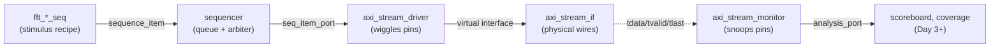
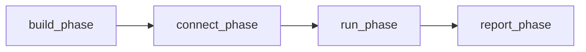
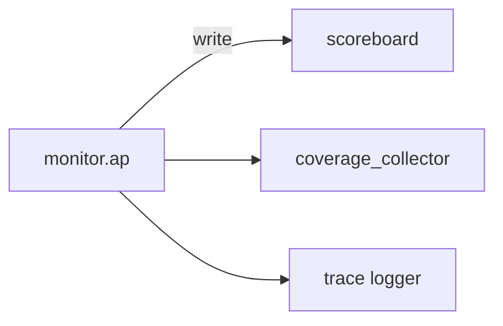
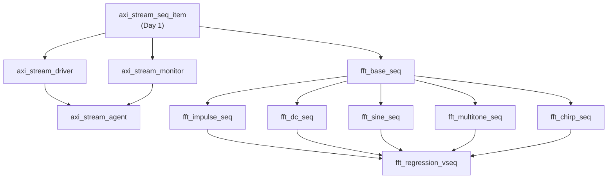
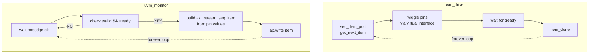

# Day 2 — Driver, Monitor, Agent, Sequences (deep-dive walkthrough)

**Prerequisite:** [Day 1 walkthrough](day1_walkthrough.md) — make sure you've
read §3 (interfaces & clocking), §4 (sequence_item & factory) and §9 (UVM
concept overview) before tackling this one.

---

## 0. TL;DR — what Day 2 produced

Nine new SystemVerilog files. They turn the static "wires + packet shape"
of Day 1 into **live UVM components** that can drive pins and observe
responses. Still no scoreboard, still no DUT-connected smoke test — those
arrive in Day 3.

```
UVM/
├── env/
│   ├── axi_stream_driver.sv   <- pulls items from sequencer, wiggles pins
│   ├── axi_stream_monitor.sv  <- snoops pins, broadcasts packets to subscribers
│   └── axi_stream_agent.sv    <- bundles seqr + drv + mon (one per AXI port)
└── seq/
    ├── fft_base_seq.sv             <- parent: drives N=1024 beats from re/im arrays
    ├── fft_impulse_seq.sv          <- child: x[0]=A, rest=0
    ├── fft_dc_seq.sv               <- child: x[n]=A for all n
    ├── fft_sine_seq.sv             <- child: x[n] = A·sin(2π·k·n/N)
    ├── fft_multitone_seq.sv        <- child: sum of 3 sinusoids
    ├── fft_chirp_seq.sv            <- child: linear sweep 0 → N/2
    └── fft_regression_vseq.sv      <- virtual seq: runs all 5 back-to-back
```

`fft_pkg.sv` was updated to `\`include` all of them in dependency order.

`make env-check` passes (0 errors, 0 warnings).

---

## 1. The flow we just enabled

After Day 1 we had the *wires* (interface) and the *packet* (sequence_item).
Day 2 wires those into the canonical UVM stimulus path:



The **agent** packages the seqr + drv + mon into one component. The **virtual sequence** sits above the sequencer and orchestrates which stimulus
sequence runs when.

Picture of one beat moving through the system:

```
1. Test calls    impulse_seq.start(env.s_axis_agent.sequencer)
                                       │
2. Sequence runs pre_body()  →  fills re_data[0]=10000, rest=0
                                       │
3. Sequence runs body() loop, beat b:
   ┌─────────────────────────────────────────────┐
   │ req = type_id::create(...)                  │
   │ req.set_sample(0, re_data[b], im_data[b])   │
   │ req.tlast = (b == 1023)                     │
   │ start_item(req); finish_item(req);          │ ◄── blocks until driver done
   └─────────────────────────────────────────────┘
                                       │
4. Sequencer queues item, driver receives:
   ┌─────────────────────────────────────────────┐
   │ seq_item_port.get_next_item(req);           │
   │ @(posedge clk); vif.tdata <= req.tdata;     │
   │                  vif.tvalid <= 1;            │
   │                  vif.tlast  <= req.tlast;    │
   │ do @(posedge clk); while (vif.tready !=1);  │ ◄── handshake
   │ vif.tvalid <= 0;                            │
   │ seq_item_port.item_done();                  │ ◄── unblocks sequence
   └─────────────────────────────────────────────┘
                                       │
5. Sequence's body() loop advances to beat b+1, repeat.
```

---

## 2. File 1 — `env/axi_stream_driver.sv`

### 2.1 Class declaration

```systemverilog
class axi_stream_driver extends uvm_driver #(axi_stream_seq_item);
    `uvm_component_utils(axi_stream_driver)
```

- `uvm_driver` is *parameterised* by the request type. The `#(axi_stream_seq_item)`
  syntax says "this driver consumes `axi_stream_seq_item` transactions". Inside
  the class, `req` (a built-in handle on uvm_driver) is now typed as
  `axi_stream_seq_item`.
- `\`uvm_component_utils` is the **component**-flavour of the factory macro.
  Day 1's `\`uvm_object_utils` was for *data* objects (sequence_items). Components
  (driver, monitor, agent, env, test) have a slightly different constructor
  signature (`new(name, parent)` vs `new(name)`) and lifecycle, so they need
  a separate macro.

### 2.2 The two configuration fields

```systemverilog
    virtual axi_stream_if.master vif;
    int unsigned p_pack = 1;
```

- `virtual axi_stream_if.master vif` — the **virtual interface handle**. This
  is the magic bridge between the OOP class world (no pins) and the static
  module world (only pins).
  - `axi_stream_if` is the type
  - `.master` restricts us to the master modport (compile-time check: we
    can only drive what the modport allows us to drive)
  - `virtual` qualifier means "this is a handle to an interface instance
    that will be set later". You cannot have a non-virtual interface
    handle inside a class.
- `p_pack` — sample-packing factor. The driver doesn't actually pack here
  (the sequence does); the field is just used by `build_phase` to log
  the configuration so debugging is easier.

### 2.3 The UVM phase methods

UVM has a fixed list of phases that every component runs through:



- **`build_phase`** runs *once*, top-down. Used for: creating child components,
  fetching config from `uvm_config_db`. NEVER do simulation-time stuff here
  (no `@`, no `#`).
- **`connect_phase`** runs *once*, bottom-up. Used for: connecting analysis
  ports to subscribers. Driver doesn't need it (we don't have a subscriber to
  hook up).
- **`run_phase`** is the *only* time-consuming phase. Runs in parallel across
  all components; this is where the actual simulation happens.
- **`report_phase`** runs *once* at the end. Used to print a summary, compute
  pass/fail. Day 3+ — the scoreboard uses this.

In the driver we override two of them: `build_phase` and `run_phase`.

### 2.4 `build_phase` — wiring the virtual interface

```systemverilog
function void build_phase(uvm_phase phase);
    super.build_phase(phase);
    if (!uvm_config_db#(virtual axi_stream_if.master)::get(this, "", "vif", vif))
        `uvm_fatal("AXIDRV", "vif handle not set in uvm_config_db")
    void'(uvm_config_db#(int unsigned)::get(this, "", "p_pack", p_pack));
endfunction
```

`uvm_config_db` is UVM's typed key/value store. Two operations:

```
SET (called by the test):
    uvm_config_db#(virtual axi_stream_if.master)::set(
        null,                     // context (null = root)
        "uvm_test_top.env.s_axis_agent.driver",  // scope path
        "vif",                    // key
        s_if.master_modport       // value
    );

GET (called by the driver):
    uvm_config_db#(virtual axi_stream_if.master)::get(
        this,                     // context (the driver)
        "",                       // local scope
        "vif",                    // key
        vif                       // output handle
    );
```

The `#(...)` is a SystemVerilog *parameterised class* specialisation — each
type needs its own DB. So `uvm_config_db#(int)` and `uvm_config_db#(string)` are
literally different classes at compile time.

The `if (!...::get(...)) \`uvm_fatal(...)` idiom is mandatory boilerplate:
`get` returns 0 if the key isn't found, and a driver without a vif is useless
so we abort.

For the `p_pack` lookup we use `void'(...)`: the cast-to-void tells the
compiler "yes, I know `get` returns a value; I'm intentionally discarding it".
We don't fatal if `p_pack` isn't set — it defaults to 1.

### 2.5 `run_phase` — the driver heartbeat

```systemverilog
task run_phase(uvm_phase phase);
    vif.tdata  <= '0;
    vif.tvalid <= 1'b0;
    vif.tlast  <= 1'b0;
    vif.tuser  <= '0;

    @(negedge vif.rst);   // wait for reset to release
    @(posedge vif.clk);

    forever begin
        seq_item_port.get_next_item(req);
        drive_one_beat(req);
        seq_item_port.item_done();
    end
endtask
```

This is the **canonical driver loop** — you'll see this exact pattern in
every UVM driver ever written.

- `task` (not `function`) — tasks can consume simulation time (use `@`, `#`).
- Initial drive of zeros — guarantees there's no X on the AXI lines at time 0.
- `@(negedge vif.rst)` — wait until reset deasserts. The interface owns `rst`,
  not the driver, so we just block on the wire.
- `forever begin ... end` — runs for the entire simulation. The driver
  doesn't decide when to stop; that's the test's job (via phase objections —
  Day 3).
- `seq_item_port` is a built-in member of `uvm_driver`. It's a **TLM port**
  that the sequencer hands items through.
  - `get_next_item(req)` — block until the sequencer has a ready item; then
    assign it to `req`. The sequence is also blocked at this point (in its
    `finish_item` call), waiting for us.
  - `item_done()` — release the sequence so it can produce the next item.

### 2.6 `drive_one_beat` — the pin-level dance

```systemverilog
task drive_one_beat(axi_stream_seq_item item);
    @(posedge vif.clk);
    vif.tdata  <= item.tdata;
    vif.tvalid <= 1'b1;
    vif.tlast  <= item.tlast;

    do @(posedge vif.clk); while (vif.tready !== 1'b1);

    vif.tvalid <= 1'b0;
    vif.tlast  <= 1'b0;
endtask
```

This is where the AXI4-Stream protocol lives:

1. Wait for a clock edge. (UVM phases don't auto-sync to a clock — we must.)
2. Present `tdata + tvalid + tlast` simultaneously. Non-blocking `<=` means
   these all update after the current event region — by next clk edge
   they're stable.
3. The `do..while` loop checks `tready` *after* each subsequent posedge until
   the slave accepts. If the slave is ready immediately we still take one clock
   cycle (the loop body always runs once). That's correct — the AXI spec says
   "transfer occurs on the rising edge where both tvalid and tready are high",
   which is the *next* edge after we asserted tvalid.
4. After handshake, drop tvalid for at least one cycle. The next call to
   `drive_one_beat` re-asserts on its next `@(posedge vif.clk)`.

> **Why `!==` and not `!=` ?** `!==` is the 4-state "strictly not equal" —
> if `tready` is X (during reset glitches), `tready !== 1'b1` is true, so we
> keep waiting. With `!=`, an X compare yields X which gets implicitly cast
> to false, and we'd march on with garbage data.

---

## 3. File 2 — `env/axi_stream_monitor.sv`

### 3.1 What changes from driver to monitor

A monitor is **passive**: never drives anything, always observes. Architecturally
it's almost identical to a driver minus the sequencer port:

| Aspect | Driver | Monitor |
|---|---|---|
| Modport | `.master` (drives stuff) | `.monitor` (input-only) |
| Heartbeat | `forever { get_next_item; drive; item_done; }` | `forever { @edge; if handshake: write_to_analysis_port; }` |
| Output | Pin wiggles | `uvm_analysis_port` broadcasts |
| Sequencer connection | Yes (built-in `seq_item_port`) | No |

The class is intentionally **dual-purpose**: it monitors either side (S_AXIS *or*
M_AXIS) depending on configuration. We pass two interesting flags:

- `m_axis_dedup` — when 1, skip every other handshake (handles the Serial FFT's
  2-cycle hold quirk on M_AXIS, the same problem the existing
  `fft_axi_tb_xc7.v` solves with its `sample_phase` toggle).
- `label` — a human string ("S_AXIS" or "M_AXIS_serial") to make log lines
  legible when multiple monitors fire at once.

### 3.2 Analysis ports — UVM's "broadcast" pattern

```systemverilog
uvm_analysis_port #(axi_stream_seq_item) ap;
...
function new(...);
    super.new(...);
    ap = new("ap", this);   // analysis ports are NOT factory-created
endfunction
```

An `uvm_analysis_port` is a **one-to-many broadcast** channel. Anyone can
`connect(ap)` to it and they'll receive every item the monitor writes:



Compare to the **TLM port** the driver uses (`seq_item_port`), which is
*one-to-one* and *blocking*: the producer (sequence) waits for the consumer
(driver) to call `item_done`.

Analysis ports are unblocking — the monitor never waits; it just throws items
into the void and any number of subscribers (zero or more) catch them.

### 3.3 The capture loop

```systemverilog
task run_phase(uvm_phase phase);
    axi_stream_seq_item item;
    int beat_idx     = 0;
    bit sample_phase = 1'b0;

    @(negedge vif.rst);

    forever begin
        @(posedge vif.clk);

        if (vif.tvalid === 1'b1 && vif.tready === 1'b1) begin
            if (m_axis_dedup && sample_phase) begin
                sample_phase = ~sample_phase;
                continue;
            end

            item = axi_stream_seq_item::type_id::create("item");
            item.tdata      = vif.tdata;
            item.tlast      = vif.tlast;
            item.tuser      = vif.tuser;
            item.beat_index = beat_idx;

            ap.write(item);

            beat_idx++;
            if (vif.tlast) beat_idx = 0;
            sample_phase = ~sample_phase;
        end
    end
endtask
```

Subtleties to notice:

- We allocate a **new** `axi_stream_seq_item` for every captured beat. UVM
  semantics: the receiver might keep the handle indefinitely, so we mustn't
  reuse the same object. (Compare to the driver, where `req` is reused
  because we own it.)
- `beat_idx++; if (vif.tlast) beat_idx = 0;` resets the index after the last
  beat of each FFT block, so blocks 2, 3, 4 also start at beat 0.
- The `m_axis_dedup` branch uses `continue` — skip the rest of this iteration
  but still toggle `sample_phase` so the *next* handshake gets captured.

> **Why `===` and not `==` ?** `===` is 4-state strict equality. If tvalid is
> X during reset, `tvalid === 1'b1` is **false** (X is not strictly equal to 1).
> With `==`, X compared to 1 is X, which gets implicitly cast to 1 in a condition,
> and we'd erroneously think a handshake happened.

### 3.4 What the analysis port enables (preview of Day 3+)

When the scoreboard comes online:
```systemverilog
// In fft_env.connect_phase
m_axis_agent.monitor.ap.connect(scoreboard.actual_export);
```

That one line wires every M_AXIS beat into the scoreboard's `write()`
implementation. Multiple subscribers can connect; each gets its own copy of
the item.

---

## 4. File 3 — `env/axi_stream_agent.sv`

### 4.1 Why "agent" exists at all

The UVM "agent" pattern is purely organisational. Without it, the env
would have to instantiate seqr/drv/mon individually for every protocol
interface — verbose and easy to forget connections. The agent says:

> "One AXI port = one agent. The agent knows internally how to wire its own
> seqr/drv/mon. The env just creates one agent per port and gets on with life."

### 4.2 The `is_active` knob

```systemverilog
if (get_is_active() == UVM_ACTIVE) begin
    sequencer = axi_stream_sequencer::type_id::create("sequencer", this);
    driver    = axi_stream_driver   ::type_id::create("driver",    this);
end
```

`uvm_agent` has a built-in `is_active` flag (`UVM_ACTIVE` or `UVM_PASSIVE`).
We use it to decide whether to build the driver+sequencer:

- **S_AXIS agent → UVM_ACTIVE** — we drive stimulus into the DUT
- **M_AXIS agent → UVM_PASSIVE** — we only watch DUT outputs

This is set by the env in `build_phase` via `uvm_config_db`:
```systemverilog
uvm_config_db#(uvm_active_passive_enum)::set(
    this, "s_axis_agent", "is_active", UVM_ACTIVE);
uvm_config_db#(uvm_active_passive_enum)::set(
    this, "m_axis_agent", "is_active", UVM_PASSIVE);
```

### 4.3 The sequencer typedef

```systemverilog
typedef uvm_sequencer#(axi_stream_seq_item) axi_stream_sequencer;
```

`uvm_sequencer` is a stock UVM class — the **default sequencer** is fine for
99 % of cases. We just need to specialise its item type. The typedef gives the
specialised class a friendly name so later code can refer to
`axi_stream_sequencer` without re-stating the parameter.

We don't override anything; the default sequencer arbitrates between sequences
on a first-come-first-served basis.

### 4.4 `connect_phase` — the only wire we own

```systemverilog
function void connect_phase(uvm_phase phase);
    super.connect_phase(phase);
    if (get_is_active() == UVM_ACTIVE)
        driver.seq_item_port.connect(sequencer.seq_item_export);
endfunction
```

The driver has a **port** (it makes requests). The sequencer has an **export**
(it answers requests). The connect statement glues them. After this, calling
`driver.seq_item_port.get_next_item(...)` actually pulls from the sequencer's
queue.

> **TLM connect direction rule:** ports connect to exports of the same type.
> Read it as "I am the *consumer* (port), connect me to the *provider* (export)".

---

## 5. File 4 — `seq/fft_base_seq.sv`

### 5.1 Sequence vs sequence_item

These two have similar names and confuse newcomers:

| `uvm_sequence_item` | `uvm_sequence` |
|---|---|
| **Data** — one transaction | **Recipe** — produces many transactions |
| Has fields: tdata, tlast, ... | Has body() task that creates items |
| Day 1 wrote one | Day 2 writes several |

A sequence's `body()` is where stimulus *intent* lives. It says "make 1024
beats with these contents", not "set tvalid then wait for tready" (that's
the driver).

### 5.2 The class

```systemverilog
class fft_base_seq extends uvm_sequence #(axi_stream_seq_item);
    `uvm_object_utils(fft_base_seq)

    rand int re_data [FFT_N];
    rand int im_data [FFT_N];

    sig_kind_e   signal_kind = SIG_IMPULSE;
    int unsigned amplitude   = 10000;
    int unsigned p_pack      = 1;
```

- `uvm_sequence #(axi_stream_seq_item)` — sequences are parameterised by
  *request type* (the items they produce). Same idea as the driver.
- `\`uvm_object_utils` (note: **object**, not **component**) — sequences are
  data objects from UVM's perspective, not components, so they use the simpler
  factory macro.
- `re_data[FFT_N]`, `im_data[FFT_N]` — fixed-size arrays of 1024 ints. These
  hold the time-domain samples. Each child sequence fills them with its
  pattern.
- The three bookkeeping fields are read by the scoreboard and coverage
  collector later — so they know what test ran without inspecting tdata bits.

### 5.3 `pre_body` vs `body`

UVM gives sequences a fixed set of pre/post hooks: `pre_start`, `pre_body`,
`body`, `post_body`, `post_start`. We override two:

```systemverilog
virtual task pre_body();
    foreach (re_data[i]) re_data[i] = 0;
    foreach (im_data[i]) im_data[i] = 0;
endtask
```

`pre_body` runs *before* the main `body` task. The base sequence zeroes both
arrays. Each child sequence calls `super.pre_body()` first (resetting to
zeros), then overwrites the bins it cares about. So `fft_impulse_seq` sets
only `re_data[0]`; everything else is already 0.

```systemverilog
virtual task body();
    axi_stream_seq_item req;
    int beats_total = FFT_N / p_pack;

    for (int b = 0; b < beats_total; b++) begin
        req = axi_stream_seq_item::type_id::create($sformatf("req_%0d", b));
        start_item(req);

        req.tdata = '0;
        for (int s = 0; s < p_pack; s++) begin
            int idx = b * p_pack + s;
            req.set_sample(s,
                16'($signed(re_data[idx])),
                16'($signed(im_data[idx])));
        end

        req.tlast      = (b == beats_total - 1);
        req.beat_index = b;
        finish_item(req);
    end
endtask
```

Key patterns:

- `beats_total = FFT_N / p_pack` — for Serial (P=1) we send 1024 beats;
  for Parallel (P=4) we send 256 beats, each packing 4 samples. **Same
  sequence works for both DUTs.**
- `req.tdata = '0` zeros the whole 128-bit field, then the inner loop sets
  only the `p_pack` samples we're using.
- `req.set_sample(s, ...)` uses the helper we wrote in Day 1 to pack
  re/im into the right slice of tdata.
- `start_item(req) + finish_item(req)` — the *blocking* sequence-side
  handshake with the driver:
  - `start_item` blocks until the sequencer says "you may proceed"
    (the driver isn't busy)
  - `finish_item` blocks until the driver has called `item_done`
- `tlast = (b == beats_total - 1)` — fire tlast on the last beat exactly
  once per block.

### 5.4 The `16'($signed(...))` cast

This idiom appears in `set_sample(...)`:

```systemverilog
req.set_sample(s, 16'($signed(re_data[idx])), 16'($signed(im_data[idx])));
```

- `re_data[idx]` is `int` (32-bit signed in SV)
- `$signed(re_data[idx])` keeps it interpreted as signed
- `16'(...)` truncates to 16 bits

We need the explicit signed-then-truncate because `set_sample` expects a
`bit signed [15:0]`. Without `$signed`, the int-to-bit conversion can lose
the sign-extension and a negative sample like `-10000` becomes a large
positive 32-bit value, which truncates to garbage.

---

## 6. Files 5-9 — the five test sequences

Each one is ~20 lines and follows the same recipe:
1. Extend `fft_base_seq`.
2. Constructor sets `signal_kind`.
3. Override `pre_body` to fill `re_data[]` with the test pattern.

### 6.1 Impulse — the trivial case

```systemverilog
virtual task pre_body();
    super.pre_body();
    re_data[0] = amplitude;
endtask
```

One line. The `super.pre_body()` zeros everything; then we set `re_data[0]`.
The FFT of an impulse is a constant: `X[k] = A` for all k.

### 6.2 DC — the other trivial case

```systemverilog
virtual task pre_body();
    super.pre_body();
    foreach (re_data[i]) re_data[i] = amplitude;
endtask
```

All samples equal `A`. The FFT collapses all energy into bin 0: `X[0] = N·A`,
rest zero. The Parallel MDF achieves 120 dB SQNR here; the Serial achieves
~75 dB (its BFP scanner can't optimally scale DC).

### 6.3 Sine — the interesting case

```systemverilog
int unsigned tone_bin = 50;
localparam real PI = 3.14159265358979;

virtual task pre_body();
    real angle, sample;
    super.pre_body();
    foreach (re_data[n]) begin
        angle      = 2.0 * PI * tone_bin * n / FFT_N;
        sample     = amplitude * $sin(angle);
        re_data[n] = $rtoi(sample);
    end
endtask
```

`$sin` and `$rtoi` are SV system functions:
- `$sin(x)` — IEEE-754 sine. Returns `real` (double).
- `$rtoi(x)` — round-to-int. Standard truncation toward zero.

The FFT of a real sine has two peaks (at bins K and N-K). For K=50, N=1024:
peaks at 50 and 974, magnitude `A·N/2 = 10000·512 = 5,120,000`.

### 6.4 Multi-tone

Sum of three sinusoids; each gets `amplitude/3` so the peak summed waveform
stays in 16-bit range.

```systemverilog
amp_per = amplitude / 3.0;
foreach (re_data[n]) begin
    sum = amp_per * ($sin(2.0*PI*bin0*n/FFT_N)
                   + $sin(2.0*PI*bin1*n/FFT_N)
                   + $sin(2.0*PI*bin2*n/FFT_N));
    re_data[n] = $rtoi(sum);
end
```

Six peaks total: 50, 200, 450 + mirrors at 824, 574, 974. (Picking 200 close
to 200 not by accident — 200 has a more interesting BFP behaviour than
power-of-2 bins.)

### 6.5 Chirp — linear frequency sweep

```systemverilog
phi = 2.0 * PI * (f_start + (f_end - f_start) * n / (2.0 * FFT_N)) * n / FFT_N;
sample = amplitude * $sin(phi);
```

That formula is the *instantaneous-phase* representation of a chirp:
`φ(n) = 2π · (f_start + slope·n/2) · n / N`. At sample 0 the frequency
is `f_start`; at sample N it's `f_end`. The chirp's FFT spreads energy
across bins `[f_start..f_end]`. With defaults 0→511, energy spreads over
the entire positive-frequency half — perfect torture-test for BFP scaling.

---

## 7. File 10 — `seq/fft_regression_vseq.sv` (the playlist)

### 7.1 "Virtual" sequences explained

A normal sequence (`uvm_sequence #(T)`) produces items of type `T` and runs
on one sequencer. A *virtual* sequence sits one level above: it doesn't
produce items itself, it coordinates *other sequences* (potentially on
multiple sequencers).

```systemverilog
class fft_regression_vseq extends uvm_sequence;
    `uvm_object_utils(fft_regression_vseq)
    `uvm_declare_p_sequencer(axi_stream_sequencer)
```

- `extends uvm_sequence` (no `#(T)`) — declares "I don't have my own item type".
- `\`uvm_declare_p_sequencer(axi_stream_sequencer)` — declares a typed handle
  `p_sequencer` to the agent's sequencer. The vseq uses `p_sequencer` to
  start child sequences on the right sequencer.

For Day 4 we have only one sequencer (S_AXIS), so the vseq looks like a
playlist. When we add more agents later (e.g., a config-via-AXI-Lite agent)
we'd add a second `p_sequencer` and the vseq would coordinate both.

### 7.2 The body

```systemverilog
task body();
    fft_impulse_seq    impulse_seq;
    ...
    impulse_seq = fft_impulse_seq::type_id::create("impulse_seq");
    impulse_seq.p_pack = p_pack;
    impulse_seq.start(p_sequencer);
    ...
endtask
```

Each child sequence is:
1. Created via the factory
2. Configured (p_pack passed through)
3. Started on the sequencer (`start(sqr)` runs `pre_body → body → post_body`
   blocking until done)

Because the vseq runs sequences *serially* via blocking `start()` calls, all
5 tests execute back-to-back in order: impulse → DC → sine → multi-tone →
chirp.

Day 3-4 will add inter-block delays (`#100ns` between sequences) if we want
to give the FFT time to drain.

---

## 8. The dependency graph



This drives the `\`include` order in `fft_pkg.sv`:
```systemverilog
`include "axi_stream_seq_item.sv"   // Day 1 — must come first
`include "axi_stream_driver.sv"
`include "axi_stream_monitor.sv"
`include "axi_stream_agent.sv"
`include "fft_base_seq.sv"
`include "fft_impulse_seq.sv"
`include "fft_dc_seq.sv"
`include "fft_sine_seq.sv"
`include "fft_multitone_seq.sv"
`include "fft_chirp_seq.sv"
`include "fft_regression_vseq.sv"
```

ModelSim's `vlog -mfcu` treats every file on the command line as one big
compilation unit, but inside a package the include order still matters
because the compiler resolves class references top-down.

---

## 9. SystemVerilog concepts newly used

| Concept | Where it appeared | What it does |
|---|---|---|
| `virtual <interface>` handle | driver, monitor | Class-friendly reference to a physical interface |
| `function void` | build_phase | Function with no return value (UVM requires) |
| `task` | run_phase | Time-consuming routine (can `@`, `#`, `wait`) |
| `forever` loop | driver, monitor | Run forever — the parallel-running phase body |
| `<=` non-blocking assignment | driver `drive_one_beat` | Schedule update for end of time region |
| `===` 4-state strict equality | monitor handshake check | Treats X as not-equal-to-anything |
| `do { ... } while (...)` | driver | Loop body runs at least once |
| `void'(expression)` | build_phase | Discard return value of a function |
| `typedef`-of-class | `axi_stream_sequencer` | Give a parameterised class a short name |
| `localparam` inside a class | sine_seq | Per-class compile-time constant |
| `$sin`, `$rtoi` | sine/chirp seqs | SV built-in math (real → int) |
| `foreach` | base seq | Iterate over an array |
| `$sformatf` | many | Format string into a string variable |
| `\`uvm_declare_p_sequencer` | vseq | Typed handle to the underlying sequencer |

---

## 10. UVM concepts newly used

| Concept | Where | Purpose |
|---|---|---|
| `uvm_driver #(T)` | driver | Base class for protocol-level pin drivers |
| `uvm_monitor` | monitor | Base class for passive observers |
| `uvm_agent` | agent | Bundles seqr+drv+mon for one protocol port |
| `uvm_sequencer #(T)` | typedef in agent | Arbitrates between competing sequences |
| `uvm_sequence #(T)` | base_seq + 5 child seqs | Recipe for generating items |
| `uvm_sequence` (no T) | vseq | "Virtual" sequence — coordinates other sequences |
| `\`uvm_component_utils` | drv/mon/agent | Factory registration for *components* |
| `\`uvm_object_utils` | sequences | Factory registration for *data objects* |
| `uvm_config_db#(T)::get/set` | driver, monitor | Typed config store |
| `uvm_analysis_port #(T)` | monitor | One-to-many broadcast TLM port |
| `seq_item_port.get_next_item` | driver | Blocking pull from sequencer |
| `seq_item_port.item_done` | driver | Release the sequence |
| `start_item / finish_item` | base seq body | Sequence-side handshake with driver |
| `get_is_active()` | agent | Read the ACTIVE/PASSIVE flag |
| `uvm_active_passive_enum` | agent typedef | The two values for is_active |
| `\`uvm_declare_p_sequencer(T)` | vseq | Typed handle to the underlying sequencer |
| `pre_body() / body() / post_body()` | sequences | Sequence lifecycle hooks |
| `seq.start(sqr)` | vseq body | Run a child sequence on a sequencer |

---

## 11. Driver vs Monitor — side-by-side



Mirror image. Driver consumes items and produces pin events; monitor
consumes pin events and produces items.

---

## 12. Common UVM gotchas that bit us (or almost did)

| Symptom | Cause | Fix |
|---|---|---|
| `vif handle not set in uvm_config_db` | Test forgot to set vif before env builds | Set in `tb_top` initial block, before `run_test()` |
| `tvalid !== 1'b1` evaluates to X during reset | Used `!=` instead of `!==` | Use 4-state operators in handshake checks |
| Items printed with random gibberish for tdata | Forgot `UVM_HEX` flag on field automation | Add `UVM_HEX` to `\`uvm_field_int` |
| Monitor captures each beat twice | M_AXIS holds tdata for 2 cycles on Serial DUT | `m_axis_dedup = 1` toggles sample_phase |
| `super.pre_body()` not called in child | Child overrode pre_body without zeroing first | Always start child override with `super.pre_body();` |
| Negative samples become huge positive | Implicit int-to-bit cast loses sign | `16'($signed(value))` |

---

## 13. What's working at the end of Day 2

- ✅ All files compile cleanly against UVM 1.1d (`make env-check` = 0 errors)
- ✅ Driver/monitor/agent classes are factory-registered
- ✅ Five test sequences and a virtual playlist exist
- ⚠ Nothing has *run* yet — that's Day 3 (when the env, ref model,
   scoreboard, and DUT testbench come online)

If you want to *see* the driver wiggle pins right now, you'd need:
- A `tb_top.sv` that instantiates the interface + a clock
- An `fft_base_test` class that creates an agent and starts a sequence
- An `initial run_test();` to launch UVM

That's a Day 3 task — better to combine it with the scoreboard so the first
end-to-end smoke test produces a meaningful PASS/FAIL result.

---

## 14. Day 3 preview

By end of Day 3 we want **one test passing end-to-end on the Serial DUT**.
Concretely:

1. **`scripts/gen_refs.py`** — Python generator: for each of 5 signals,
   produces `*_re.mem` and `*_im.mem` (stimulus) plus `*_ref_re.mem` and
   `*_ref_im.mem` (NumPy expected FFT output, conjugated for the +j twiddle
   convention).

2. **`env/fft_ref_model.sv`** — at `start_of_simulation_phase`, loads the
   right `_ref_*.mem` based on which test is active. Emits 1024 expected
   `axi_stream_seq_item`s to the scoreboard.

3. **`env/fft_scoreboard.sv`** — subscribes to the M_AXIS monitor's
   analysis_port. Collects 1024 actual items. At `report_phase`, compares
   actual vs reference, computes optimal-α SQNR (same formula as
   `thesis_report.py`), prints PASS/FAIL.

4. **`env/fft_env.sv`** — instantiates the S_AXIS agent (active), M_AXIS
   agent (passive), scoreboard, ref model. Wires the analysis ports.

5. **`tests/fft_base_test.sv` + `fft_smoke_test.sv`** — base test creates
   the env + sets vifs in config_db; smoke test starts the impulse_seq.

6. **`tb/tb_top_serial.sv`** — wraps it all: clock, reset,
   `axi_stream_if s_if` + `m_if`, `fft_axi_top dut(...)`, `initial run_test()`.

7. **Smoke run:** `make serial UVM_TESTNAME=fft_smoke_test` should print
   `[SCOREBOARD] Impulse SQNR = 120.00 dB  PASS`.

Day 3 is the biggest day — about 7 hours of focused work. After that, Day 4
is mostly applying the same pattern to the Parallel DUT (P=4 packing) and
adding SVA properties.

---

*End of Day 2 walkthrough. The companion source files live in `UVM/env/`
and `UVM/seq/`. Open any of them alongside this doc and read the section
that matches.*
