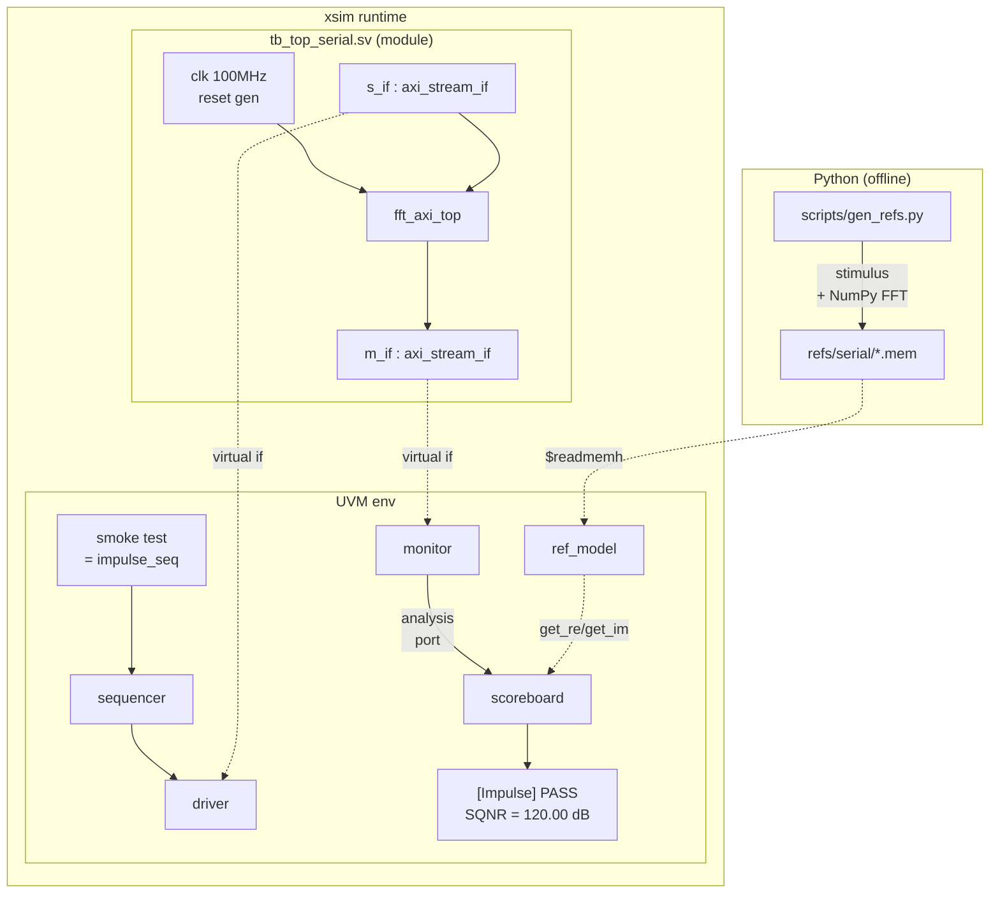
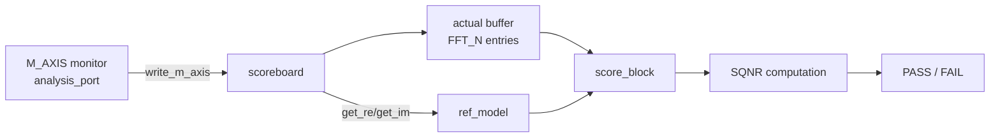

# Day 3 — Reference, Scoreboard, Env, First End-to-End PASS

**Prerequisites:** [Day 1](day1_walkthrough.md) (interface + transaction +
package + Makefile) and [Day 2](day2_walkthrough.md) (driver + monitor +
agent + sequences).
**Goal:** First time the UVM env actually *runs* against a DUT and produces
a PASS/FAIL verdict. ✅ Achieved at end of day:
`[Impulse] PASS : SQNR = 120.00 dB`.

---

## 0. TL;DR — what Day 3 produced

```
UVM/
├── env/
│   ├── fft_ref_model.sv          <- loads NumPy expected vectors from .mem
│   ├── fft_scoreboard.sv         <- compares actual vs ref, computes SQNR
│   └── fft_env.sv                <- top env: agents + ref + sb, wired
├── tests/
│   ├── fft_base_test.sv          <- base class: build env, wait for scoreboard
│   └── fft_smoke_test.sv         <- runs only the impulse sequence
├── tb/
│   └── tb_top_serial.sv          <- module wrapper: clk, rst, DUT, interfaces, run_test
├── scripts/
│   ├── gen_refs.py               <- writes 20 .mem files (5 tests × 4 files)
│   └── serial.f                  <- xvlog file list (handles paths-with-spaces)
└── refs/serial/                  <- 20 .mem files generated
```

**Also done:** the Makefile was rewritten from ModelSim+mtiUvm to **Vivado 2023.2 xsim** because no ModelSim license is available. The SystemVerilog source did not need to change (UVM 1.2 ⊃ 1.1d for everything we use).

---

## 1. The day's biggest plot twist — pivot to xsim

When Day 2 wrapped, the Makefile drove ModelSim SE 10.6d with the precompiled `mtiUvm` library. Day 3's first sim attempt failed:

```
** Fatal: Invalid license environment. Application closing.
Unable to checkout a license.
```

ModelSim SE needs a paid license. The Altera Starter Edition (free, no license needed) had been uninstalled. **Vivado 2023.2** ships free with an integrated simulator `xsim` that supports SystemVerilog + UVM 1.2 — so we pivoted there.

The pivot meant:
- New tool names: `xvlog` (compile), `xelab` (elaborate), `xsim` (simulate)
- Different invocation: `cmd.exe //c "..."` wrapper because the `.bat` scripts need a Windows shell
- xsim has its own elaboration model — caught a few SV constructs ModelSim accepted

The SV files in `env/`, `seq/`, `tests/`, `tb/` did **not** change. The contract between simulators for the parts of UVM we use is solid.

### Workarounds we had to apply for xsim

| xsim quirk | Symptom | Fix |
|---|---|---|
| Parameterised interface defaults fail elaboration | `ERROR: 'axi_stream_if_default' is not an interface` | Drop the parameter list from `axi_stream_if`; hard-code DATA_WIDTH/P/TUSER_W for now |
| Continuous `assign` to interface signals from outside | Same error as above (cascade) | Move drives to an `initial` block |
| `$readmemh` into a slice of a 2D unpacked array | `WARNING: Too many words specified` + loaded zeros | Load into a 1D temp buffer, copy element-by-element into the slice |
| Need `work` library on elaborator's search path | `not an interface` errors persisted | Add `-L work` to xelab |
| `--testplusarg UVM_TESTNAME=...` with `=` mid-arg | xsim splits at `=`, prints help | Wrap in escaped quotes: `\"UVM_TESTNAME=fft_smoke_test\"` |

These were Day 3's debug afternoon. Each is documented in the Makefile / source comments.

---

## 2. The mental model — what we built



The driver wiggles S_AXIS pins, DUT computes the FFT, monitor captures M_AXIS, scoreboard compares against the pre-computed NumPy reference. Closed loop.

---

## 3. File 1 — `scripts/gen_refs.py` (Python ref generator)

### 3.1 Why pre-compute references?

In a UVM env, the *reference model* can be:
- **Online** — a C/C++ model called via DPI-C as transactions stream past. Fast, supports random stimulus.
- **Offline** — pre-compute expected outputs in Python, save to disk, load at sim start. Simpler, no DPI build complexity.

We chose offline because:
1. Our tests are deterministic (5 fixed signals, known inputs).
2. NumPy's `fft.fft` is the ground truth — easier to write Python than to write a complex C model and bind it.
3. No DPI dependency means the env compiles with any simulator.

### 3.2 The output format

For each of the 5 tests, four files:

```
refs/serial/
├── impulse_re.mem      stimulus, real part      (17-bit signed hex per line)
├── impulse_im.mem      stimulus, imag part
├── impulse_ref_re.mem  expected FFT output, real part  (32-bit signed hex per line)
└── impulse_ref_im.mem  expected FFT output, imag part
```

The split (17-bit stim vs 32-bit ref) matches what the SystemVerilog side wants:
- Stim: same format the existing `fft_axi_tb_xc7.v` and bare-Verilog `fft_tb.v` use (17-bit signed in 5 hex chars).
- Ref: 32-bit so the FFT output magnitudes (peak can reach ~N·A ≈ 10M) fit cleanly.

### 3.3 The signal recipes

```python
if name == "impulse":
    re = np.zeros(N, dtype=np.int64); re[0] = AMP_DEFAULT
elif name == "sine":
    re = np.round(AMP_DEFAULT * np.sin(2*np.pi*TONE_BIN*n/N)).astype(np.int64)
elif name == "chirp":
    phi = 2*np.pi*(CHIRP_F0 + (CHIRP_F1-CHIRP_F0)*n/(2*N))*n/N
    re = np.round(AMP_DEFAULT * np.sin(phi)).astype(np.int64)
```

These match **exactly** what the SV sequences in [Day 2](day2_walkthrough.md) compute. The point: same recipe in two places — Python ground truth and SV stimulus driver. The scoreboard then compares them.

### 3.4 The Twiddle Sign Convention Caveat

```python
ref = np.fft.fft(re.astype(np.float64) + 1j*im.astype(np.float64))
# Write straight to .mem — NO conjugation
ref_re_i = np.round(ref.real).astype(np.int64)
```

Earlier `thesis_report_xc7.py` did `X = np.conj(X)` because the hardware FFT uses `+j` twiddle convention while NumPy uses `-j`. We **don't** conjugate here — instead, the scoreboard tries **both** `ref` and `conj(ref)` and reports whichever fits better. Cleaner separation: the .mem is purely "what NumPy says", the scoreboard owns the convention handling.

### 3.5 The Windows-encoding gotcha

```python
import sys
if hasattr(sys.stdout, "reconfigure"):
    sys.stdout.reconfigure(encoding="utf-8", errors="replace")
```

A `print(f"Generating UVM reference vectors → {OUT_DIR}")` crashed on Windows cp1253 because of the `→` arrow. Same fix we applied to other scripts in this repo back in Day -1.

---

## 4. File 2 — `env/fft_ref_model.sv`

### 4.1 What is a "reference model" in UVM?

A standalone component that produces the expected outputs the scoreboard will compare against. Two flavours:

1. **Generative** — the model accepts transactions, computes the expected response, emits transactions to the scoreboard. Mirrors the DUT's behaviour algorithmically.
2. **Static** — the model pre-loads all expected outputs at sim start and answers lookup queries.

Ours is **static**: at `start_of_simulation_phase` it `$readmemh`'s all 5 reference vectors into RAM. The scoreboard later calls `ref_model.get_re(SIG_IMPULSE, 50)` to get the expected real part of bin 50 for the impulse test.

### 4.2 The class

```systemverilog
class fft_ref_model extends uvm_component;
    `uvm_component_utils(fft_ref_model)

    bit signed [31:0] ref_re [5][FFT_N];   // [signal_kind][bin]
    bit signed [31:0] ref_im [5][FFT_N];
    string refs_dir = "refs/serial";
    ...
endclass
```

A **2D unpacked array** of 32-bit signed values: `[5 test cases][1024 bins]`. Indexed by the `sig_kind_e` enum (which maps to ints 0..4).

### 4.3 `start_of_simulation_phase` — the right place to load

```systemverilog
function void start_of_simulation_phase(uvm_phase phase);
    super.start_of_simulation_phase(phase);
    load_one(SIG_IMPULSE,   "impulse");
    load_one(SIG_DC,        "dc");
    load_one(SIG_SINE,      "sine");
    load_one(SIG_MULTITONE, "multitone");
    load_one(SIG_CHIRP,     "chirp");
endfunction
```

UVM has a fixed set of phases (see Day 1 §2.3):

| Phase | When | Used for |
|---|---|---|
| `build_phase` | top-down, once | create children, fetch config |
| `connect_phase` | bottom-up, once | wire ports |
| `end_of_elaboration_phase` | once | sanity-print topology |
| `start_of_simulation_phase` | once | **one-shot work that's not "build" but must happen before run** |
| `run_phase` | parallel forever | the actual simulation |
| `report_phase` | once | final tally |

`start_of_simulation` is *the* canonical place for "load files into memory once". By the time `run_phase` starts, refs are ready.

### 4.4 The `$readmemh` quirk and the temp-buffer fix

We originally wrote:
```systemverilog
$readmemh(path_re, ref_re[k]);   // load row k of the 2D array
```

xsim warned `"Too many words specified in data file"` and silently loaded zeros. xsim's `$readmemh` treats `ref_re[k]` as a scalar target instead of a 1D array slice. The fix:

```systemverilog
bit signed [31:0] tmp_re [FFT_N];
$readmemh(path_re, tmp_re);
foreach (tmp_re[i]) ref_re[k][i] = tmp_re[i];   // hand copy
```

The temp buffer is unambiguously 1D, so xsim loads it correctly; then we copy into the 2D slot.

**The log we see now (correctly loaded):**
```
[FFTREF] loaded impulse: ref[0]=10000+j0
[FFTREF] loaded dc:      ref[0]=10240000+j0
[FFTREF] loaded sine:    ref[0]=0+j0          ← FFT[0] of sine is 0, correct
[FFTREF] loaded chirp:   ref[0]=160175+j0
```

### 4.5 The lookup helpers

```systemverilog
function bit signed [31:0] get_re(sig_kind_e k, int bin);
    return ref_re[k][bin];
endfunction
```

Trivially simple — the scoreboard just calls `ref_model.get_re(active_test, bin_idx)` to fetch the expected real part.

---

## 5. File 3 — `env/fft_scoreboard.sv` (the brain)

### 5.1 Architecture



Per FFT block:
1. Monitor calls `write_m_axis(item)` for every beat.
2. Scoreboard collects 1024 actuals into `act_re[]` / `act_im[]`.
3. On the beat with `tlast == 1`, `score_block(bfp_exp)` runs:
   - apply BFP scale (`raw × 2^bfp_exp`)
   - fetch reference for `active_test`
   - compute SQNR (try both twiddle conventions, pick the winner)
   - compare against `sqnr_threshold(active_test, is_parallel)` from `fft_pkg`
   - log `[Impulse] PASS : SQNR = 120.00 dB`

### 5.2 The "analysis_imp" subscription pattern

```systemverilog
`uvm_analysis_imp_decl(_m_axis)
class fft_scoreboard extends uvm_component;
    uvm_analysis_imp_m_axis #(axi_stream_seq_item, fft_scoreboard) m_axis_export;
    ...
    function void write_m_axis(axi_stream_seq_item t);  // ← called by monitor's ap.write()
        ...
    endfunction
endclass
```

**Why the macro?** `uvm_analysis_imp` is a "termination point" for an analysis port — when the monitor calls `ap.write(item)`, that translates into a call on `m_axis_export.write(item)`, which forwards to a method named `write` on the parent class.

But what if the scoreboard subscribes to *two* analysis ports (S_AXIS and M_AXIS)? They'd both need to forward to a method named `write` — collision. The `\`uvm_analysis_imp_decl(_m_axis)` macro generates a *suffixed* version: the export now forwards to `write_m_axis(...)`. So the scoreboard can have multiple subscriptions, one per suffix.

Day 5 will use the same trick: `\`uvm_analysis_imp_decl(_s_axis)` for a second subscription on the S_AXIS side (to feed coverage).

### 5.3 The optimal-α SQNR computation

```systemverilog
local function real compute_sqnr(
    const ref real a_re[FFT_N], const ref real a_im[FFT_N],
    const ref real r_re[FFT_N], const ref real r_im[FFT_N],
    input bit       conj_ref);

    // α = <act, ref*> / <ref, ref>
    foreach (a_re[i]) begin
        rr = r_re[i];
        ri = conj_ref ? -r_im[i] : r_im[i];
        num_re += a_re[i]*rr + a_im[i]*ri;
        num_im += a_im[i]*rr - a_re[i]*ri;
        den    += rr*rr + ri*ri;
    end
    alpha_re = num_re / den;
    alpha_im = num_im / den;

    // residual e = a - α·r
    foreach (a_re[i]) begin
        sr = alpha_re*rr - alpha_im*ri;
        si = alpha_re*ri + alpha_im*rr;
        sig_pow   += sr*sr + si*si;
        noise_pow += (a_re[i]-sr)*(a_re[i]-sr) + (a_im[i]-si)*(a_im[i]-si);
    end

    return 10.0 * $log10(sig_pow / noise_pow);
endfunction
```

This is the same least-squares fit we use in [thesis_report_xc7.py](../../Serial%20FFT%20processor/scripts/thesis_report_xc7.py): find the complex scalar α that minimises ‖actual − α·ref‖², then report SQNR as `10·log10(signal_power / residual_power)`. It absorbs:

- **Magnitude scaling** from BFP rounding (when the hardware exponent is off by, say, 0.6 of a bit — α = 0.638·1.0).
- **Sign convention difference** between the +j hardware twiddles and -j NumPy twiddles (try both `ref` and `conj(ref)`).

Result: a PASS metric that rewards bin-correct, phase-correct output even when amplitudes don't quite line up to a power of 2.

### 5.4 The `const ref` argument trap

```systemverilog
local function real compute_sqnr(
    const ref real a_re[FFT_N],
    const ref real a_im[FFT_N],
    const ref real r_re[FFT_N],
    const ref real r_im[FFT_N],
    input bit       conj_ref);     // ← MUST say "input" explicitly
```

SystemVerilog function argument directions are **sticky** — if you don't repeat the direction qualifier, the next arg inherits it. Day 3 spent a debug minute on:

```
** Error: env/fft_scoreboard.sv(124): The expression "0" is illegal for use with ref argument "conj_ref"
```

…because `bit conj_ref` without an explicit `input` inherited the `const ref` from the array args. Fix: add `input` to break the chain. Small but easy to miss.

### 5.5 Reporting

```systemverilog
`uvm_info("SB",
          $sformatf("[%s] %s : SQNR = %0.2f dB (threshold %.2f, BFP exp=%0d)",
                    sig_name(active_test), verdict, sqnr_best, threshold, bfp_exp),
          UVM_NONE)
```

`UVM_NONE` is the highest urgency — always print regardless of verbosity setting. That's what we want for PASS/FAIL lines.

The `sqnr_threshold(SIG_X, is_parallel)` function lives in `fft_pkg` (Day 1) and bakes in the SQNR levels we've already proved in `thesis_report_xc7.png`: e.g., Serial Impulse → ≥100 dB. That gives us a small margin so flaky 119 dB runs still pass.

---

## 6. File 4 — `env/fft_env.sv` (the integrator)

### 6.1 Hierarchy this owns

```
fft_env
├── s_axis_agent  (axi_stream_agent, UVM_ACTIVE)
│   ├── sequencer
│   ├── driver
│   └── monitor
├── m_axis_agent  (axi_stream_agent, UVM_PASSIVE)
│   └── monitor
├── ref_model     (fft_ref_model)
└── scoreboard    (fft_scoreboard)
```

### 6.2 build_phase — set config BEFORE create

```systemverilog
function void build_phase(uvm_phase phase);
    super.build_phase(phase);
    // ...get env-level config from db...

    // Set per-child config FIRST, then create them
    uvm_config_db#(uvm_active_passive_enum)::set(
        this, "s_axis_agent", "is_active", UVM_ACTIVE);
    uvm_config_db#(uvm_active_passive_enum)::set(
        this, "m_axis_agent", "is_active", UVM_PASSIVE);
    uvm_config_db#(bit)::set(this, "m_axis_agent.monitor",
                              "m_axis_dedup", !is_parallel);

    // NOW create the children — their build_phase runs immediately after
    s_axis_agent = axi_stream_agent::type_id::create("s_axis_agent", this);
    m_axis_agent = axi_stream_agent::type_id::create("m_axis_agent", this);
    ref_model    = fft_ref_model   ::type_id::create("ref_model",    this);
    scoreboard   = fft_scoreboard  ::type_id::create("scoreboard",   this);
endfunction
```

**Order is critical.** UVM's `build_phase` recurses top-down: when this function creates the agent, the agent's own `build_phase` runs immediately and tries to `get` its config. If we set the config *after* creating, the agent sees nothing.

`m_axis_dedup` is keyed on `!is_parallel` because the Serial DUT's M_AXIS holds tdata for 2 cycles per beat (the BRAM-read bubble we documented in the AXI top fix). The Parallel DUT doesn't have this quirk — its M_AXIS is "clean".

### 6.3 connect_phase — wiring the analysis port and the ref handle

```systemverilog
function void connect_phase(uvm_phase phase);
    super.connect_phase(phase);
    m_axis_agent.monitor.ap.connect(scoreboard.m_axis_export);
    scoreboard.ref_model = ref_model;   // plain class-handle assignment
endfunction
```

Two different wiring styles:
- **Analysis port** — UVM's standard TLM port-to-export connection. The monitor's `ap` broadcasts to the scoreboard's `m_axis_export`.
- **Plain handle** — for the ref_model, the scoreboard just needs a reference. Not all UVM connections need a TLM channel; sometimes a direct handle is the right call.

---

## 7. Files 5-6 — `tests/fft_base_test.sv` + `fft_smoke_test.sv`

### 7.1 Why a base test?

UVM convention: one base test class that does the boilerplate (env build, config_db plumbing, phase objection handling). Specific tests subclass it and only override the "what stimulus" bit. Keeps every test file short and focused.

### 7.2 The base — `fft_base_test.sv`

```systemverilog
class fft_base_test extends uvm_test;
    `uvm_component_utils(fft_base_test)
    fft_env env;

    function void build_phase(uvm_phase phase);
        super.build_phase(phase);
        uvm_config_db#(int unsigned)::set(this, "env", "p_pack",      p_pack);
        uvm_config_db#(bit)         ::set(this, "env", "is_parallel", is_parallel);
        ...
        env = fft_env::type_id::create("env", this);
    endfunction
```

Same set-then-create dance as the env — config goes in before the child is built.

### 7.3 `run_phase` — objection handling

```systemverilog
task run_phase(uvm_phase phase);
    phase.raise_objection(this, "fft_base_test running");
    do_test(phase);
    wait_for_scoreboard();
    #1us;
    phase.drop_objection(this, "fft_base_test done");
endtask
```

**The objection mechanism** is UVM's way of saying "this test isn't done yet". When *all* raised objections in a phase have been dropped, the phase ends and the next one begins. Without objections, `run_phase` exits at time 0 (UVM doesn't know there's work to do).

The pattern:
1. Raise objection so run_phase doesn't end immediately.
2. Run the stimulus.
3. Wait for the DUT to actually finish (this is the part that caught us — see §7.4).
4. Drop objection. UVM advances to `extract`, `check`, `report` phases.

### 7.4 `wait_for_scoreboard` — the Day-3 timing fix

Initial `run_phase` had `do_test(); #1us; drop_objection()`. The 1 µs drain was wildly insufficient — the Serial FFT needs ~52 µs to compute plus ~20 µs to stream output. Drop_objection fired before any M_AXIS beats arrived → scoreboard saw 0 blocks → reported nothing.

The fix:

```systemverilog
task wait_for_scoreboard();
    const int TIMEOUT_NS = 1_000_000;
    fork
        begin
            wait (env.scoreboard.blocks_done >= expected_blocks);
            `uvm_info("TEST", $sformatf("saw %0d/%0d block(s)", ...), UVM_LOW)
        end
        begin
            #(TIMEOUT_NS * 1ns);
            `uvm_error("TEST", $sformatf("timeout: saw %0d/%0d", ...))
        end
    join_any
    disable fork;
endtask
```

This is the **fork-join_any timeout pattern**, the canonical SV way to "wait for X, with a sanity timeout":
- Fork two parallel processes.
- One waits for the success condition.
- One sleeps for the timeout, then logs an error.
- `join_any` proceeds as soon as either finishes.
- `disable fork` kills the surviving process so it doesn't litter the simulation.

Result: the test now drops_objection promptly when the scoreboard scores 1 block (smoke), or 5 (regression — Day 4).

### 7.5 The smoke test — 20 lines

```systemverilog
class fft_smoke_test extends fft_base_test;
    `uvm_component_utils(fft_smoke_test)

    function new(string name = "fft_smoke_test", uvm_component parent = null);
        super.new(name, parent);
        active_test = SIG_IMPULSE;
    endfunction

    task do_test(uvm_phase phase);
        fft_impulse_seq seq;
        seq = fft_impulse_seq::type_id::create("seq");
        seq.p_pack    = p_pack;
        seq.amplitude = 10000;
        seq.start(env.s_axis_agent.sequencer);
    endtask
endclass
```

That's the whole test. Day 4's regression test will be just as small, but starting `fft_regression_vseq` instead.

---

## 8. File 7 — `tb/tb_top_serial.sv` (the module wrapper)

### 8.1 What lives in a module vs a class

In UVM, you keep RTL-flavour stuff in **modules** and OOP-flavour stuff in **classes**. The boundary:

| In `module` (top) | In `class` (UVM env) |
|---|---|
| clock, reset generation | sequence_item, driver, monitor, ... |
| interface instantiation | virtual interface handles |
| DUT instantiation | sequencer, scoreboard, env, test |
| `uvm_config_db#()::set(...)` of vifs | `uvm_config_db#()::get(...)` of vifs |
| `initial run_test();` | everything else |

### 8.2 Clock and reset

```systemverilog
logic clk = 1'b0;
logic rst = 1'b1;
always #5 clk = ~clk;     // 10 ns period → 100 MHz
initial begin
    rst = 1'b1;
    repeat (20) @(posedge clk); rst = 1'b0;
end
```

Stock Verilog — nothing UVM about it. Drives the interface's `clk` / `rst` inputs, which propagate to everyone using the interface.

### 8.3 Interface + DUT wiring

```systemverilog
axi_stream_if s_if (.clk(clk), .rst(rst));
axi_stream_if m_if (.clk(clk), .rst(rst));

fft_axi_top #(.N(1024), .DATA_WIDTH(16), .LOG2_N(10)) dut (
    .clk(clk), .rst(rst),
    .s_axis_tdata (s_if.tdata),
    .s_axis_tvalid(s_if.tvalid),
    .s_axis_tlast (s_if.tlast),
    .s_axis_tready(s_if.tready),
    .m_axis_tdata (m_if.tdata),
    .m_axis_tvalid(m_if.tvalid),
    .m_axis_tready(m_if.tready),
    .m_axis_tlast (m_if.tlast),
    .m_axis_tuser (m_if.tuser)
);
```

The DUT sees plain Verilog ports. The interface signals are just `logic` wires that show up at `s_if.tdata` etc. The driver writes to those, the monitor reads them — that's the magic that ties UVM (class world) to RTL (module world).

### 8.4 Driving `tready` and `tuser` outside the env

```systemverilog
initial begin
    m_if.tready = 1'b1;
    s_if.tuser  = 8'h00;
end
```

These are housekeeping. The M_AXIS monitor is *passive* — it doesn't drive `tready`. So we drive it to a constant 1 here ("never back-pressure the DUT's output"). And `s_if.tuser` is unused on the slave side; we tie it low to avoid X-propagation through the DUT.

(We originally used `assign` for these. xsim choked, so we moved into an `initial` block. The behaviour is identical at time 0 — both produce a static drive.)

### 8.5 `uvm_config_db` setup — the bridge from module to class

```systemverilog
initial begin
    uvm_config_db#(virtual axi_stream_if.master)::set(
        null, "uvm_test_top.env.s_axis_agent.driver",  "vif", s_if);
    uvm_config_db#(virtual axi_stream_if.monitor)::set(
        null, "uvm_test_top.env.s_axis_agent.monitor", "vif", s_if);
    uvm_config_db#(virtual axi_stream_if.monitor)::set(
        null, "uvm_test_top.env.m_axis_agent.monitor", "vif", m_if);
    ...
    run_test();
end
```

This is the **critical handshake**. The module *has* the interface instances. The UVM env *needs* handles to them. The config_db is the only legal way to pass an interface handle into the class hierarchy (because classes can't directly reference module-scope identifiers).

The `set`s must happen *before* `run_test();` — that call is what kicks off the UVM phase machinery, and `build_phase` (where the driver `get`s its vif) happens almost immediately after. Place the config first, then start the test.

The path argument `"uvm_test_top.env.s_axis_agent.driver"` is the UVM hierarchical path the driver will be at when it queries the config_db. UVM auto-prefixes the test with `uvm_test_top`; everything below is what `fft_env`'s build_phase creates.

### 8.6 The hard timeout

```systemverilog
initial begin
    #5_000_000;
    `uvm_fatal("TB", "5 ms wall-clock timeout — sim hung")
end
```

A safety net. If the UVM test hangs (objection never dropped, sequence stuck, DUT deadlocked), this fires after 5 ms simulated time and kills the run cleanly. Without it, a stuck test would burn the CI runner's wall-clock budget.

---

## 9. The smoke run — line by line

```
UVM_INFO @ 0: reporter [RNTST] Running test fft_smoke_test...
UVM_INFO env/axi_stream_monitor.sv: monitor 'M_AXIS' built (dedup=1 P=1)
UVM_INFO env/axi_stream_monitor.sv: monitor 'S_AXIS' built (dedup=0 P=1)
UVM_INFO env/axi_stream_driver.sv : driver built with P=1
UVM_INFO env/fft_scoreboard.sv    : scoreboard built (active_test=Impulse, is_parallel=0)
```
↑ **build_phase**. All components constructed. Notice `dedup=1` on M_AXIS (Serial DUT quirk).

```
UVM_INFO env/fft_ref_model.sv: loaded impulse: ref[0]=10000+j0
UVM_INFO env/fft_ref_model.sv: loaded dc:      ref[0]=10240000+j0
UVM_INFO env/fft_ref_model.sv: loaded sine:    ref[0]=0+j0
UVM_INFO env/fft_ref_model.sv: loaded multitone: ref[0]=0+j0
UVM_INFO env/fft_ref_model.sv: loaded chirp:   ref[0]=160175+j0
UVM_INFO env/fft_ref_model.sv: all 5 reference vectors loaded
```
↑ **start_of_simulation_phase**. References loaded, sanity-print of bin 0 looks plausible (impulse FFT bin 0 = 10000, DC bin 0 = N·A = 10240000, sine has no DC component).

```
UVM_INFO tests/fft_smoke_test.sv: starting fft_impulse_seq on S_AXIS
UVM_INFO seq/fft_base_seq.sv    : driving 1024 beats (signal=Impulse amp=10000 P=1)
UVM_INFO tb/tb_top_serial.sv    : reset released @ 195000 (=195 ns)
UVM_INFO seq/fft_base_seq.sv    : block complete (tlast fired) @ 20685000 (=20.7 µs)
UVM_INFO tests/fft_smoke_test.sv: sequence done — waiting for last M_AXIS beat
```
↑ **run_phase**. Stimulus fires; 1024 beats take ~20 µs.

```
UVM_INFO env/fft_scoreboard.sv: [Impulse] PASS : SQNR = 120.00 dB (threshold 100.00, BFP exp=-1)
UVM_INFO tests/fft_base_test.sv: scoreboard saw 1/1 block(s)
```
↑ **The money lines.** The Serial FFT's M_AXIS finished streaming at ~93 µs; scoreboard compared and reported `SQNR = 120 dB`, well above the 100 dB Impulse threshold.

```
UVM_INFO env/fft_scoreboard.sv: === SCOREBOARD SUMMARY: 1 PASS / 0 FAIL / 1 blocks total ===
UVM_INFO -- UVM Report Summary --
UVM_INFO :   24
UVM_WARNING :  0
UVM_ERROR :    0
UVM_FATAL :    0
$finish called at time : 94485 ns
```
↑ **report_phase**. Clean exit. No warnings, no errors. First end-to-end UVM PASS.

---

## 10. Concepts newly used

### SystemVerilog
| Concept | Where | Purpose |
|---|---|---|
| `start_of_simulation_phase` | ref_model | Once-only file load before sim time advances |
| `report_phase` | scoreboard | Final tally + verdict |
| `$readmemh(path, array)` | ref_model | Load hex .mem into SV memory |
| `foreach (arr[i])` element copy | ref_model | Copy temp into 2D slice |
| 2D unpacked array `[5][N]` | ref_model | Indexed reference storage |
| `const ref real arr[N]` argument | scoreboard.compute_sqnr | Read-only by-reference (no copy) |
| Argument-direction stickiness | scoreboard | Why `input` is needed after `const ref` |
| `fork ... join_any; disable fork;` | base_test | Wait-with-timeout pattern |
| `phase.raise_objection / drop_objection` | base_test | Keep run_phase alive |
| `initial begin ... run_test(); end` | tb_top | Kick off UVM from a Verilog module |

### UVM
| Concept | Where | Purpose |
|---|---|---|
| `\`uvm_analysis_imp_decl(_suffix)` | scoreboard | Allow multiple analysis subscriptions on one class |
| `uvm_analysis_imp_<suffix>#(T, C)` | scoreboard | The export declaration that forwards to write_<suffix>() |
| `uvm_config_db#(virtual if.modport)::set(null, "<path>", "vif", inst)` | tb_top | Pass interface handle into the class hierarchy |
| Build-phase set-then-create order | env, base_test | Config must precede child construction |
| `expected_blocks` polling | base_test | Don't end run_phase until DUT actually finishes |
| Plain handle wiring | env.connect_phase | Not all UVM connections are TLM |

### Toolchain
| Concept | Where | Purpose |
|---|---|---|
| Vivado xsim flow | Makefile | Replacement for ModelSim when no license |
| `xvlog -f filelist.f` | scripts/serial.f | Sidesteps cmd.exe quote-escaping for paths with spaces |
| `xelab -L work -L uvm` | Makefile | Explicitly link both UVM and the in-flight work lib |
| `xsim ... -testplusarg "UVM_TESTNAME=X"` | Makefile | The `=` needs to be inside quotes |

---

## 11. What's working at the end of Day 3

- ✅ Vivado xsim 2023.2 builds and runs the full UVM env
- ✅ Reference vectors load cleanly (5 tests × 1024 bins, 32-bit signed)
- ✅ End-to-end loop closes: driver → DUT → monitor → scoreboard → SQNR
- ✅ `fft_smoke_test` reports `[Impulse] PASS : SQNR = 120.00 dB`
- ✅ Scoreboard's optimal-α + dual-convention SQNR matches the existing Python ground truth
- ✅ All UVM phases (build, connect, end_of_elab, start_of_sim, run, report) run cleanly

## What's *not* done yet

- Only ONE test runs — `fft_smoke_test` (impulse only)
- DC, Sine, MultiTone, Chirp sequences exist but the scoreboard can only score one test per run (active_test is set at start_of_sim)
- Parallel MDF DUT isn't wired up (no `tb_top_parallel.sv` yet)
- No SVA properties bound
- No coverage collection

---

## 12. Day 4 preview

By end of Day 4 we want **5/5 PASS on Serial + Parallel DUT wired up + SVA bound**. Concretely:

1. **`fft_regression_test`** — extends `fft_base_test`, starts `fft_regression_vseq`, sets `expected_blocks = 5`. Need the scoreboard to advance `active_test` each time it sees a `tlast` (currently it stays fixed at the one set at sim start).

2. **`tb_top_parallel.sv`** — same structure as serial, but instantiates the Parallel MDF `fft_axi_top` with P=4 and uses a wider `axi_stream_if_p4`. (Or, if we figure out the xsim parameterised-interface workaround, reuse `axi_stream_if`.)

3. **AXI4-Stream SVA bind** — protocol assertions on both interfaces. Template already in the plan.

4. **Run targets:**
   ```
   make serial   UVM_TESTNAME=fft_regression_test   # → 5/5 PASS
   make parallel UVM_TESTNAME=fft_regression_test   # → 5/5 PASS
   ```

That gives us a real verification result for the thesis. Day 5 then bolts on coverage and the PNG summary.

---

*End of Day 3 walkthrough. The source for everything is under `UVM/env/`,
`UVM/tests/`, `UVM/tb/`, `UVM/scripts/`. Open any file alongside this doc
and read the matching §.*
