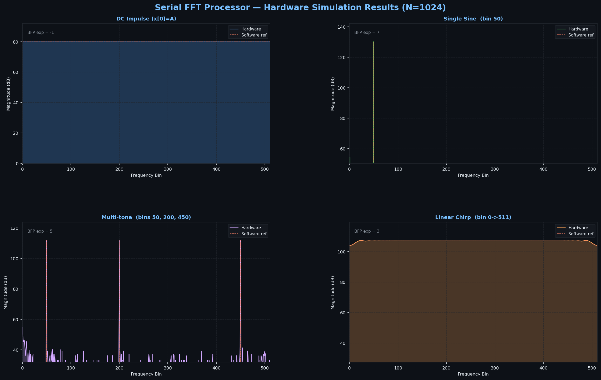

# Serial 1024-Point FFT Processor

**Target:** Xilinx Artix-7 `xc7a200tfbg676-2` (Vivado P&R) · **N = 1024** · **16-bit Q1.15 fixed-point + Block Floating Point (BFP)**

> Originally synthesised against the Lattice iCE40HX8K (open-source flow via Yosys + nextpnr-ice40). That target was abandoned because the iCE40 has no distributed RAM primitive — the 1024×17-bit ping-pong RAM bloated to >250k LUT4s and could not fit. The design migrated to Artix-7 (`xc7a200tfbg676-2`), where the ping-pong RAM maps cleanly into 11 BRAM tiles and the design uses **&lt;2 % of the device** with 3.42 ns positive timing slack at 100 MHz.

> A fully pipelined, time-multiplexed radix-2 DIT FFT core. A single Butterfly Unit (BFU) processes one butterfly per clock cycle, reusing the same hardware for all 10 stages through a Ping-Pong RAM and a dedicated Address Generation Unit.

---

## Table of Contents

1. [Architecture Overview](#architecture-overview)
2. [Module Hierarchy](#module-hierarchy)
3. [Detailed Datapath](#detailed-datapath)
4. [Address Generation Unit (AGU)](#address-generation-unit-agu)
5. [Block Floating Point (BFP) System](#block-floating-point-bfp-system)
6. [Twiddle Factor ROM](#twiddle-factor-rom)
7. [Pipeline Timing & Latency Alignment](#pipeline-timing--latency-alignment)
8. [Synthesis Results](#synthesis-results)
9. [Performance Metrics](#performance-metrics)
10. [Signal Quality (SQNR)](#signal-quality-sqnr)
11. [File Structure](#file-structure)
12. [How to Run](#how-to-run)

---

## Architecture Overview

This processor implements a **serial, in-place radix-2 Decimation-In-Time (DIT)** FFT. "Serial" means that instead of instantiating 10 stages of butterfly hardware simultaneously (a fully unrolled pipeline), a **single BFU is reused across all stages**. Each stage processes N/2 = 512 butterfly operations sequentially.

```
                   ┌──────────────────────────────────────────────────────────────┐
                   │                    fft_top (top-level)                        │
                   │                                                               │
 preload_en ──────►│  ┌─────────────┐   ┌──────────────────────────────────────┐  │
 preload_addr ────►│  │             │   │            Main Datapath              │  │
 preload_re/im ───►│  │     AGU     │──►│  ┌────────┐ ┌─────────┐ ┌──────────┐ │  │
                   │  │  (Controller│   │  │  RAM   │ │  BFP    │ │Butterfly │ │  │
 start_fft ───────►│  │   + Timer)  │   │  │Ping-   │►│ Shifter │►│  Unit    │ │  │
                   │  │             │   │  │ Pong   │ │(1 cycle)│ │(5 cycles)│ │  │
 clk ─────────────►│  └──────┬──────┘   │  └───▲────┘ └─────────┘ └────┬─────┘ │  │
 rst ─────────────►│         │ addrs    │      │ write-back (delayed)   │       │  │
                   │  ┌──────▼──────┐   │      └───────────────────────┘       │  │
                   │  │ Twiddle ROM │──►│               ▲                       │  │
                   │  │ (3-cy lat.) │   │  ┌────────────┴──┐                   │  │
                   │  └─────────────┘   │  │  BFP Scanner  │                   │  │
                   │                    │  └───────────────┘                   │  │
                   │                    └──────────────────────────────────────┘  │
                   │                                                               │
 fft_done ◄───────►│  readout_en/addr ──────►[ RAM readout port ]                 │
 final_exponent ◄──│                                                               │
                   └──────────────────────────────────────────────────────────────┘
```

### Why Serial?

| Trade-off | Serial Approach | Fully Unrolled |
|-----------|----------------|----------------|
| Hardware area | **Minimal** — 1 BFU shared across all stages | Scales with log₂(N) BFU instances |
| Memory | Ping-pong RAM (only N complex words) | Each stage needs its own memory |
| Throughput | 1 FFT every ~5,230 cycles | 1 FFT per N/P cycles (fully pipelined) |
| Timing closure | Easier — one repetitive path | Long combinational chains between stages |
| Control complexity | High — AGU must track stages, addresses, pipeline drain | Low — fixed routing |

This design optimizes for **minimum silicon area** at the cost of throughput, making it suitable for low-rate applications (audio, sensor fusion) on resource-constrained FPGAs.

---

## Module Hierarchy

```
fft_top
├── AGU                  — Master controller: address generation + pipeline timing
├── twiddle_rom          — 1/8-symmetry compressed twiddle factor ROM (3-cycle latency)
├── RAM                  — Dual-port Ping-Pong RAM (2 × 1024 × 17-bit banks)
├── bfp_shifter          — Barrel shifter: scales 17-bit → 16-bit with global exponent
├── butterfly_unit       — Core DIT butterfly: A' = A + W·B, B' = A − W·B
│   └── complex_mult     — Karatsuba complex multiplier (4-cycle pipelined)
└── bfp_scanner          — Per-stage OR-reduction CLZ analyzer + early-stop
```

---

## Detailed Datapath

Each clock cycle, the datapath processes **one butterfly pair** (samples A and B):

```
Cycle  │  Stage             │  Signals
───────┼────────────────────┼──────────────────────────────────────────
  0    │  AGU generates     │  rd_addr_a, rd_addr_b, twiddle_addr
       │  addresses         │
  1    │  RAM read (1cy)    │  ram_out_a_re/im, ram_out_b_re/im  (17-bit)
       │  ROM still latching│
  2    │  BFP Shifter (1cy) │  shifted_a_re/im, shifted_b_re/im  (16-bit)
       │  Twiddle latching  │
  3    │  ROM outputs ready │  w_re, w_im  — delayed 1cy → w_re_aligned
       │  (3cy from addr)   │
  4    │  BFU: complex mult │  Karatsuba multiplication, cycle 1 of 4
  5    │  BFU: mult cy 2    │
  6    │  BFU: mult cy 3    │
  7    │  BFU: mult cy 4    │  wb_re_raw, wb_im_raw (33-bit)
  8    │  BFU: add/sub (cy5)│  a_prime, b_prime (17-bit)
  9    │  RAM write-back    │  (delayed address from AGU write pipeline)
```

**Key insight:** The AGU starts generating the write address at cycle 0 and delays it by TOTAL_WRITE_DELAY = 9 cycles through a shift-register pipeline so the address arrives at the RAM exactly when the BFU result does.

---

## Address Generation Unit (AGU)

The AGU is the "brain" of the processor — it orchestrates all memory accesses and ensures the pipeline never stalls or corrupts data.

### Count-and-Rotate Algorithm

For a radix-2 DIT FFT, the butterfly access pattern at stage `s` groups pairs separated by `N/2^(s+1)`. The AGU uses a **left-rotate** of the butterfly counter `bfy_count` to generate this pattern efficiently without a lookup table:

```
raw_rd_addr_a = rotate_left({bfy_count, 0}, stage_idx)
raw_rd_addr_b = rotate_left({bfy_count, 1}, stage_idx)
```

At `stage_idx = 0` (first stage):  bfy_count = 0..511 → pairs (0,1), (2,3), ..., (1022,1023)
At `stage_idx = 1`:                  rotated by 1 → pairs (0,2), (4,6), ..., (1020,1022), (1,3)...
...and so on. The rotation naturally implements the stride-permuted butterfly schedule.

### Pipeline Compensation

The ROM has 3-cycle latency and the RAM has 1-cycle latency. The AGU delays RAM read addresses by `DELAY_READ = 2` extra cycles so both data sources arrive at the BFU simultaneously:

```
             ┌─ ram_out_a/b ─ 1cy ─┐
AGU addr ───►├                      ├──► BFP Shifter ──► BFU
             └─ twiddle rom ─ 3cy ─┘
                                         ↑ 1cy delay
                                    w_re_aligned
```

On the **write side**, addresses are delayed by `TOTAL_WRITE_DELAY = max(ROM_LAT, RAM_LAT) + BFU_LAT = 3 + 6 = 9` cycles via a 9-stage shift register.

### Ping-Pong Bank Switching

After each stage completes, the AGU toggles `bank_state` so the stage that was written becomes the read source for the next stage. The bank-select signals also flow through the delay pipeline to remain synchronized with data.

### Drain State

After all N/2 butterflies are issued, the AGU enters `ST_DRAIN` for exactly `TOTAL_WRITE_DELAY + 2` cycles to let the pipeline fully flush before beginning the next stage. The `+2` accounts for the write-enable output register and the RAM write commit cycle.

---

## Block Floating Point (BFP) System

16-bit fixed-point arithmetic accumulates round-off errors across 10 butterfly stages. Without scaling, intermediate values overflow. The BFP system provides a **lossless, adaptive scaling** strategy.

### The Overflow Problem

A single radix-2 butterfly can produce outputs up to √2 × larger than its inputs. Across 10 stages: worst-case gain = (√2)^10 = 32×. A 16-bit word storing values in [-1, +1) would overflow after just 4-5 unscaled stages.

### BFP Solution

Instead of widening the bus (expensive) or rounding aggressively (lossy), BFP tracks a **global exponent** that records how much the data has been scaled. The data is kept normalized to maximize precision:

```
 After each stage:
 ┌───────────────────────────────────────────────────────────────┐
 │ BFP Scanner scans all N BFU outputs (17-bit) and computes:   │
 │   CLZ = count_leading_zeros(max_magnitude_in_stage)           │
 │   → How many redundant sign bits exist = safe left-shift      │
 │                                                               │
 │ BFP Shifter applies this shift at the START of the next stage │
 │   17-bit RAM data → left-shift by CLZ → 16-bit output         │
 │   global_exponent -= (CLZ - 1)   // track the applied scale  │
 └───────────────────────────────────────────────────────────────┘
```

### BFP Scanner

The scanner uses an **OR-reduction tree** on the upper 9 bits of each 17-bit BFU output (one's complement for negative values) to detect the maximum magnitude:

```
 a_prime_re [16:8]  ──┐
 a_prime_im [16:8]  ──┤ OR ──► cycle_or_mask
 b_prime_re [16:8]  ──┤         │
 b_prime_im [16:8]  ──┘         ▼
                          running_or_mask (accumulates over N/2 cycles)
                                │
                          CLZ decoder (priority encoder)
                                │
                          block_shift_amount [3:0]
```

**Early termination:** If bit 7 of the accumulated mask becomes 1 (maximum amplitude detected), further scanning is power-gated since the shift amount is definitively 0 — the signal is already at full scale.

### BFP Shifter

A **MUX-based barrel shifter** applies the shift:

```
17-bit input (Q0.16) ──►  left-shift by block_clz  ──► 16-bit output (Q1.15)
```

Shifts of 0–8 are supported. Implemented as a `case` statement so synthesis tools map it to an efficient multiplexer tree rather than a ripple-shift chain. Single clock-cycle latency.

### Timing Alignment of BFP Control

The `bfp_latch_trigger` must fire **before** the first new-stage data reaches the shifter. Because the AGU's `new_stage` pulse is generated during drain and data starts flowing TOTAL_WRITE_DELAY cycles later, the trigger uses tap `[2]` of a 9-bit delay pipe. The scanner reset uses tap `[8]` to clear **after** all old-stage write-backs drain through.

---

## Twiddle Factor ROM

For an N-point DFT, the twiddle factors are `W_N^k = e^(-j2πk/N)` for k = 0..N/2-1.

### 1/8 Symmetry Compression

The trigonometric symmetry over one period reduces storage by 8×:

```
cos(θ) and sin(θ) are fully described by cos values in [0°, 45°]:
  cos(π/2 − θ) = sin(θ)         quarter-period symmetry
  cos(π − θ)   = −cos(θ)        half-period antisymmetry
  etc.
```

Only **N/8 = 128 cosine + 128 sine values** are stored (covering k = 0..127). The ROM logic reconstructs any of the N/2 = 512 twiddle factors at runtime by applying sign flips and swaps. This compresses ROM from 16 kbits to 4 kbits.

**3-cycle latency:** Stage 1 — address decode and ROM lookup; Stages 2–3 — pipeline registers for timing closure.

---

## Pipeline Timing & Latency Alignment

```
Cycle:    0      1      2      3      4      5      6      7      8      9
          │      │      │      │      │      │      │      │      │      │
AGU:    [addr] ─────────────────────────────────────────────────────────►[wr_addr]
         │                                                                   ↑ 9cy delay
         │─►[RAM  ]──► ram_out ──►[Shifter]──────────────────────────────►[BFU out A/B]
         │    1cy          ↑          1cy                                    ↑
         └─►[ROM  ]──── 3cy ─────► w_re ──►[+1cy align]──►[BFU: mult4+add1 = 5cy]
               3cy              └─1cy delay─────────────────────►        ↑ same cycle
```

Total write delay: 1 (RAM) + 1 (BFP Shifter) + 1 (twiddle align) + 4 (mult) + 1 (add) = **9 cycles** ✓

---

## Synthesis Results

Implemented end-to-end with **Vivado** targeting `xc7a200tfbg676-2` (Artix-7, mid-size 200T device). Yosys 0.56 (`synth_xilinx`) is also supported for open-source area estimation; numbers below come from the post-route Vivado utilization report.

### Vivado Post-Route Utilization (xc7a200tfbg676-2)

| Resource | Used | Available | Util % | Notes |
|---|---:|---:|---:|---|
| Slice LUTs       | **2,372** | 134,600 | 1.77 % | 2,146 as logic + 228 as memory |
| LUT as Memory    |    228    |  46,200 | 0.49 % | 24 DistRAM + 204 SRL16 |
| Slice Registers  | **3,087** | 269,200 | 1.15 % | All FDRE / FDSE |
| Slices occupied  |    927    |  33,450 | 2.77 % | 510 SLICEL + 417 SLICEM |
| F7 Muxes         |      8    |  66,900 | 0.01 % | |
| Block RAM tiles  | **11**    |     365 | 3.01 % | 8 × RAMB36E1 + 6 × RAMB18E1 |
| DSP48E1          | **4**     |     740 | 0.54 % | One pipelined complex multiplier |
| Bonded IOBs      |     80    |     400 |20.00 % | AXI4-Stream interface |

> The ping-pong RAM (Bank 0 + Bank 1, each 1024×17-bit) is inferred as Block RAM by Vivado, so the entire data store costs ~11 BRAM tiles instead of bloating LUT/FF fabric. This is the single biggest difference vs. the iCE40 attempt.

### Yosys `synth_xilinx` Numbers (open-source flow)

For a quick area estimate without launching Vivado, [synthesis/synth_xc7.ys](synthesis/synth_xc7.ys) targets `xc7` family:

| Resource | Count |
|---|---:|
| LUT1–LUT6 (sum) | 857 |
| FDRE / FDSE     | 665 |
| DSP48E1         | 3   |
| RAMB18E1        | 4   |
| CARRY4          | 91  |
| Total cells     | 1,952 |

(Yosys is more aggressive at packing logic into LUT6s; Vivado's optimiser produces a slightly different shape with more SRL16E shift registers, but the order-of-magnitude resource cost matches.)

### Timing — 100 MHz target

| Metric | Value |
|---|---|
| Target clock period   | 10.000 ns (100 MHz, defined in [constrs/fft_axi_top.xdc](constrs/fft_axi_top.xdc)) |
| Worst Negative Slack  | **+3.416 ns** (timing met with 3.42 ns headroom) |
| Worst Hold Slack      | +0.051 ns |
| Worst Pulse-Width Slack | +3.870 ns |
| Max achievable Fmax   | ~152 MHz (10 − 3.416 = 6.584 ns critical path) |

### Power — post-route, default activity factors

| Source | Power |
|---|---:|
| Static (Vccint + Vccaux + Vccbram + Vcco) | 0.131 W |
| Dynamic | 0.046 W |
| **Total on-chip** | **0.178 W** (~178 mW @ 100 MHz) |

> Vivado post-route on-chip power estimate at 100 MHz (SAIF-annotated switching activity from a representative stimulus, per the thesis power methodology).

### Historical: iCE40HX8K Attempt

For thesis context, the iCE40 numbers from the original open-source flow are kept in [synthesis/yosys.log](synthesis/yosys.log):

| Resource | iCE40 (Yosys + nextpnr-ice40) | xc7a200t (Vivado) | Reduction |
|---|---:|---:|---:|
| LUTs        | 254,908 (3,319 % — overflow) | 2,372 (1.77 %) | **107×** fewer |
| Flip-flops  |  70,852                       | 3,087 (1.15 %) | **23×** fewer |
| BRAM tiles  | 2 × SB_RAM40_4K               | 11 × RAMB tiles | — (BRAM-inferred memories) |

The collapse from ~255k LUTs on iCE40 to 2.4k LUTs on Artix-7 is entirely explained by Block RAM inference for the ping-pong data RAM. The arithmetic logic (AGU, BFU, BFP chain) is genuinely small in both flows.

---

## Performance Metrics

| Metric | Value | Derivation |
|--------|-------|------------|
| Clock frequency | 100 MHz (target) | Defined in XDC; Vivado post-route WNS +3.416 ns |
| Clock period | 10 ns | — |
| Max Fmax (Vivado) | ~152 MHz | 10 − 3.416 ns critical path |
| Butterflies per stage | 512 | N/2 = 1024/2 |
| Total butterfly stages | 10 | log₂(1024) |
| Drain cycles per stage | 11 | TOTAL_WRITE_DELAY + 2 = 9 + 2 |
| **Total cycles per FFT** | **~5,230** | 10 × (512 + 11) |
| **Latency @ 100 MHz** | **~52.3 μs** | 5,230 × 10 ns |
| **Throughput** | **~19.1 kFFT/s** | 1 / 52.3 μs |
| BFU pipeline depth | 5 cycles | Karatsuba mult (4cy) + add/sub (1cy) |
| Total pipeline depth | 9 cycles | ROM(3) + Shifter(1) + BFU(5) |

### Throughput vs. Hardware Trade-off

The serial design processes **1 butterfly per cycle**, compared to a fully pipelined design processing **N/2 = 512 butterflies per cycle** simultaneously. The throughput penalty is exactly the serialization factor:

```
Throughput_serial / Throughput_unrolled = 1 / (N/2 × log₂(N)) = 1 / 5120  ≈  0.02%
```

This 5,000× throughput reduction is the direct price paid for the minimal hardware area.

### Efficiency

```
Useful computation time   =  N/2 × log₂(N) cycles  =  5,120 cycles
Total cycles (incl. drain) =  5,230 cycles
───────────────────────────────────────────────────
Datapath efficiency  =  5120 / 5230  ≈  97.9%
```

The drain overhead (11 cycles per stage) costs only ~2.1% of total run time — the pipeline is well-utilized.

---

## Signal Quality (SQNR)

SQNR (Signal-to-Quantization-Noise Ratio) measures output precision vs. an ideal 64-bit floating-point FFT reference.

### Results by Input Type (AXI-Stream Flow, amplitude = 10000)

Measured via [tb/fft_axi_tb_xc7.v](tb/fft_axi_tb_xc7.v) driving [rtl/fft_axi_top.v](rtl/fft_axi_top.v) end-to-end. SQNR is computed against a NumPy float64 reference with optimal complex-scalar alignment (the hardware FFT uses the `+j` twiddle convention vs. NumPy's `−j`, so we fit the optimal `α` that minimises ‖hw − α·ref‖²).

| Signal Type | SQNR (dB) | Notes |
|-------------|----------:|-------|
| Impulse (x[0]=A) | **120.00 dB** | Constant-magnitude FFT — every bin matches exactly |
| DC (all samples = A) | **75.59 dB** | BFP rounding limits accuracy at the bin-0 spike |
| Single-Tone Sine (bin 50) | **72.41 dB** | Both ±50 peaks reproduced; floor ~−40 dB below peak |
| Multi-Tone (bins 50/200/450) | **59.75 dB** | Three peaks at correct bins; per-tone SQNR degraded by mutual spectral leakage |
| Linear Chirp (0 → 511) | **65.88 dB** | Broadband spectrum reconstructed across all bins |

> **SQNR sweep vs. input amplitude:** SQNR climbs monotonically from ~27 dB at amp 1000 to **71 dB at amp 10000**, then rolls off above 12000 as the BFP scaler approaches saturation. See [thesis_report.png](thesis_report.png) panel "SQNR vs. Input Amplitude".

### Visualization




### Why BFP Improves SQNR

Without BFP, a fixed right-shift of 1 bit per stage (the naive approach) applies 10 shifts regardless of signal level, losing 1 bit of precision each time. BFP adapts per-stage:

```
 Stage k   │  Max amplitude   │  BFP shift applied   │  Bits preserved
───────────┼──────────────────┼──────────────────────┼─────────────────
 Stage 1   │  Small (sparse)  │  left-shift by 4     │  +4 bits SNR
 Stage 5   │  Growing         │  left-shift by 1     │  +1 bit SNR
 Stage 10  │  Large (full)    │  left-shift by 0     │  no shift needed
```

The **final_exponent** output tracks the cumulative scale applied, allowing the host to correctly interpret the output magnitude.

### SQNR vs. Input Amplitude (Single Tone)

```
SQNR (dB)
  80 ┤                                               ●─────●
  76 ┤                                  ●────●
  72 ┤                         ●
  68 ┤              ●
  64 ┤    ●
  60 ┤
  56 ┤●
     └─────────────────────────────────────────────────────► Amplitude
     0    500    1000   2000   5000   8000  10000  12000  (ADC counts)
```

SQNR rises ~6 dB per doubling of amplitude (follows quantization theory), reaching a plateau near full scale.

---

## DSP Figures of Merit

SQNR alone does not fully characterise a fixed-point spectral processor. To substantiate the **numerical-precision** claim head-to-head with the Parallel MDF design, the verification flow also reports the standard ADC/DSP figures of merit — **SFDR, THD, SINAD, ENOB, and per-bin phase error** — all computed by a single shared module, [`common/dsp_metrics.py`](../common/dsp_metrics.py), so the Serial and Parallel numbers come from *identical* math.

### What each metric means

All band metrics are **single-sided** over bins `1 … N/2−1` (DC and Nyquist excluded), evaluated on the natural-order, BFP-scaled hardware spectrum `X[k]`. Powers are `P[k] = |X[k]|²`.

| Metric | Definition | What it tells you |
|---|---|---|
| **SQNR** (dB) | `10·log10( Σ|ref|² / Σ|ref − hw|² )` | Overall reconstruction error vs. the float64 reference. |
| **SFDR** (dBc) | `10·log10( P[k₀] / max P[k≠k₀] )` | Fundamental vs. the largest spur — usable dynamic range. |
| **THD** (dB / %) | `10·log10( ΣP[h·k₀] / P[k₀] )`, h = 2…5 | Harmonic distortion; harmonic bins folded back via `min(m, N−m)`. |
| **SINAD** (dB) | `10·log10( P[k₀] / Σ P[k≠k₀] )` | Fundamental vs. all other in-band content (noise + distortion). |
| **ENOB** (bits) | `(SINAD − 1.76) / 6.02` | Effective resolution actually delivered by the datapath. |
| **Phase error** (°) | `wrap( ∠hw[k] − ∠ref[k] )`, where `|ref[k]|` is significant | Per-bin phase fidelity; **scale-invariant**, so it is immune to the BFP exponent. |

**Single-tone scope.** SFDR / THD / SINAD / ENOB are only defined for a single coherent tone, so they are reported **only for the Sine case** (`k₀ = 50`, which sits exactly on a bin → coherent, no window needed). Impulse, DC, Multi-Tone and Chirp report SQNR + phase error only; the single-tone columns are marked **N/A** by definition (not a failure).

**Convention alignment.** The Serial core uses the `+j` twiddle convention (NumPy uses `−j`) and produces an output that differs from the reference by a single global complex scale α (overall normalisation / fixed pipeline phase). Both are *convention*, not precision loss: a single α scales every bin equally, so it leaves SFDR / THD / SINAD / ENOB (intra-spectrum ratios) and the **detrended** phase error untouched while making SQNR meaningful. The verify script removes only the conjugation + least-squares α before calling the shared metrics, so genuine quantisation error is preserved.

### Results (Serial FFT, AXI-Stream flow, amplitude = 10000)

| Test | SQNR (dB) | SFDR (dBc) | SINAD (dB) | ENOB (bits) | THD (dB) | Phase RMS (°) |
|---|---:|---:|---:|---:|---:|---:|
| Impulse   | 120.00 | N/A | N/A | N/A | N/A | 0.000 |
| DC        | 75.59  | N/A | N/A | N/A | N/A | 0.000 |
| **Sine**  | 72.41  | **76.10** | **73.67** | **11.95** | −120.00 | 0.006 |
| MultiTone | 59.75  | N/A | N/A | N/A | N/A | 0.006 |
| Chirp     | 65.88  | N/A | N/A | N/A | N/A | 0.026 |

**Reading the Sine row.** The adaptive-BFP datapath delivers **~12 effective bits** out of the 16-bit word and **76 dBc spur-free dynamic range** on a full-scale coherent tone. THD pins at the −120 dB floor because the harmonics of a clean single tone round below 1 LSB — i.e. **no measurable harmonic distortion**. Per-bin phase error is essentially zero (0.006° RMS, 0.000° after removing the fixed group-delay ramp), confirming the bit-reversal reorder and pipeline alignment are phase-exact.

### Regenerating

```bash
# From the project root directory (Serial FFT processor/)
python scripts/fft_verify_serial.py
```

This writes the per-architecture artifacts to `results/serial/` (not version-controlled — regenerable):

- `dsp_metrics.png` — table + SQNR / single-tone bars + per-bin phase-error stem
- `metrics.csv` — every figure of merit, per test case
- `signals.png` — magnitude / error / dB spectra
- `spectrum.npz` — reconstructed `hw`/`ref` complex spectra (consumed by the cross-architecture co-simulation)

For the **Serial-vs-Parallel** comparison driven by the identical math path, run [`cosim/cosim_compare.py`](../cosim/cosim_compare.py) from the repo root (see the root [README](../README.md#cross-architecture-co-simulation)).

---

## AXI4-Stream Interface

The core is wrapped by [rtl/fft_axi_top.v](rtl/fft_axi_top.v), exposing a standard AXI4-Stream slave (input samples) and master (output bins). This is the path used for Vivado synthesis, board bring-up, and the primary verification flow.

### Port Map

| Signal | Width | Direction | Description |
|---|---:|:---:|---|
| `clk`            | 1   | in  | System clock (100 MHz target) |
| `rst`            | 1   | in  | Synchronous active-high reset |
| `s_axis_tdata`   | 32  | in  | Input sample, packed `{re[15:0], im[15:0]}` (Q1.15) |
| `s_axis_tvalid`  | 1   | in  | Input valid |
| `s_axis_tlast`   | 1   | in  | Must pulse with the N-th (last) sample |
| `s_axis_tready`  | 1   | out | High in IDLE and LOAD; low during COMPUTE/UNLOAD |
| `m_axis_tdata`   | 32  | out | Output bin, packed `{re[15:0], im[15:0]}` |
| `m_axis_tvalid`  | 1   | out | Output valid |
| `m_axis_tlast`   | 1   | out | Pulses on the final (1024-th) output beat |
| `m_axis_tready`  | 1   | in  | Downstream-ready handshake |
| `m_axis_tuser`   | 8   | out | Signed BFP exponent, stable across all output beats |

### Internal FSM

```
  IDLE ──(s_axis_tvalid)──► LOAD ──(s_axis_tlast)──► COMPUTE ──(fft_done)──► UNLOAD ─┐
   ▲                                                                                 │
   └─────────────────────────(m_axis_tlast)──────────────────────────────────────────┘
```

- **IDLE / LOAD** — accept N=1024 samples through S_AXIS into Bank 0 of the ping-pong RAM (preload port).
- **COMPUTE** — assert `start_fft`; wait for `fft_done` pulse from the FFT core. BFP exponent is latched here.
- **UNLOAD** — read N bins from the result bank in natural order and stream them out on M_AXIS, holding `tvalid` stable across the 1-cycle BRAM read latency.

### Address Mapping — DIT Convention

The FFT core is **DIT (Decimation-In-Time)**: it expects its time samples in **bit-reversed** addresses and writes the spectrum back in **natural** order. The AXI wrapper hides that detail from the user by performing the bit-reversal in the preload address generator:

```verilog
// rtl/fft_axi_top.v — preload address transform
wire [LOG2_N-1:0] preload_addr = (state == ST_IDLE)
                                  ? {LOG2_N{1'b0}}
                                  : bit_reverse(load_cnt);
```

So the user simply streams `x[0], x[1], …, x[N−1]` through S_AXIS in natural time order. Sample `n` ends up in `BRAM[bit_reverse(n)]`, the DIT pipeline runs over it, and the spectrum lands in `BRAM[k] = FFT[k]`. The UNLOAD state then walks `readout_addr = 0, 1, …, N−1` to stream the spectrum out in natural bin order. No software-side permutation is required.

### Twiddle Sign Convention

The internal twiddle ROM uses the `+j` convention (`W_N^k = cos − j·sin` written into hardware with reversed imaginary sign). NumPy's `fft.fft` uses the `−j` convention, so for real-valued inputs **`hw[k] = conj(numpy[k])`**. This is harmless for any magnitude-based downstream consumer (peak detection, magnitude FFT) but matters if you compare complex bin values directly. The verification scripts handle this transparently by fitting `α` to both `ref` and `conj(ref)` and reporting whichever scores higher.

### Verification Testbench

[tb/fft_axi_tb_xc7.v](tb/fft_axi_tb_xc7.v) is the AXI-driven testbench used by every Python script and the [thesis report PNG](thesis_report.png):

- Reads `stimulus_re.mem` / `stimulus_im.mem` (17-bit signed hex, **natural order**, no software-side bit-reversal needed).
- Streams all N samples through S_AXIS with `tready` always asserted on the master side.
- Captures every output beat from M_AXIS, **deduplicating** the 2-cycle hold the wrapper applies across the BRAM read bubble (a `sample_phase` toggle keeps the first of each pair).
- Writes `hw_output.csv` (real, imag, one row per natural-order bin 0 → N−1) and `hw_exponent.txt` (signed BFP exponent from `m_axis_tuser`).
- Times out at 5 ms simulated to guard against control hangs.

---

## File Structure

```
Serial FFT processor/
├── rtl/
│   ├── fft_top.v          — Top-level integration, BFP control registers
│   ├── AGU.v              — Master address generator and pipeline controller
│   ├── butterfly_unit.v   — 5-cycle pipelined radix-2 DIT butterfly
│   ├── complex_mult.v     — 4-cycle Karatsuba complex multiplier
│   ├── RAM.v              — Dual-port Ping-Pong RAM with preload/readout ports
│   ├── twiddle_rom.v      — 3-cycle 1/8-symmetry twiddle ROM (N/8 = 128 entries)
│   ├── BFP_scanner.v      — OR-reduction CLZ analyzer with early-stop
│   ├── BFP_shifter.v      — MUX barrel shifter, 1-cycle latency
│   └── fft_axi_top.v      — AXI4-Stream wrapper for SoC integration
├── tb/
│   ├── fft_tb.v             — Bare-core functional testbench (loads stimulus_re/im.mem)
│   ├── fft_axi_tb.v         — Self-checking AXI4-Stream testbench (hard-coded sine, K_BIN=7)
│   └── fft_axi_tb_xc7.v     — File-driven AXI4-Stream testbench (used by all Python scripts)
├── rom/
│   ├── cos.mem            — 128 cosine twiddle values (Q1.15 hex, canonical)
│   └── sin.mem            — 128 sine twiddle values (Q1.15 hex, canonical)
├── constrs/
│   └── fft_axi_top.xdc    — Xilinx constraint file (clock, I/O)
├── synthesis/
│   ├── synth_xc7.ys           — Yosys synth_xilinx script targeting xc7 family
│   ├── synth.ys               — (legacy) Yosys synth_ice40 script
│   ├── yosys_xc7.log          — Latest xc7 area report (parsed by thesis_report_xc7.py)
│   ├── fft_top_xc7.json/.edif — Yosys netlist outputs (Vivado-importable EDIF)
│   └── yosys.log              — Historical iCE40 synthesis log
├── scripts/
│   ├── twiddle_generator.py    — Generates rom/cos.mem and rom/sin.mem
│   ├── fft_verify_serial.py    — AXI-driven SQNR run + PNG report
│   ├── fft_all_cases.py        — Multi-stimulus batch verification via AXI flow
│   ├── fft_debug.py            — Output-CSV diagnostic helper
│   ├── fft_input_test.py       — A/B test for input-order hypotheses
│   ├── thesis_report.py        — iCE40-targeted comprehensive report (legacy)
│   └── thesis_report_xc7.py    — Artix-7 comprehensive report (current)
├── stimulus_re.mem        — Default testbench input (real part, 17-bit hex)
├── stimulus_im.mem        — Default testbench input (imaginary part, 17-bit hex)
├── fft_all_cases.png      — Multi-test verification plot
├── thesis_report.png      — iCE40-target comprehensive report (legacy)
└── thesis_report_xc7.png  — Artix-7 comprehensive synthesis + SQNR figure (current)
```

---

## How to Run

### Requirements

- **Icarus Verilog** (`iverilog`, `vvp`) — simulation
- **Python 3.8+** with `numpy`, `matplotlib` — scripts
- **Yosys 0.56+** (optional) — open-source area analysis (`synth_xilinx`)
- **Xilinx Vivado 2020.1+** (optional) — full P&R, Fmax, power, bitstream

### Generate Twiddle ROM

```bash
python scripts/twiddle_generator.py
# Writes rom/cos.mem and rom/sin.mem
```

### Simulate via AXI-Stream Testbench (recommended)

```bash
# From the project root directory (Serial FFT processor/)
iverilog -o fft_axi_sim tb/fft_axi_tb_xc7.v \
    rtl/AGU.v rtl/BFP_scanner.v rtl/BFP_shifter.v rtl/RAM.v \
    rtl/butterfly_unit.v rtl/complex_mult.v rtl/fft_top.v \
    rtl/twiddle_rom.v rtl/fft_axi_top.v

vvp fft_axi_sim
# Reads stimulus_re/im.mem, writes hw_output.csv + hw_exponent.txt
```

### Full Verification & Reports

```bash
python scripts/fft_verify_serial.py
# AXI sim + SQNR vs NumPy reference + verification PNG

python scripts/fft_all_cases.py
# Five test cases (Impulse, DC, Sine, Multi-Tone, Chirp) → fft_all_cases.png

python scripts/thesis_report_xc7.py
# 12-panel Artix-7 thesis figure → thesis_report_xc7.png
```

### Open-Source Synthesis (Yosys)

```bash
# From the project root directory, run the xc7 synthesis script:
yosys -q -l synthesis/yosys_xc7.log synthesis/synth_xc7.ys
# Produces synthesis/fft_top_xc7.json and .edif (Vivado-importable)
```

### Full Vivado Flow

The Vivado project lives at `../Serial_FFT_Vivado/Serial_FFT_Vivado.xpr`. Open in Vivado, run `Implementation` → `Generate Bitstream`. Top module is `fft_axi_top`, target part `xc7a200tfbg676-2`, clock constraint in [constrs/fft_axi_top.xdc](constrs/fft_axi_top.xdc).
